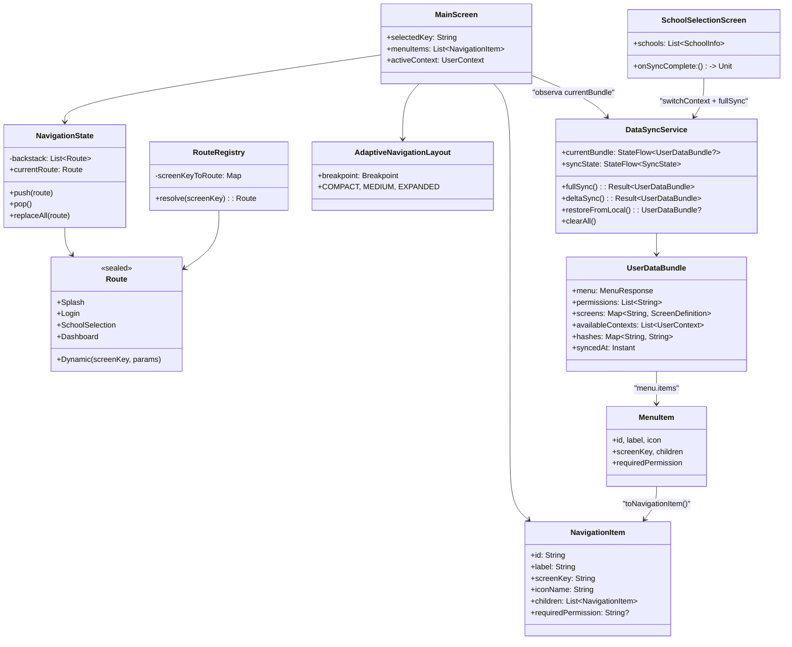
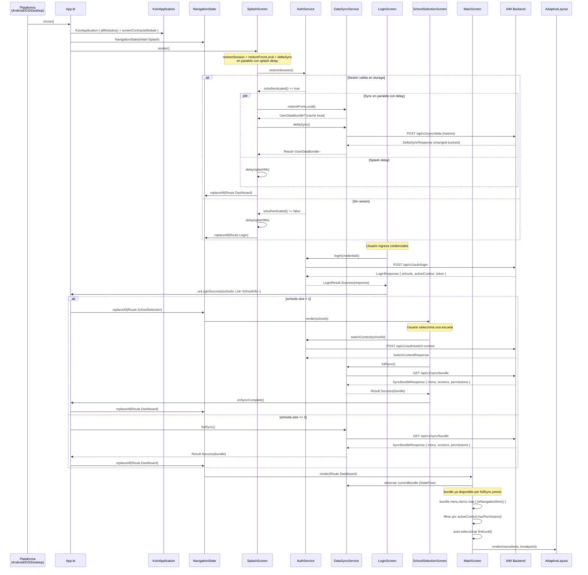
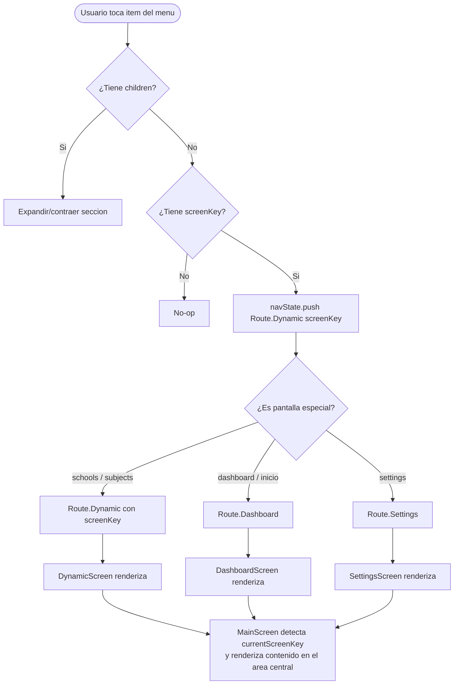
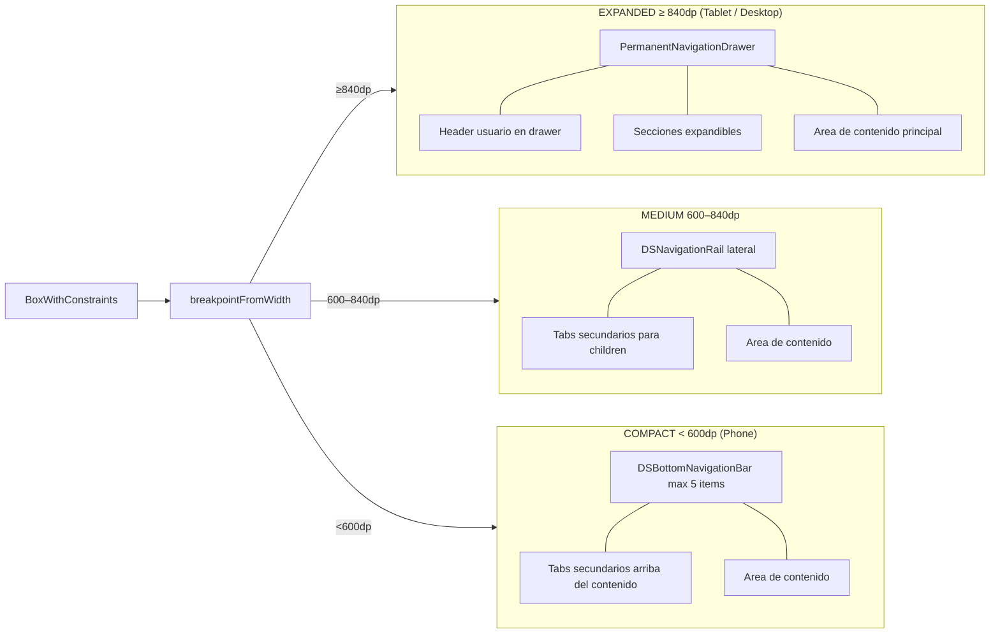
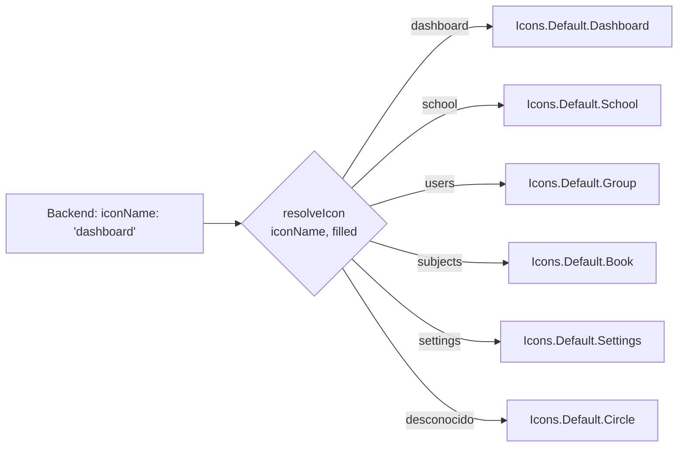
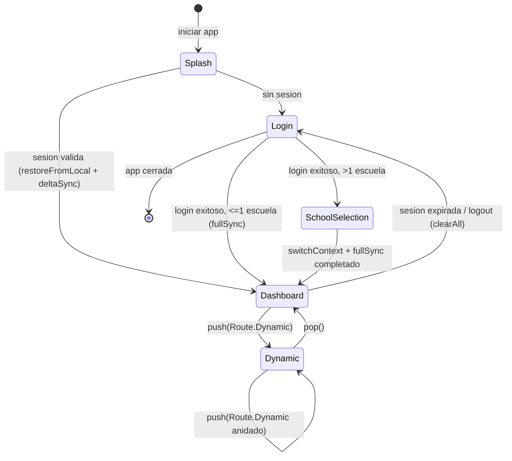
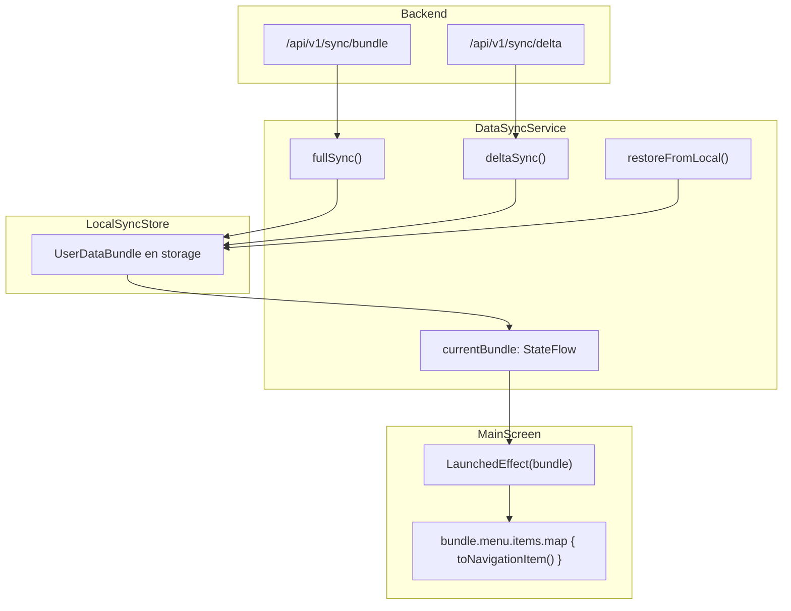

# 01 — Menu y Navegacion

## Clases Involucradas

---

## Flujo Secuencial: Arranque y Carga del Menu

---

## Flujo de Seleccion de Item del Menu

---

## Layout Adaptativo por Breakpoint

---

## Resolucion de Iconos del Backend

---

## Estado de Navegacion (Backstack)

---

## Origen de Datos del Menu (Sync Bundle)

---

## Diferencias por Plataforma

| Aspecto | Android | iOS | Desktop | WasmJS |
|---------|---------|-----|---------|--------|
| Entry point | `MainActivity.setContent {}` | `MainViewController.kt` | `Main.kt (Window)` | `main.kt (CanvasBasedWindow)` |
| Breakpoint inicial | Calculado por `LocalConfiguration.current.screenWidthDp` | Calculado por geometria de ventana | Siempre EXPANDED por defecto | Variable segun viewport |
| Back navigation | Boton fisico Android mapea a `navState.pop()` | Gesture iOS mapea a `pop()` | Alt+← o boton en toolbar | Boton del browser o toolbar |
| PermanentDrawer | Solo en tablets | Solo en iPad | Siempre visible | Solo en pantallas grandes |
| Animaciones | `AnimatedContent` de Compose | `AnimatedContent` de Compose | `AnimatedContent` de Compose | `AnimatedContent` (sin GPU accel) |

---

## Mejoras Propuestas

| Mejora | Justificacion | Prioridad | Estado |
|--------|--------------|-----------|--------|
| Deep-linking | Soportar URLs directas a `Route.Dynamic(screenKey)` en Android/iOS/Web | Alta | Pendiente |
| Cache del menu por rol | ~~Evitar GET al menu en cada re-composicion del MainScreen~~ El menu ahora viene del sync bundle (`DataSyncService.currentBundle`), no se re-fetcha individualmente | Media | **Completado** |
| Animacion de transicion entre pantallas | Actualmente usa `AnimatedContent` sin transicion personalizada | Baja | Pendiente |
| Resolucion de iconos extensible | El mapa de iconos esta hardcodeado; permitir iconos custom del backend (SVG/URL) | Media | Pendiente |
| Menu breadcrumb en EXPANDED | Mostrar la ruta `Escuelas > Lista` en la toolbar para pantallas anidadas | Media | Pendiente |
