# 02 — Permisos y RBAC

## Clases Involucradas

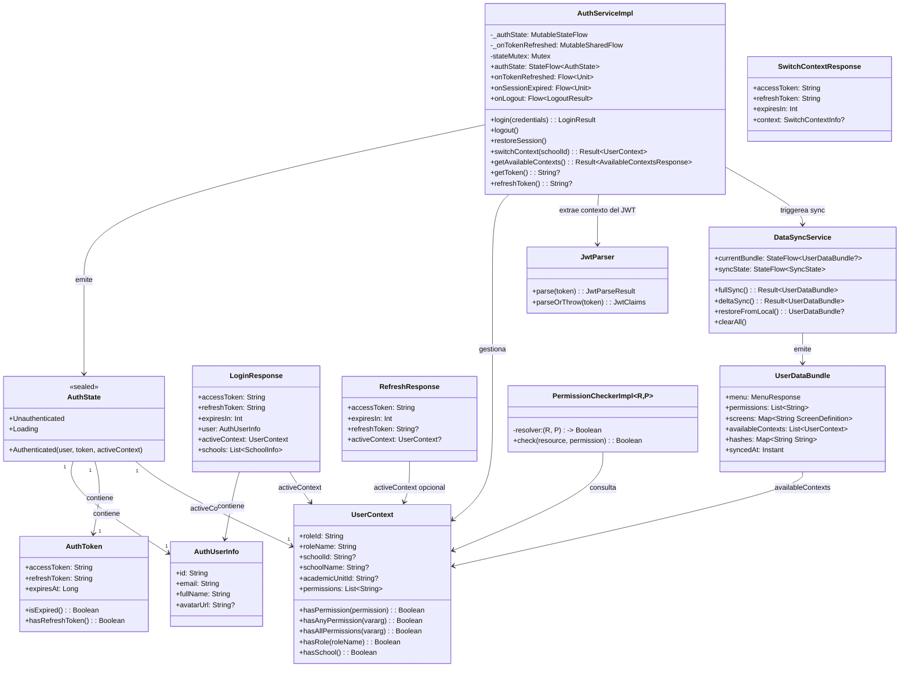

---

## Flujo Secuencial: Login con RBAC

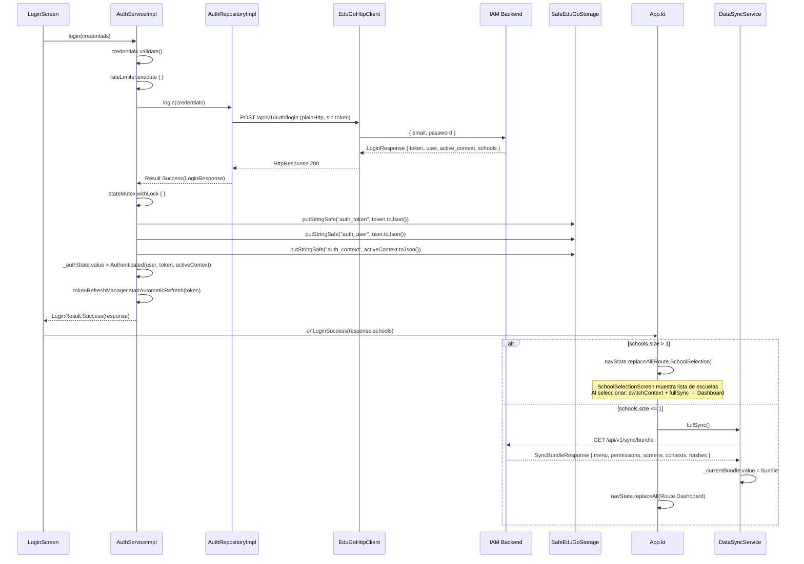

---

## Flujo: Verificacion de Permiso en un Evento SDUI

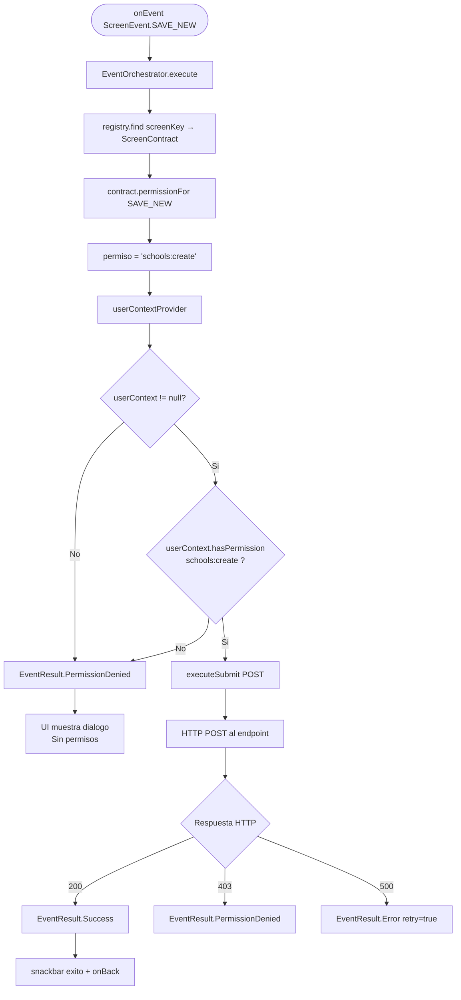

---

## Mapa de Permisos Predeterminados por Evento

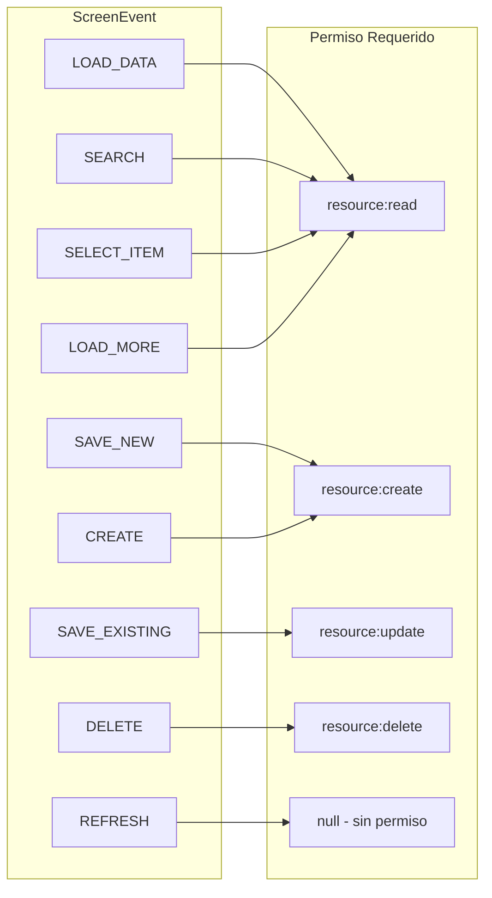

---

## Estado de Autenticacion: Maquina de Estados

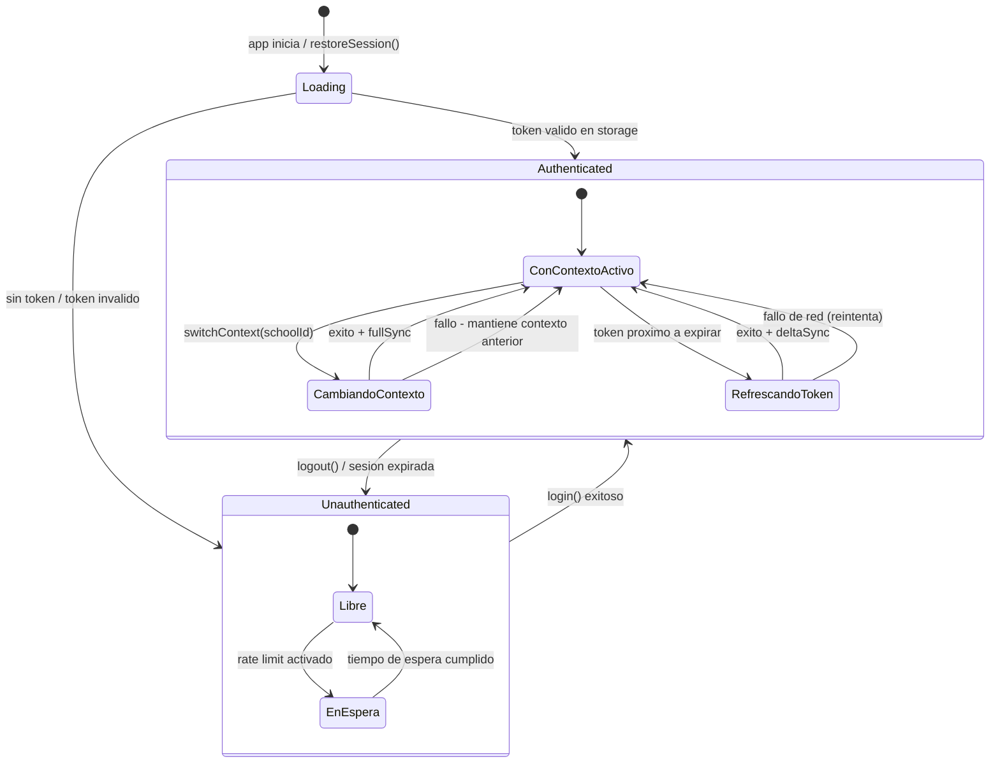

---

## Flujo: Cambio de Escuela (Switch Context)

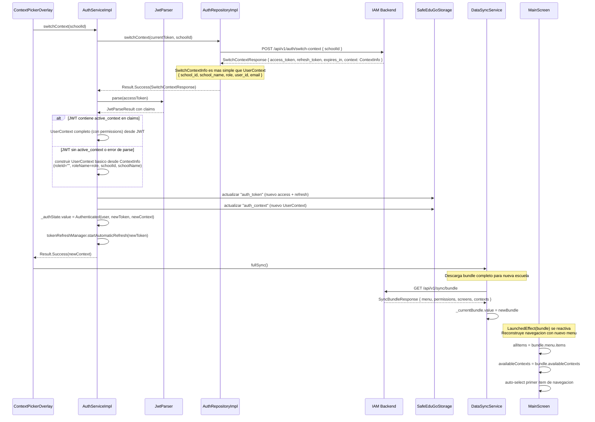

---

## Flujo: Renovacion de Token (Token Refresh)

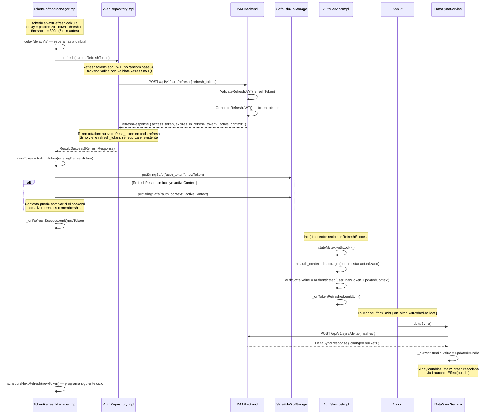

### Manejo de Errores en Refresh

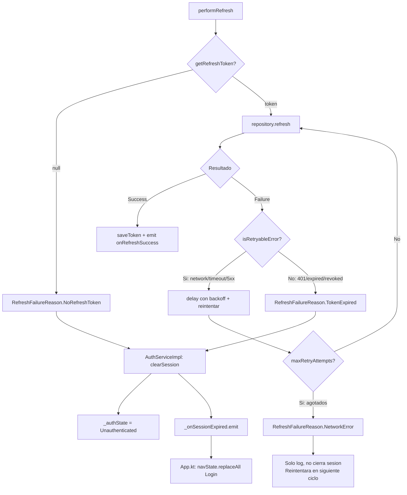

---

## Flujo: Splash — Restauracion de Sesion

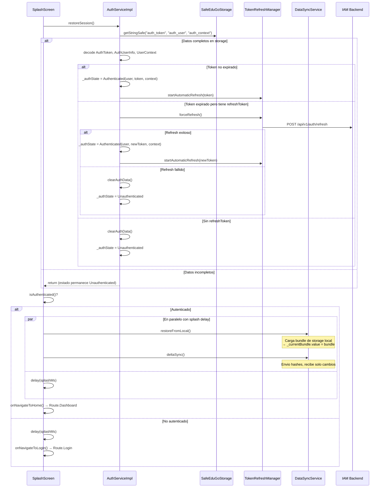

---

## Estructura de Permisos por Rol (Ejemplo)

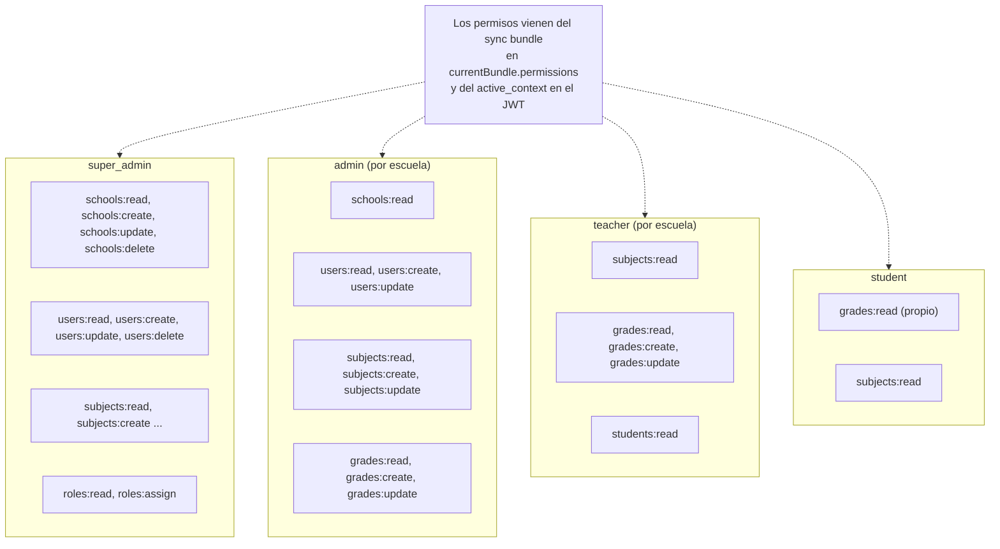

---

## Almacenamiento de Contexto: 3 Keys + Sync Bundle

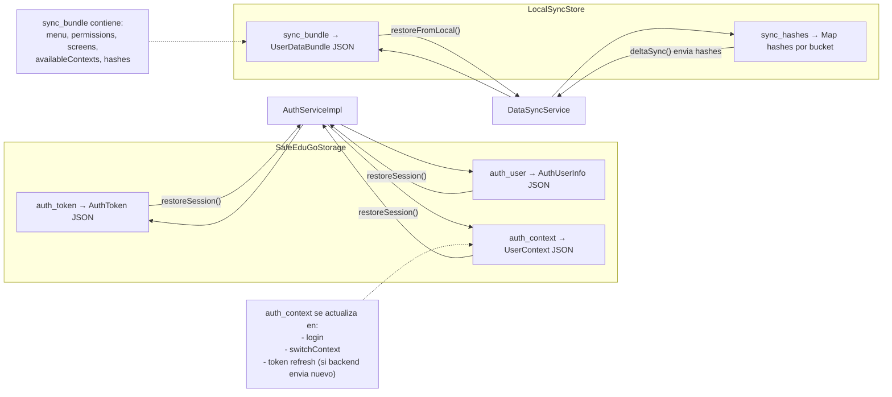

---

## Contextos Disponibles: Origen y Uso

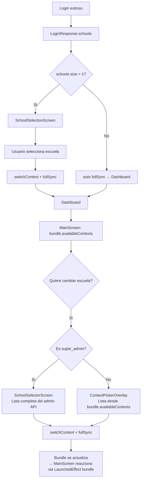

---

## Diferencias por Plataforma

| Aspecto | Android | iOS | Desktop | WasmJS |
|---------|---------|-----|---------|--------|
| Storage del token | `SharedPreferences` | `NSUserDefaults` | `java.util.prefs` | `localStorage` |
| Seguridad del token | No cifrado (texto plano en SharedPrefs) | No cifrado en NSUserDefaults | Legible en plist | Legible en localStorage |
| Keychain/Keystore | No implementado | No implementado | No implementado | N/A |
| Thread safety | `Mutex` de coroutines | `Mutex` de coroutines | `Mutex` de coroutines | Single thread (JS) |
| super_admin sin escuela | Redirige a SchoolSelector | Redirige a SchoolSelector | Redirige a SchoolSelector | Redirige a SchoolSelector |
| Token refresh | Automatico con schedule | Automatico con schedule | Automatico con schedule | Automatico con schedule |

---

## Mejoras Propuestas

| Mejora | Justificacion | Estado |
|--------|--------------|--------|
| Cifrar token en storage | Los tokens JWT son texto plano en SharedPrefs/NSUserDefaults; usar Android Keystore / iOS Keychain | Pendiente - Alta prioridad |
| Permisos cacheados por rol | Si el mismo rol+escuela se usa seguido, evitar round-trip al backend en cada login | IMPLEMENTADO — los permisos vienen en el sync bundle y se cachean localmente en `LocalSyncStore` |
| Offline permission check | Si hay cache del UserContext, permitir navegar sin red aunque no se pueda verificar expiracion | IMPLEMENTADO — `UserContext` cacheado en sync bundle via `restoreFromLocal()` sobrevive offline; `SplashScreen` restaura bundle local antes de intentar delta sync |
| Renovacion silenciosa pre-expiracion | `TokenRefreshManager` renueva 5 min antes de expirar, configurado via `TokenRefreshConfig.refreshThresholdSeconds` | IMPLEMENTADO — funcionando con schedule automatico, token rotation JWT, y delta sync post-refresh |
| Audit log local | Registrar en storage los cambios de contexto para debugging | Pendiente - Baja prioridad |
| Refresh token rotation | Cada refresh emite nuevo refresh token para invalidar el anterior | IMPLEMENTADO — `RefreshResponse.refreshToken` se usa si viene, sino se reutiliza el existente |
