# 03 — Carga de UI Dinamica (SDUI)

## Clases Involucradas

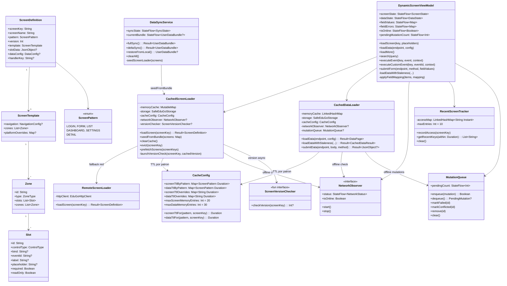

---

## Pipeline Completo de Carga de Pantalla

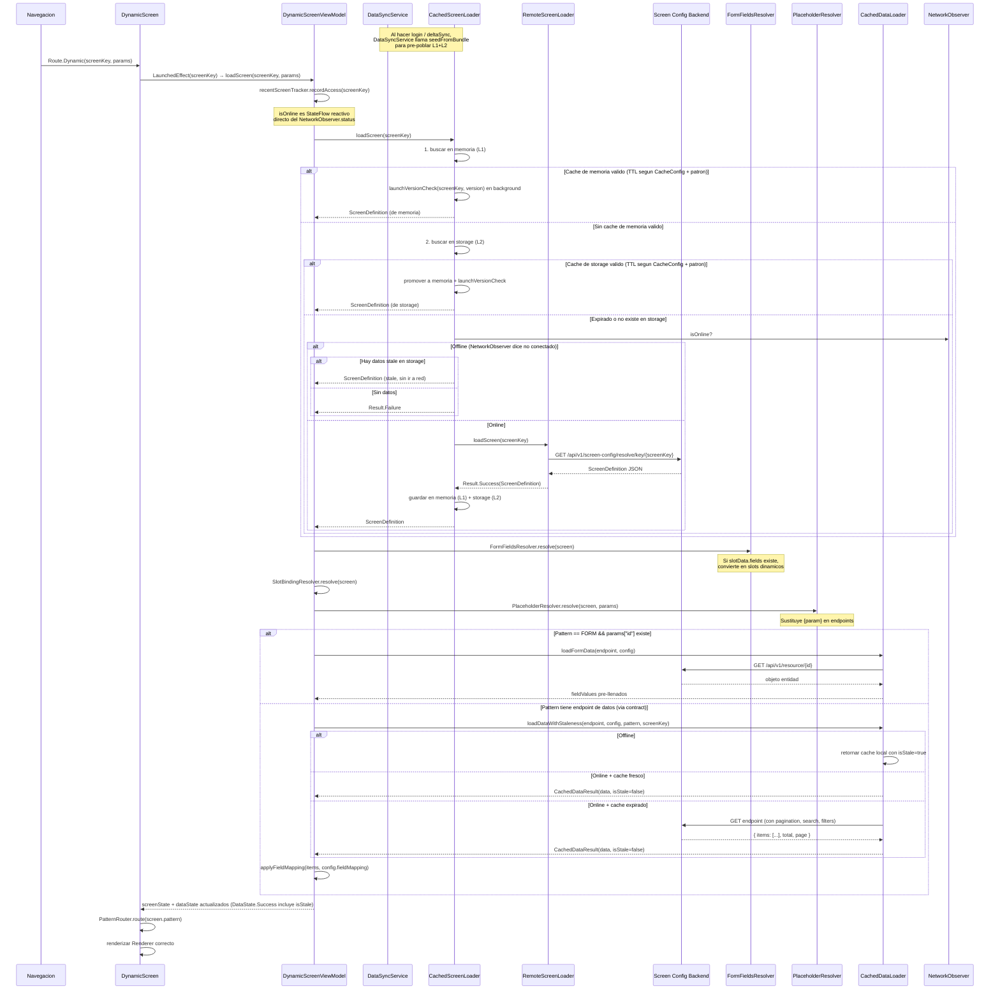

---

## Estructura del ScreenDefinition (Ejemplo: schools-list)

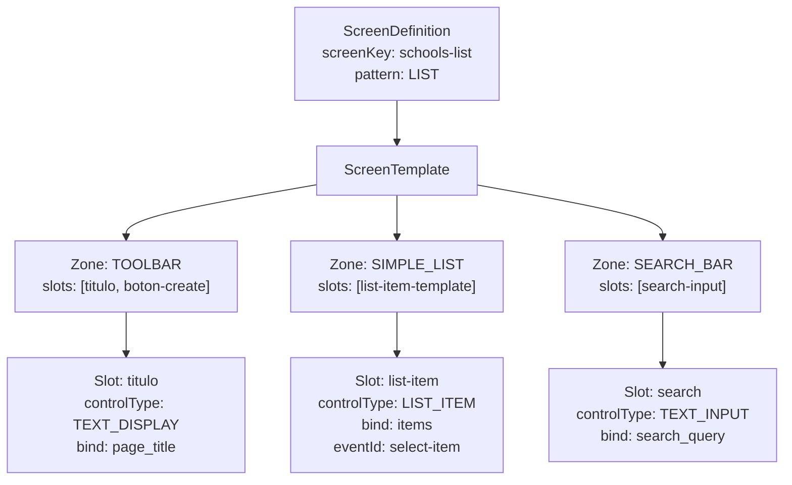

---

## Renderers por Patron

```mermaid
flowchart TD
    PatternRouter --> |LIST| ListPatternRenderer
    PatternRouter --> |FORM| FormPatternRenderer
    PatternRouter --> |DASHBOARD| DashboardPatternRenderer
    PatternRouter --> |DETAIL| DetailPatternRenderer
    PatternRouter --> |SETTINGS| SettingsPatternRenderer
    PatternRouter --> |LOGIN| LoginPatternRenderer

    ListPatternRenderer --> |renderiza| DSLazyColumn
    ListPatternRenderer --> |renderiza| DSSearchBar
    ListPatternRenderer --> |renderiza| DynamicToolbar["DynamicToolbar (LIST)"]

    FormPatternRenderer --> |renderiza| DSTextField
    FormPatternRenderer --> |renderiza| DSDropdown
    FormPatternRenderer --> |renderiza| DynamicToolbar2["DynamicToolbar (FORM)"]
    FormPatternRenderer --> |filtra| ACTION_GROUP["Omite zones ACTION_GROUP\n(evita botones duplicados)"]

    DashboardPatternRenderer --> |renderiza| DSMetricCard
    DashboardPatternRenderer --> |renderiza| DSChartCard
    DashboardPatternRenderer --> |renderiza| DynamicToolbar3["DynamicToolbar (DASHBOARD)"]

    DetailPatternRenderer --> |renderiza| DSDetailField
    DetailPatternRenderer --> |renderiza| DynamicToolbar4["DynamicToolbar (DETAIL)"]
```

---

## DynamicToolbar por Patron

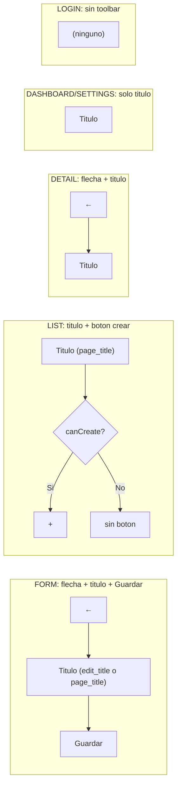

---

## Pre-carga desde Sync Bundle (seedFromBundle)

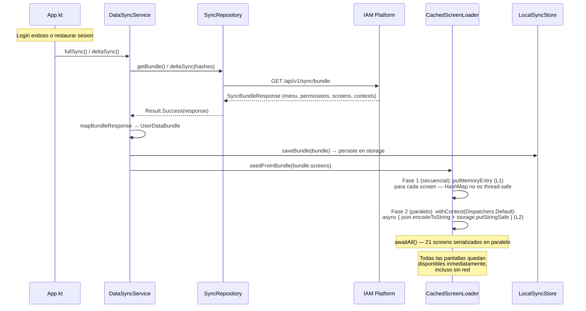

---

## Cache de Pantallas: Estrategia de 2 Niveles con TTL Configurable

### TTL por Patron (CacheConfig)

| Patron | TTL de Screen | TTL de Data | Justificacion |
|--------|---------------|-------------|---------------|
| DASHBOARD | 60s | 60s | Datos cambian frecuentemente |
| LIST | 5min | 5min | Balance entre frescura y rendimiento |
| FORM | 60min | 60min | Estructura de formularios cambia raramente |
| DETAIL | 10min | 10min | Datos individuales, frescura moderada |
| SETTINGS | 30min | 30min | Configuracion cambia poco |
| (default) | 5min | 5min | Fallback si patron no esta mapeado |

Ademas, `CacheConfig` soporta `screenTtlOverrides` y `dataTtlOverrides` por `screenKey` especifico para ajustes finos.

### Flujo de Cache

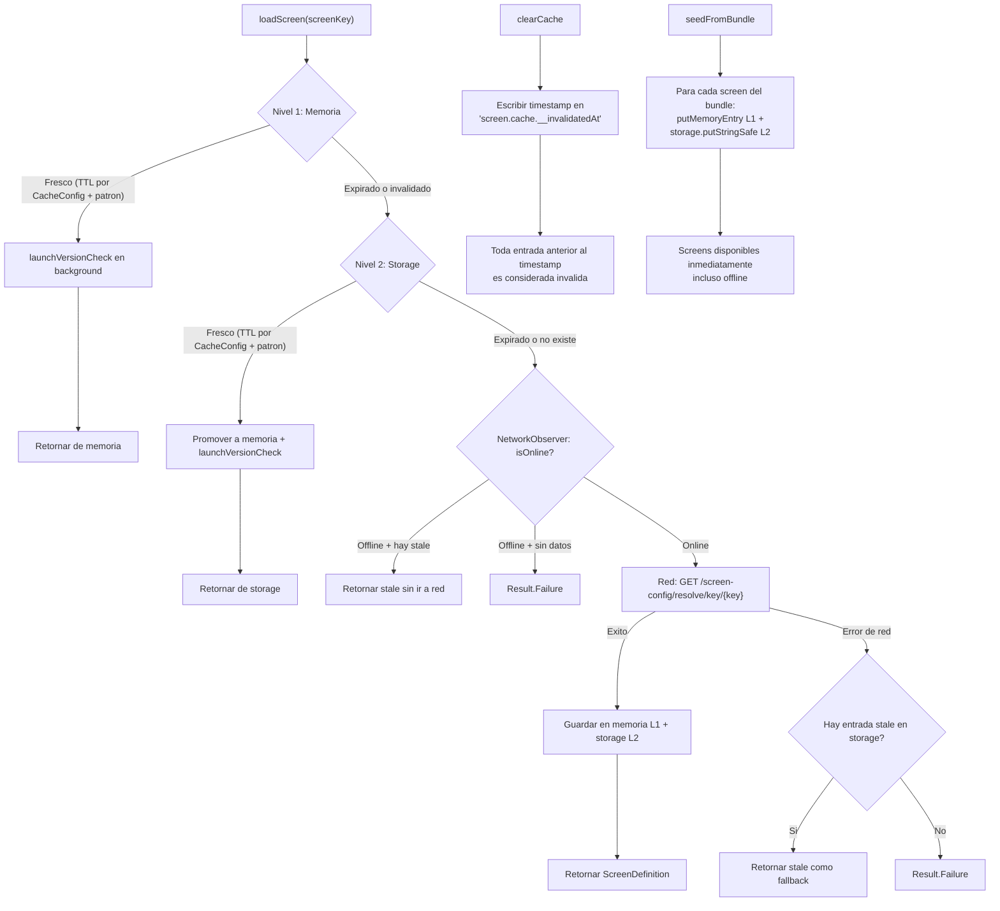

### Versionado Asincrono de Pantallas

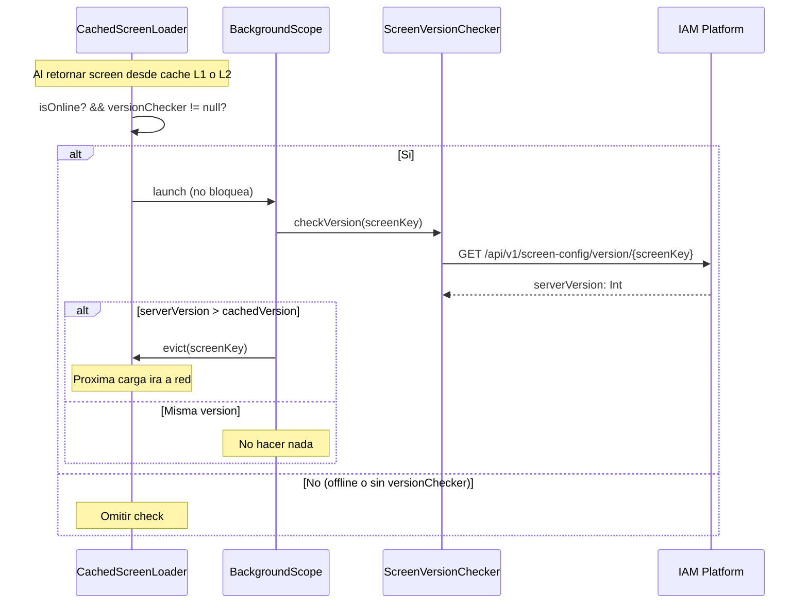

---

## Cache de Datos: CachedDataLoader

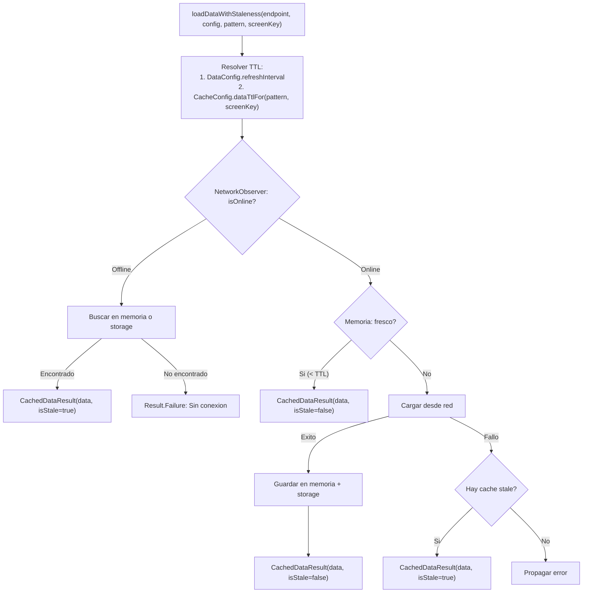

### Offline Mutations (MutationQueue)

Cuando `submitData` se invoca estando offline:

1. Se encola en `MutationQueue` (persiste en storage, max 50 mutaciones)
2. Se retorna `Result.Success(null)` (indica "guardado local")
3. El ViewModel muestra "Guardado localmente, se sincronizara al reconectar"
4. `pendingMutationCount: StateFlow<Int>` se actualiza para que la UI muestre indicador
5. Deteccion de duplicados: no encola si ya existe mutacion identica (endpoint+method+body)
6. Si la red falla al enviar (no solo offline), tambien se encola como fallback

---

## DynamicScreenViewModel: Estado y Capacidades

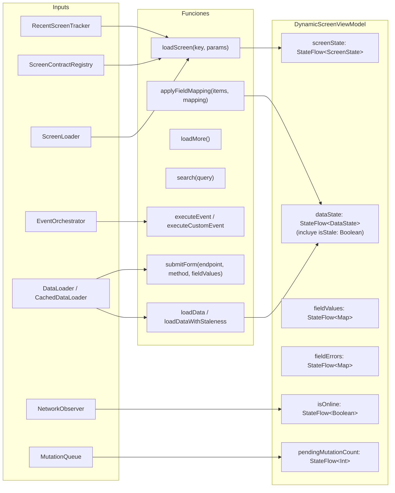

### DataState.Success: campo isStale

Cuando `isStale = true`, la UI puede mostrar un indicador visual (por ejemplo, `StaleDataIndicator`) para informar al usuario que los datos provienen del cache y pueden no estar actualizados. Esto ocurre cuando:

- Se esta offline y se retorna cache local
- La red fallo y se uso cache stale como fallback

### applyFieldMapping

Transforma los nombres de campos de la respuesta API a los nombres esperados por el template. El mapeo se define en `DataConfig.fieldMapping` con formato `"templateField" -> "apiField"`. Los campos originales se preservan junto a los alias mapeados.

---

## DataConfig y FieldMapping

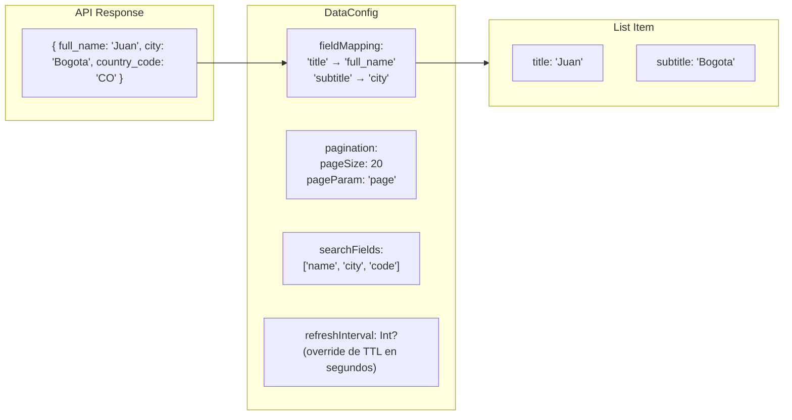

---

## RecentScreenTracker

Rastreador LRU de las ultimas pantallas accedidas. Mantiene un maximo de 10 entradas (configurable).

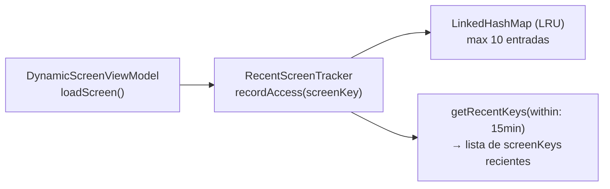

Uso: al acceder una pantalla, el ViewModel registra el acceso. Se puede consultar `getRecentKeys()` para obtener las pantallas visitadas recientemente (ej. para prefetch o analytics).

---

## Diferencias por Plataforma

| Aspecto | Android | iOS | Desktop | WasmJS |
|---------|---------|-----|---------|--------|
| Composable engine | Jetpack Compose | Compose Multiplatform (iOS rendering) | Compose for Desktop (JVM) | Compose for Web (Canvas) |
| Animaciones | Suaves, aceleradas por GPU | Suaves con Metal | Suaves con Skia | Limitadas (WASM canvas) |
| Cache de pantallas | SharedPreferences | NSUserDefaults | Java Prefs | localStorage |
| NetworkObserver | ConnectivityManager callback | NWPathMonitor | HTTP health-check polling | navigator.onLine + eventos |
| `platformOverrides` en ScreenTemplate | Puede activar configuracion especifica Android | Puede activar configuracion especifica iOS | Sin overrides especificos | Puede ajustar layouts |
| Lazy rendering | `LazyColumn` de Compose | `LazyColumn` (iOS rendering) | `LazyColumn` (JVM) | `LazyColumn` (WASM, puede ser lento con listas grandes) |

---

## Mejoras: Estado de Implementacion

| Mejora | Estado | Detalle |
|--------|--------|---------|
| Versionado de pantallas | PARCIAL | Backend tiene endpoint `GET /screen-config/version/{key}`. Cliente tiene `ScreenVersionChecker` y `launchVersionCheck` que evicta cache en background si la version del servidor es mayor. Falta auto-invalidacion proactiva (push/websocket). |
| Pre-carga de pantallas relacionadas | HECHO | `seedFromBundle` carga todas las pantallas del sync bundle en L1+L2 de una vez. Ademas existe `prefetchScreens(keys)` para pre-carga explicita. |
| Cache size configurable | HECHO | `CacheConfig` con TTLs por patron, overrides por screenKey, `maxScreenMemoryEntries=20`, `maxDataMemoryEntries=30`. |
| TTL configurable por patron | HECHO | Dashboard 60s, List 5min, Form 60min, Detail 10min, Settings 30min. Ademas `DataConfig.refreshInterval` permite override por endpoint. |
| Offline fallback con staleness | HECHO | `NetworkObserver` integrado en `CachedScreenLoader` y `CachedDataLoader`. Retorna datos stale con `isStale=true` cuando esta offline. |
| Mutation queue offline | HECHO | `MutationQueue` persiste mutaciones pendientes (max 50), con deteccion de duplicados y retry. `pendingMutationCount` expuesto al UI. |
| Skeleton loading | PENDIENTE | Mostrar placeholders mientras se carga la ScreenDefinition (actualmente es pantalla en blanco) |
| Error boundaries por zona | PENDIENTE | Si una Zone falla al renderizar, mostrar error solo en esa zona en vez de toda la pantalla |
| ScreenDefinition diff | PENDIENTE | Al recibir nueva version del servidor, hacer diff y re-renderizar solo las zonas cambiadas |
| Paralelización de seedFromBundle | HECHO | Fase 1: memoria secuencial (HashMap), Fase 2: serialización + storage en paralelo via `withContext(Dispatchers.Default)` + `async/awaitAll` |
| isOnline reactivo | HECHO | `DynamicScreenViewModel.isOnline` es StateFlow reactivo del `NetworkObserver.status`, elimina `updateOnlineStatus()` manual |
| Delta sync incremental | HECHO | `applyDeltaToBundle()` construye bundle en memoria sin recargar de storage. Solo persiste buckets cambiados |
| Splash paralelo | HECHO | `restoreSession()` + `restoreFromLocal()` en paralelo. `deltaSync()` en paralelo con splash delay |
