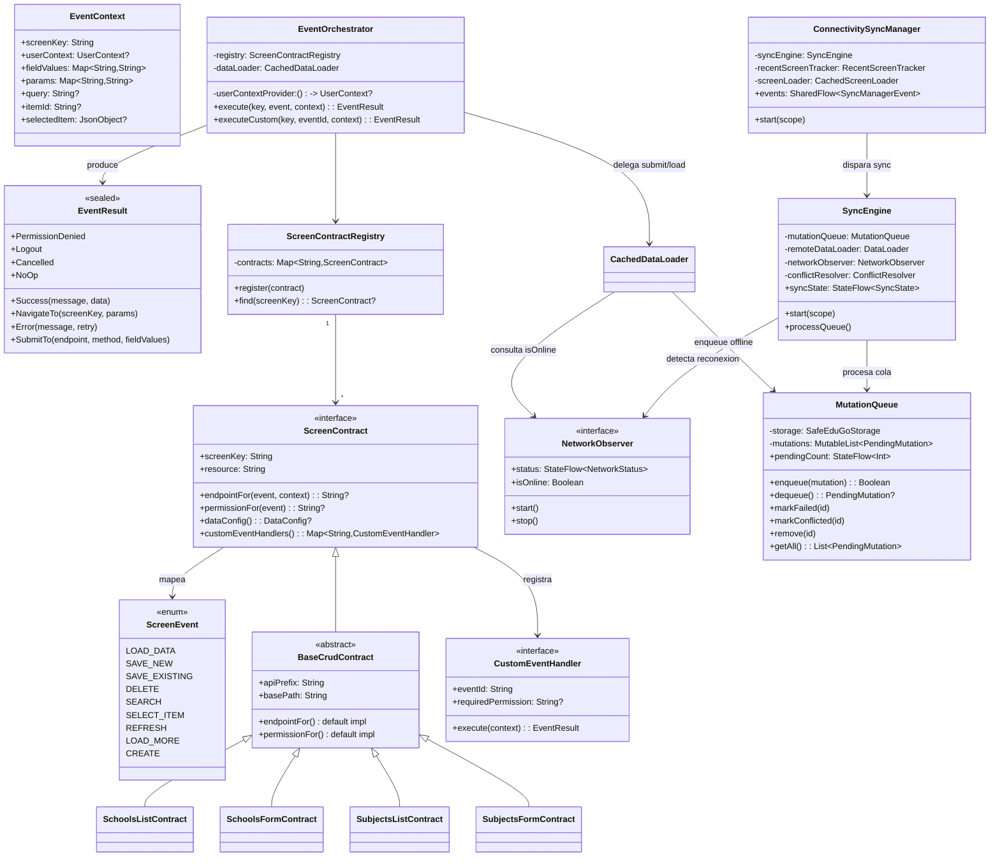
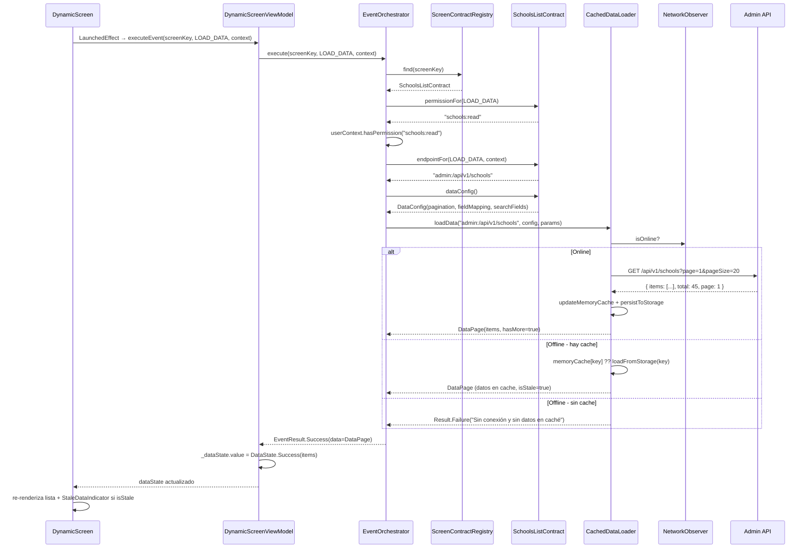
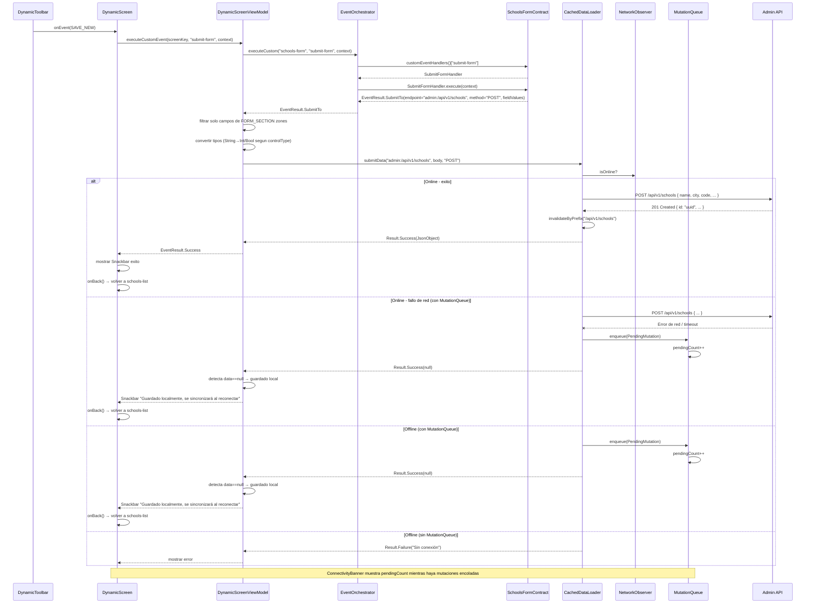
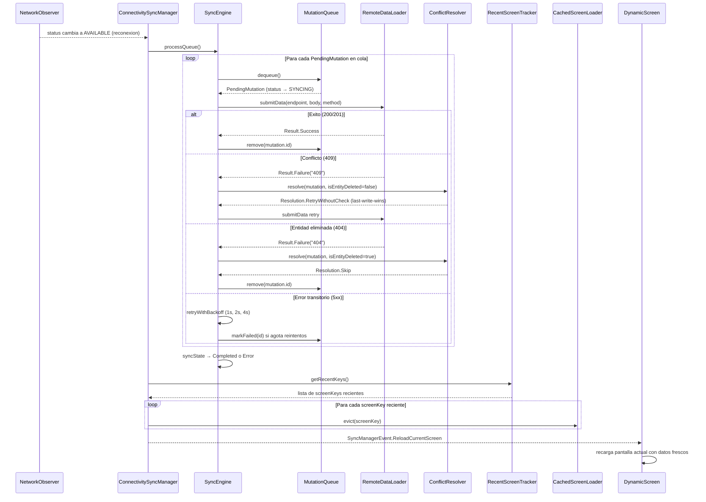
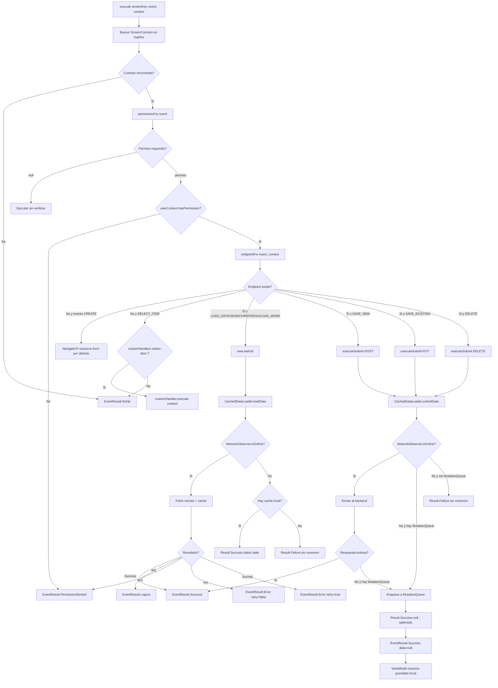
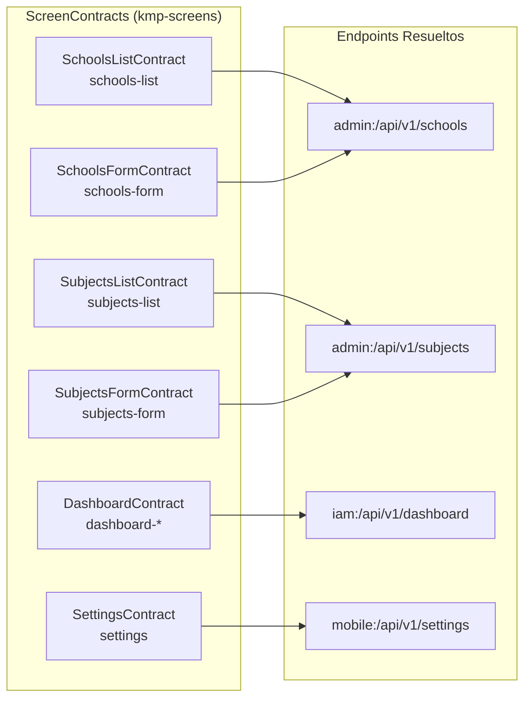
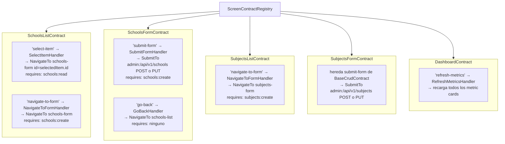
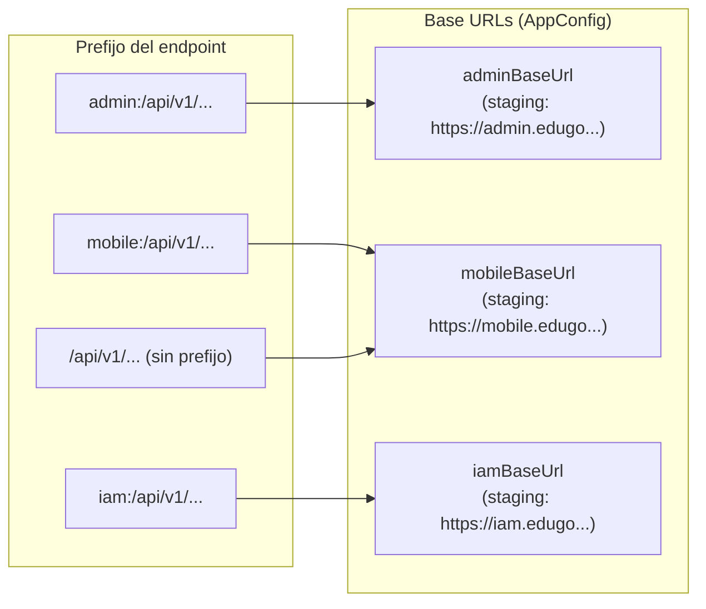

# 04 — Acciones de la UI (ScreenEvent + EventOrchestrator)

## Clases Involucradas

---

## Flujo Secuencial: Evento de Carga de Datos (LOAD_DATA)

---

## Flujo Secuencial: Guardar Formulario (FORM SAVE)

---

## Flujo: Sincronizacion al Reconectar

---

## Decision Tree del EventOrchestrator

---

## Contratos Existentes y sus Endpoints

---

## Custom Event Handlers Registrados

---

## Routing de Prefijos de API

---

## Componentes Offline en la UI

### ConnectivityBanner

Componente visual que se muestra encima del contenido cuando hay situaciones offline o sincronizacion en curso:

| Estado | Color fondo | Texto | Indicador |
|--------|-------------|-------|-----------|
| Sin conexion | Amber (#FFF3E0) | "Sin conexión - usando datos guardados" | Texto naranja |
| Sincronizando | Azul (#E3F2FD) | "Sincronizando N/M..." | CircularProgressIndicator + texto azul |
| Pendientes (online) | Azul (#E3F2FD) | "Sincronizando N cambios pendientes..." | Texto azul |

### StaleDataIndicator

Se muestra cuando `CachedDataResult.isStale = true`, indicando que los datos vienen de cache y pueden no estar actualizados.

### MutationQueue

- Persiste en `SafeEduGoStorage` con key `offline.queue.mutations`
- Maximo 50 mutaciones encoladas
- Detecta duplicados por hash `endpoint|method|body`
- Estados: `PENDING` → `SYNCING` → (removido si exito) / `FAILED` / `CONFLICTED`
- `pendingCount: StateFlow<Int>` alimenta el ConnectivityBanner

### ConflictResolver

Estrategia actual: **last-write-wins**
- Conflicto 409: reintenta sin verificacion de `updated_at`
- Entidad eliminada 404: skip (descarta la mutacion)
- Emite eventos para observabilidad: `Resolved`, `EntityDeleted`, `Failed`

---

## Diferencias por Plataforma

| Aspecto | Android | iOS | Desktop | WasmJS |
|---------|---------|-----|---------|--------|
| Coroutines scope | `viewModelScope` (Android lifecycle) | Custom scope en `ScreenModel` | Custom scope | Custom scope |
| Dispatch de eventos | Main thread via `Dispatchers.Main` | Main thread via `Dispatchers.Main` | Main thread via `Dispatchers.Main` | `Dispatchers.Main` (single thread) |
| Manejo de Back en FORM | Boton back fisico → `onBack()` | Gesture o boton toolbar → `onBack()` | Alt+← o boton toolbar | Boton toolbar |
| Snackbar de exito | `SnackbarHostState` Material3 | `SnackbarHostState` Material3 | `SnackbarHostState` Material3 | `SnackbarHostState` Material3 |
| NetworkObserver | ConnectivityManager callback | NWPathMonitor | HTTP health-check polling | navigator.onLine + eventos |
| Storage offline | SharedPreferences via Settings | NSUserDefaults via Settings | Java Preferences | localStorage |

---

## Mejoras Propuestas

| Mejora | Justificacion | Estado |
|--------|--------------|--------|
| ~~Transacciones locales~~ | ~~Para SAVE_NEW/SAVE_EXISTING, guardar borrador local y sincronizar cuando haya red~~ | **HECHO** - MutationQueue + SyncEngine + ConnectivitySyncManager |
| Undo despues de DELETE | Mostrar Snackbar con opcion "Deshacer" (patron Material 3) | Pendiente |
| Optimistic UI en SAVE | Actualizar lista inmediatamente, revertir si falla | Parcial - form saves offline retornan exito optimistico, pero la lista no muestra el item nuevo hasta sincronizar |
| Event Bus para cross-screen | Cuando una pantalla guarda datos, notificar a otras pantallas que tienen cache invalidada | Pendiente |
| Feedback de progreso en DELETE | Actualmente no hay indicador visual mientras se procesa el DELETE | Pendiente |
| Validacion client-side en FORM | Antes de llamar al backend, validar campos `required`, tipos, longitudes | Pendiente |
