# 04 — Acciones de la UI (ScreenEvent + EventOrchestrator)

## Clases Involucradas

```mermaid
classDiagram
    class ScreenEvent {
        <<enum>>
        LOAD_DATA
        SAVE_NEW
        SAVE_EXISTING
        DELETE
        SEARCH
        SELECT_ITEM
        REFRESH
        LOAD_MORE
        CREATE
    }
    class EventContext {
        +screenKey: String
        +userContext: UserContext?
        +fieldValues: Map~String,String~
        +params: Map~String,String~
        +query: String?
        +itemId: String?
        +selectedItem: JsonObject?
    }
    class EventResult {
        <<sealed>>
        +Success(message, data)
        +NavigateTo(screenKey, params)
        +Error(message, retry)
        +PermissionDenied
        +Logout
        +Cancelled
        +NoOp
        +SubmitTo(endpoint, method, fieldValues)
    }
    class ScreenContract {
        <<interface>>
        +screenKey: String
        +resource: String
        +endpointFor(event, context): String?
        +permissionFor(event): String?
        +dataConfig(): DataConfig?
        +customEventHandlers(): Map~String,CustomEventHandler~
    }
    class BaseCrudContract {
        <<abstract>>
        +apiPrefix: String
        +basePath: String
        +endpointFor() default impl
        +permissionFor() default impl
    }
    class ScreenContractRegistry {
        -contracts: Map~String,ScreenContract~
        +register(contract)
        +find(screenKey): ScreenContract?
    }
    class EventOrchestrator {
        -registry: ScreenContractRegistry
        -dataLoader: CachedDataLoader
        -userContextProvider: () -> UserContext?
        +execute(key, event, context): EventResult
        +executeCustom(key, eventId, context): EventResult
    }
    class CustomEventHandler {
        <<interface>>
        +eventId: String
        +requiredPermission: String?
        +execute(context): EventResult
    }
    class NetworkObserver {
        <<interface>>
        +status: StateFlow~NetworkStatus~
        +isOnline: Boolean
        +start()
        +stop()
    }
    class MutationQueue {
        -storage: SafeEduGoStorage
        -mutations: MutableList~PendingMutation~
        +pendingCount: StateFlow~Int~
        +enqueue(mutation): Boolean
        +dequeue(): PendingMutation?
        +markFailed(id)
        +markConflicted(id)
        +remove(id)
        +getAll(): List~PendingMutation~
    }
    class SyncEngine {
        -mutationQueue: MutationQueue
        -remoteDataLoader: DataLoader
        -networkObserver: NetworkObserver
        -conflictResolver: ConflictResolver
        +syncState: StateFlow~SyncState~
        +start(scope)
        +processQueue()
    }
    class ConnectivitySyncManager {
        -syncEngine: SyncEngine
        -recentScreenTracker: RecentScreenTracker
        -screenLoader: CachedScreenLoader
        +events: SharedFlow~SyncManagerEvent~
        +start(scope)
    }

    ScreenContract <|-- BaseCrudContract
    ScreenContract <|-- BaseDashboardContract
    BaseCrudContract <|-- SchoolsListContract
    BaseCrudContract <|-- SchoolsFormContract
    BaseCrudContract <|-- SubjectsListContract
    BaseCrudContract <|-- SubjectsFormContract
    BaseCrudContract <|-- UsersListContract
    BaseCrudContract <|-- UnitsListContract
    BaseCrudContract <|-- MembershipsListContract
    BaseCrudContract <|-- MaterialsListContract
    BaseCrudContract <|-- AssessmentsListContract
    BaseCrudContract <|-- RolesListContract
    BaseCrudContract <|-- PermissionsListContract
    ScreenContract <|-- SchoolCrudContract
    ScreenContract <|-- UserCrudContract
    ScreenContract <|-- UnitCrudContract
    ScreenContract <|-- MembershipAddContract
    ScreenContract <|-- MaterialCreateContract
    ScreenContract <|-- MaterialEditContract
    ScreenContract <|-- MaterialDetailContract
    ScreenContract <|-- AssessmentTakeContract
    ScreenContract <|-- LoginContract
    ScreenContract <|-- SettingsContract
    ScreenContract <|-- GuardianContract
    BaseDashboardContract <|-- DashboardSuperadminContract
    BaseDashboardContract <|-- DashboardSchooladminContract
    BaseDashboardContract <|-- DashboardTeacherContract
    BaseDashboardContract <|-- DashboardStudentContract
    BaseDashboardContract <|-- DashboardGuardianContract
    BaseDashboardContract <|-- ProgressDashboardContract
    BaseDashboardContract <|-- StatsDashboardContract
    ScreenContractRegistry "1" --> "*" ScreenContract
    EventOrchestrator --> ScreenContractRegistry
    EventOrchestrator --> EventResult : produce
    EventOrchestrator --> CachedDataLoader : delega submit/load
    ScreenContract --> ScreenEvent : mapea
    ScreenContract --> CustomEventHandler : registra
    CachedDataLoader --> NetworkObserver : consulta isOnline
    CachedDataLoader --> MutationQueue : enqueue offline
    SyncEngine --> MutationQueue : procesa cola
    SyncEngine --> NetworkObserver : detecta reconexion
    ConnectivitySyncManager --> SyncEngine : dispara sync
```



---

## Flujo Secuencial: Evento de Carga de Datos (LOAD_DATA)


---

## Flujo Secuencial: Guardar Formulario (FORM SAVE)


---

## Flujo: Sincronizacion al Reconectar


---

## Decision Tree del EventOrchestrator


---

## Catalogo Completo de ScreenContracts (30+ implementados)

### Contracts de Auth y Settings

| Contract | screenKey | Custom Events | Permisos |
|----------|-----------|---------------|----------|
| `LoginContract` | `app-login` | `submit-login` → `authService.login(credentials)` → NavigateTo dashboard | Ninguno |
| `SettingsContract` | `app-settings` | `logout` → `authService.logout()` → Logout; `navigate-back` → NavigateTo back; `theme-toggle` → Success | Ninguno |

### Contracts de Dashboard (7, heredan de BaseDashboardContract)

| Contract | screenKey | Endpoint de datos |
|----------|-----------|-------------------|
| `DashboardSuperadminContract` | `dashboard-superadmin` | `admin:/api/v1/stats/global` |
| `DashboardSchooladminContract` | `dashboard-schooladmin` | `admin:/api/v1/stats/global` |
| `DashboardTeacherContract` | `dashboard-teacher` | `/api/v1/stats/global` |
| `DashboardStudentContract` | `dashboard-student` | `/api/v1/stats/student` |
| `DashboardGuardianContract` | `dashboard-guardian` | `/api/v1/guardians/me/stats` |
| `ProgressDashboardContract` | `progress-dashboard` | `/api/v1/stats/progress` |
| `StatsDashboardContract` | `stats-dashboard` | `admin:/api/v1/stats/global` |

### Contracts de CRUD (heredan de BaseCrudContract o ScreenContract)

| Contract | screenKey(s) | Recurso | API Prefix | Custom Events |
|----------|-------------|---------|------------|---------------|
| `SchoolsListContract` | `schools-list` | schools | admin: | — (hereda BaseCrudContract) |
| `SchoolsFormContract` | `schools-form` | schools | admin: | — (hereda BaseCrudContract) |
| `SchoolCrudContract` | `school-create`, `school-edit` | schools | admin: | `submit-form` → POST/PUT `/api/v1/schools` → NavigateTo school-detail |
| `UsersListContract` | `users-list` | users | admin: | `select-item` → NavigateTo user-detail con id |
| `UserCrudContract` | `user-create`, `user-edit` | users | admin: | `submit-form` → POST/PUT `/api/v1/users` con validacion (first_name, last_name, email) |
| `SubjectsListContract` | `subjects-list` | subjects | admin: | — |
| `SubjectsFormContract` | `subjects-form` | subjects | admin: | — |
| `UnitsListContract` | `units-list` | academic_units | admin: | Endpoint anidado: `/api/v1/schools/{schoolId}/units` |
| `UnitCrudContract` | `unit-create`, `unit-edit` | academic_units | admin: | `submit-form` → POST/PUT anidado bajo school |
| `MembershipsListContract` | `memberships-list` | memberships | admin: | Filtro por `unit_id` via params |
| `MembershipAddContract` | `membership-add` | memberships | admin: | `submit-form` → POST con user_email + role |
| `MaterialsListContract` | `materials-list` | materials | (ninguno) | — |
| `MaterialCreateContract` | `material-create` | materials | (ninguno) | `submit-form` → POST `/api/v1/materials` |
| `MaterialEditContract` | `material-edit` | materials | (ninguno) | `submit-form` → PUT `/api/v1/materials/{id}` |
| `MaterialDetailContract` | `material-detail` | materials | (ninguno) | — (solo LOAD_DATA) |
| `AssessmentsListContract` | `assessments-list` | assessments | (ninguno) | — |
| `AssessmentTakeContract` | `assessment-take` | assessments | (ninguno) | `submit-assessment` → valida answers → Success |
| `RolesListContract` | `roles-list` | roles | iam: | — (solo lectura) |
| `PermissionsListContract` | `permissions-list` | permissions_mgmt | iam: | — (solo lectura) |
| `GuardianContract` | `children-list`, `child-progress` | progress | (ninguno) | Resuelve endpoint segun screenKey |

### Instanciacion por DI (Koin named qualifiers)

Contracts que se instancian multiples veces con distinto `screenKey` usan `named()`:

```kotlin
single(named("user-create")) { UserCrudContract("user-create", get()) }
single(named("user-edit"))   { UserCrudContract("user-edit", get()) }
single(named("school-create")) { SchoolCrudContract("school-create", get()) }
single(named("school-edit"))   { SchoolCrudContract("school-edit", get()) }
single(named("unit-create"))   { UnitCrudContract("unit-create", get()) }
single(named("unit-edit"))     { UnitCrudContract("unit-edit", get()) }
single(named("children-list"))   { GuardianContract("children-list") }
single(named("child-progress"))  { GuardianContract("child-progress") }
```

---

## Routing de Prefijos de API


---

## Componentes Offline en la UI

### ConnectivityBanner

Componente visual que se muestra encima del contenido cuando hay situaciones offline o sincronizacion en curso:

| Estado | Color fondo | Texto | Indicador |
|--------|-------------|-------|-----------|
| Sin conexion | Amber (#FFF3E0) | "Sin conexión - usando datos guardados" | Texto naranja |
| Sincronizando | Azul (#E3F2FD) | "Sincronizando N/M..." | CircularProgressIndicator + texto azul |
| Pendientes (online) | Azul (#E3F2FD) | "Sincronizando N cambios pendientes..." | Texto azul |

### StaleDataIndicator

Se muestra cuando `CachedDataResult.isStale = true`, indicando que los datos vienen de cache y pueden no estar actualizados.

### MutationQueue

- Persiste en `SafeEduGoStorage` con key `offline.queue.mutations`
- Maximo 50 mutaciones encoladas
- Detecta duplicados por hash `endpoint|method|body`
- Estados: `PENDING` → `SYNCING` → (removido si exito) / `FAILED` / `CONFLICTED`
- `pendingCount: StateFlow<Int>` alimenta el ConnectivityBanner

### ConflictResolver

Estrategia actual: **last-write-wins**
- Conflicto 409: reintenta sin verificacion de `updated_at`
- Entidad eliminada 404: skip (descarta la mutacion)
- Emite eventos para observabilidad: `Resolved`, `EntityDeleted`, `Failed`

---

## Diferencias por Plataforma

| Aspecto | Android | iOS | Desktop | WasmJS |
|---------|---------|-----|---------|--------|
| Coroutines scope | `viewModelScope` (Android lifecycle) | Custom scope en `ScreenModel` | Custom scope | Custom scope |
| Dispatch de eventos | Main thread via `Dispatchers.Main` | Main thread via `Dispatchers.Main` | Main thread via `Dispatchers.Main` | `Dispatchers.Main` (single thread) |
| Manejo de Back en FORM | Boton back fisico → `onBack()` | Gesture o boton toolbar → `onBack()` | Alt+← o boton toolbar | Boton toolbar |
| Snackbar de exito | `SnackbarHostState` Material3 | `SnackbarHostState` Material3 | `SnackbarHostState` Material3 | `SnackbarHostState` Material3 |
| NetworkObserver | ConnectivityManager callback | NWPathMonitor | HTTP health-check polling | navigator.onLine + eventos |
| Storage offline | SharedPreferences via Settings | NSUserDefaults via Settings | Java Preferences | localStorage |

---

## Mejoras Propuestas

| Mejora | Justificacion | Estado |
|--------|--------------|--------|
| ~~Transacciones locales~~ | ~~Para SAVE_NEW/SAVE_EXISTING, guardar borrador local y sincronizar cuando haya red~~ | **HECHO** - MutationQueue + SyncEngine + ConnectivitySyncManager |
| Undo despues de DELETE | Mostrar Snackbar con opcion "Deshacer" (patron Material 3) | Pendiente |
| Optimistic UI en SAVE | Actualizar lista inmediatamente, revertir si falla | Parcial - form saves offline retornan exito optimistico, pero la lista no muestra el item nuevo hasta sincronizar |
| Event Bus para cross-screen | Cuando una pantalla guarda datos, notificar a otras pantallas que tienen cache invalidada | Pendiente |
| Feedback de progreso en DELETE | Actualmente no hay indicador visual mientras se procesa el DELETE | Pendiente |
| Validacion client-side en FORM | Antes de llamar al backend, validar campos `required`, tipos, longitudes | Parcial — CrudContracts (UserCrud, SchoolCrud, UnitCrud, MembershipAdd, MaterialCreate/Edit) ya validan campos obligatorios en el handler; falta validacion generica desde metadata del slot |
| SubmitForm type conversion | Convertir tipos en el body: numbers → JsonPrimitive(int/double), booleans → JsonPrimitive(bool) | **HECHO** — `DynamicScreenViewModel.submitForm()` convierte automaticamente |
