# 05 — Almacenamiento Local

## Clases Involucradas

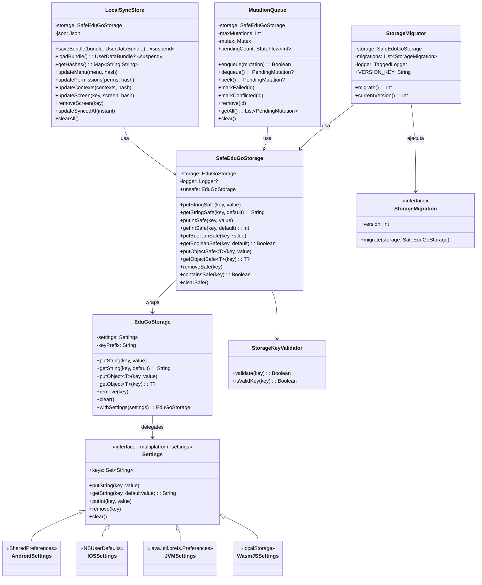

---

## Jerarquia de Wrappers

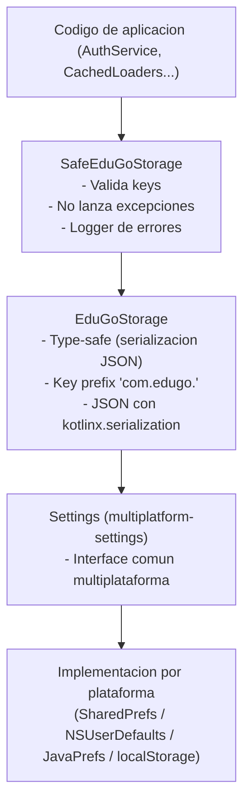

---

## Keys de Almacenamiento: Mapa Completo

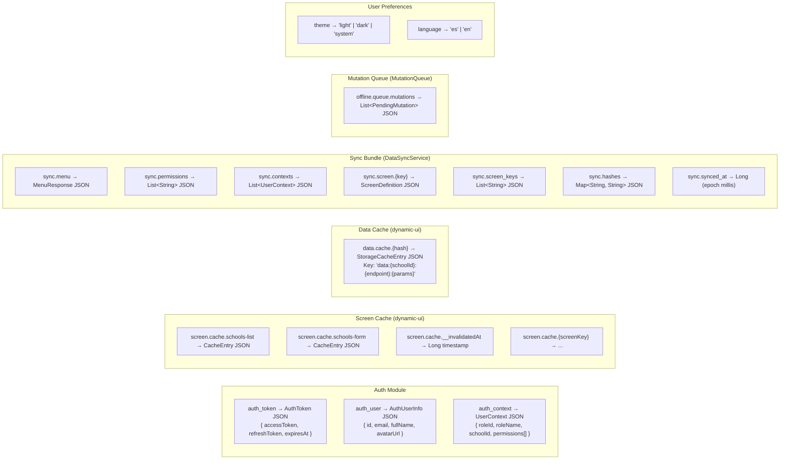

---

## Flujo de Escritura Segura

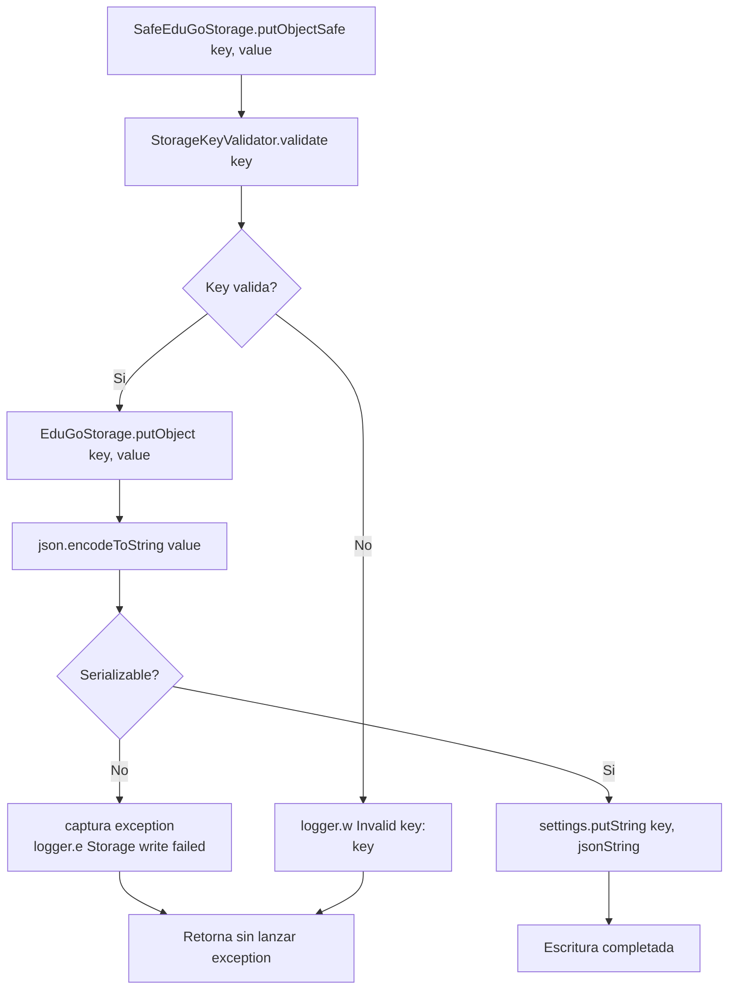

---

## Flujo de Lectura con Fallback

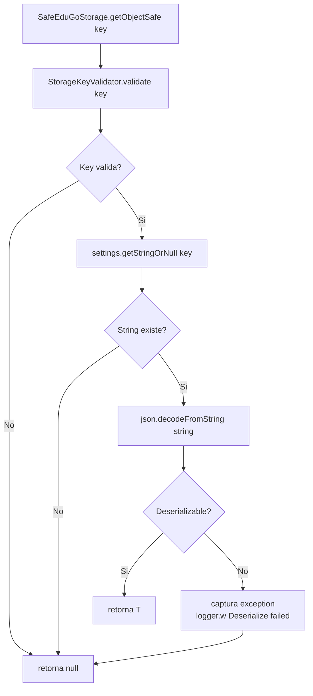

---

## Estrategia de Cache: Multinivel

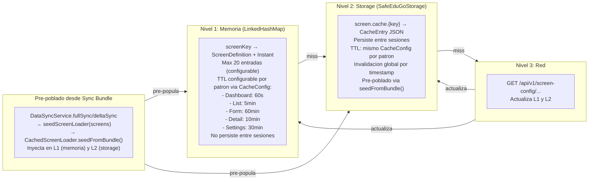

**Nota sobre CacheConfig:** Los TTLs son configurables por patron (`ScreenPattern`) y tambien por `screenKey` individual via `screenTtlOverrides` y `dataTtlOverrides`. El data cache tiene los mismos TTLs por defecto que el screen cache. El maximo de entradas en memoria es configurable: `maxScreenMemoryEntries = 20`, `maxDataMemoryEntries = 30`.

---

## LocalSyncStore: Flujo de Guardado y Carga

### Guardado del Bundle (fullSync)

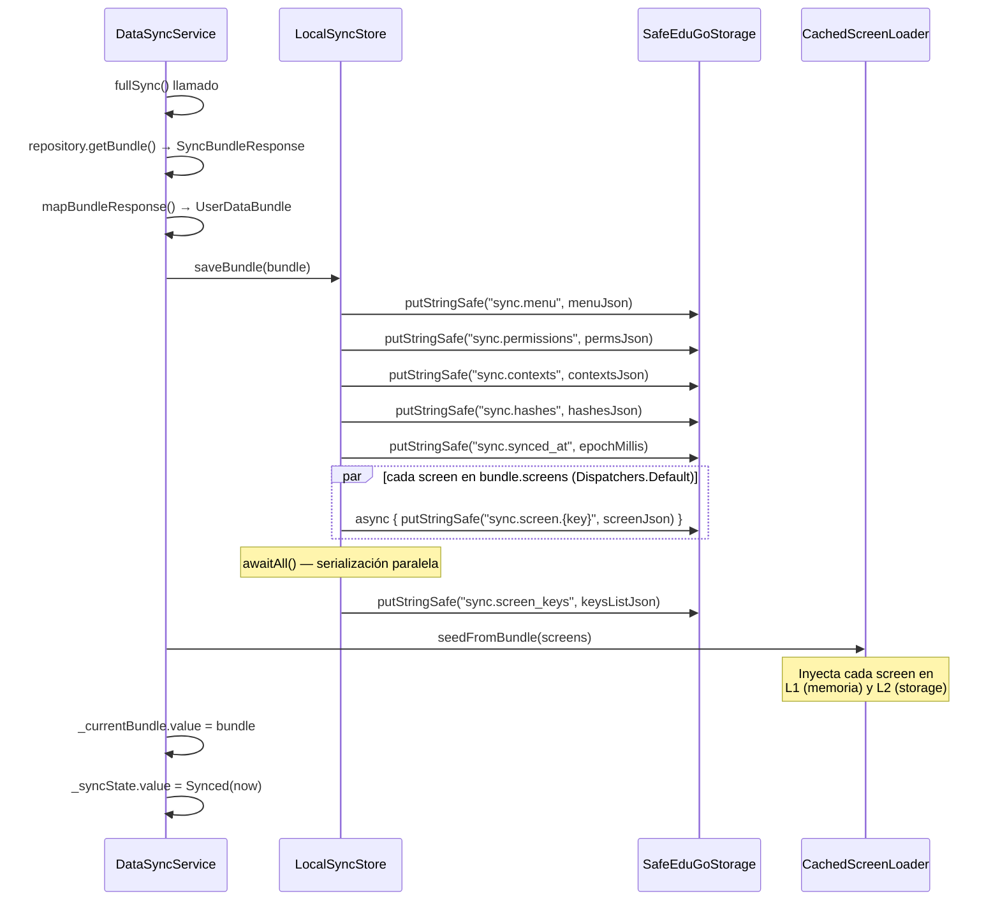

### Carga del Bundle (restoreFromLocal)

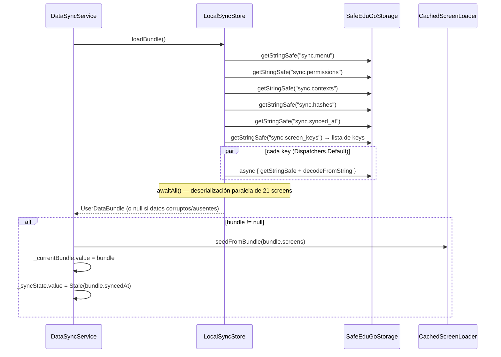

### Delta Sync (actualizacion parcial)

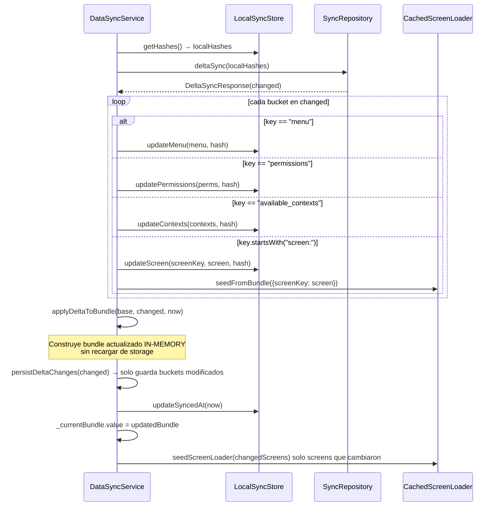

---

## Invalidacion de Cache

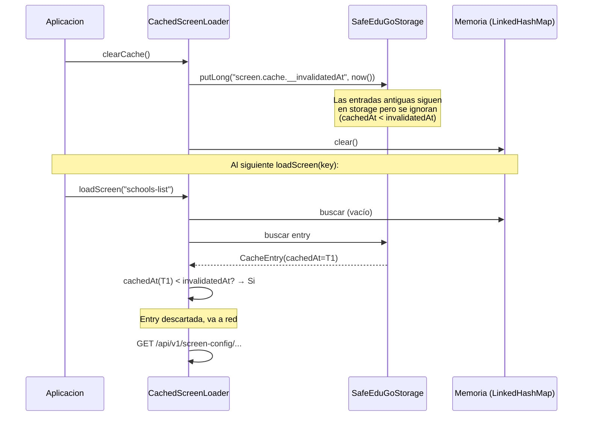

---

## MutationQueue: Flujo Offline

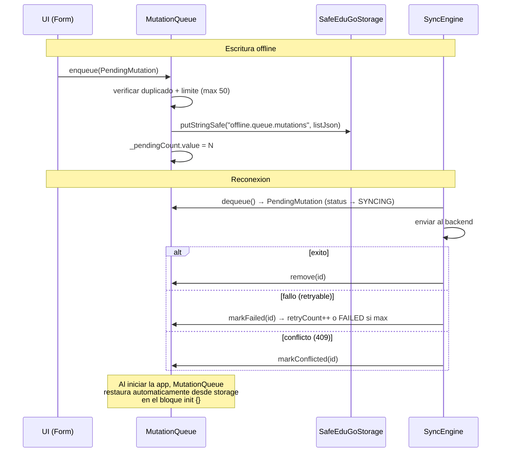

---

## Implementaciones por Plataforma

### Android — SharedPreferences

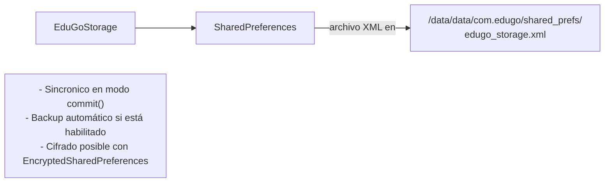

### iOS — NSUserDefaults

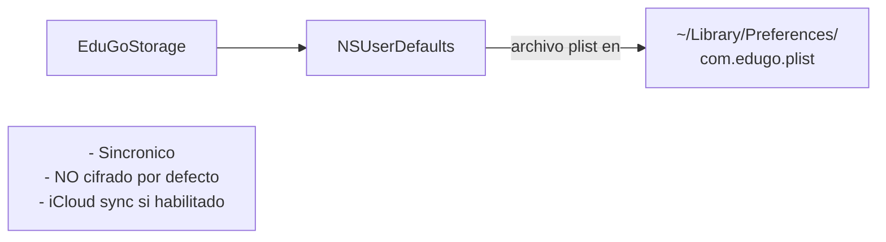

### Desktop — java.util.prefs

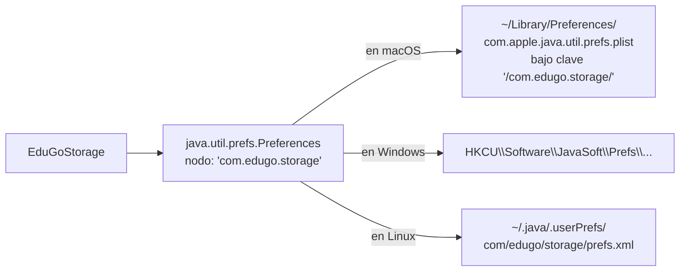

### WasmJS — localStorage

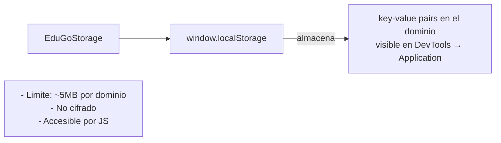

---

## Tabla Comparativa por Plataforma

| Aspecto | Android | iOS | Desktop macOS | Desktop Windows | WasmJS |
|---------|---------|-----|---------------|-----------------|--------|
| Mecanismo | SharedPreferences | NSUserDefaults | Java Preferences (plist) | Java Preferences (Registry) | localStorage |
| Cifrado nativo | No (EncryptedSharedPrefs opcional) | No (Keychain es separado) | No | No | No |
| Limite de datos | Sin límite práctico | Sin límite práctico | Sin límite práctico | Sin límite práctico | ~5MB |
| Sincronía | Asíncrono (apply) / Síncrono (commit) | Asíncrono | Síncrono | Síncrono | Síncrono |
| Backup automático | Si (Android Backup) | Si (iCloud si configurado) | No | No | No |
| Persistencia entre updates | Si (mismo package) | Si (mismo bundle ID) | Si (mismo preference node) | Si (mismo node) | Si (mismo origen) |
| Accesible sin root | No (solo la app) | No (solo la app) | Si (legible por usuario) | Si (legible por usuario) | Si (via DevTools) |

---

## Mejoras Propuestas

| Mejora | Justificacion | Prioridad | Estado |
|--------|--------------|-----------|--------|
| TTL configurable por pantalla | Algunas pantallas cambian con mas frecuencia que otras (dashboards vs forms) | Media | **HECHO** - CacheConfig implementado con TTLs por ScreenPattern |
| Limite de cache de datos configurable | `MAX_DATA_CACHE_ENTRIES = 30` esta hardcodeado | Media | **HECHO** - CacheConfig tiene `maxDataMemoryEntries` y TTLs por patron |
| Migracion de keys | Al cambiar nombres de keys, los datos existentes se pierden silenciosamente | Media | **HECHO** - `StorageMigrator` + `StorageMigration` implementados (ver seccion abajo) |
| Cifrar tokens en Android Keystore | Los JWT en SharedPrefs son legibles con ADB backup | Alta | Pendiente |
| Cifrar tokens en iOS Keychain | NSUserDefaults es legible en dispositivos con backup | Alta | Pendiente |
| Encriptar toda la cache | Los datos de listas (nombres de alumnos, escuelas) estan en plain text en storage | Alta | Pendiente |
| Compresion de cache grande | Pantallas complejas con muchos slots pueden generar JSON de varios KB | Baja | Pendiente |

---

## StorageMigrator (Implementado)

Sistema de migraciones de esquema para storage local. Permite transformar datos almacenados cuando cambia la estructura de keys o formatos.

### Arquitectura

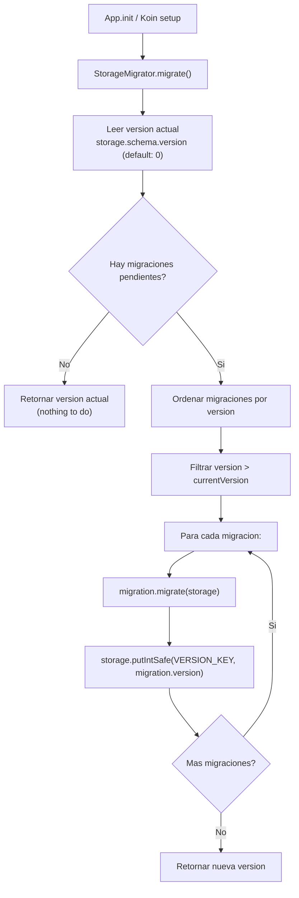

### API

```kotlin
// Definir una migracion
class MigrationV2 : StorageMigration {
    override val version = 2
    override fun migrate(storage: SafeEduGoStorage) {
        // Renombrar key
        val old = storage.getStringSafe("old_key")
        if (old.isNotEmpty()) {
            storage.putStringSafe("new_key", old)
            storage.removeSafe("old_key")
        }
    }
}

// Ejecutar migraciones
val migrator = StorageMigrator(
    storage = safeStorage,
    migrations = listOf(MigrationV2(), MigrationV3())
)
val newVersion = migrator.migrate() // ejecuta solo las pendientes
```

### Caracteristicas

- **Crash-safe**: cada migracion persiste su version inmediatamente despues de completarse. Si la app crashea a mitad de una migracion, al reiniciar continua desde la ultima completada.
- **Idempotente**: `migrate()` se puede llamar multiples veces; solo ejecuta migraciones con version mayor a la almacenada.
- **Logging**: emite logs de progreso via `TaggedLogger` (`EduGo.Storage.Migrator`).
- **Key de version**: `storage.schema.version` en `SafeEduGoStorage`. |
