# 06 — Conexion a Endpoints

## Clases Involucradas

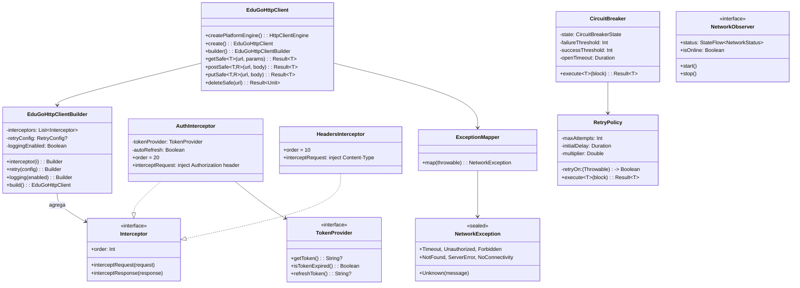

---

## Flujo Secuencial: Request HTTP Autenticado

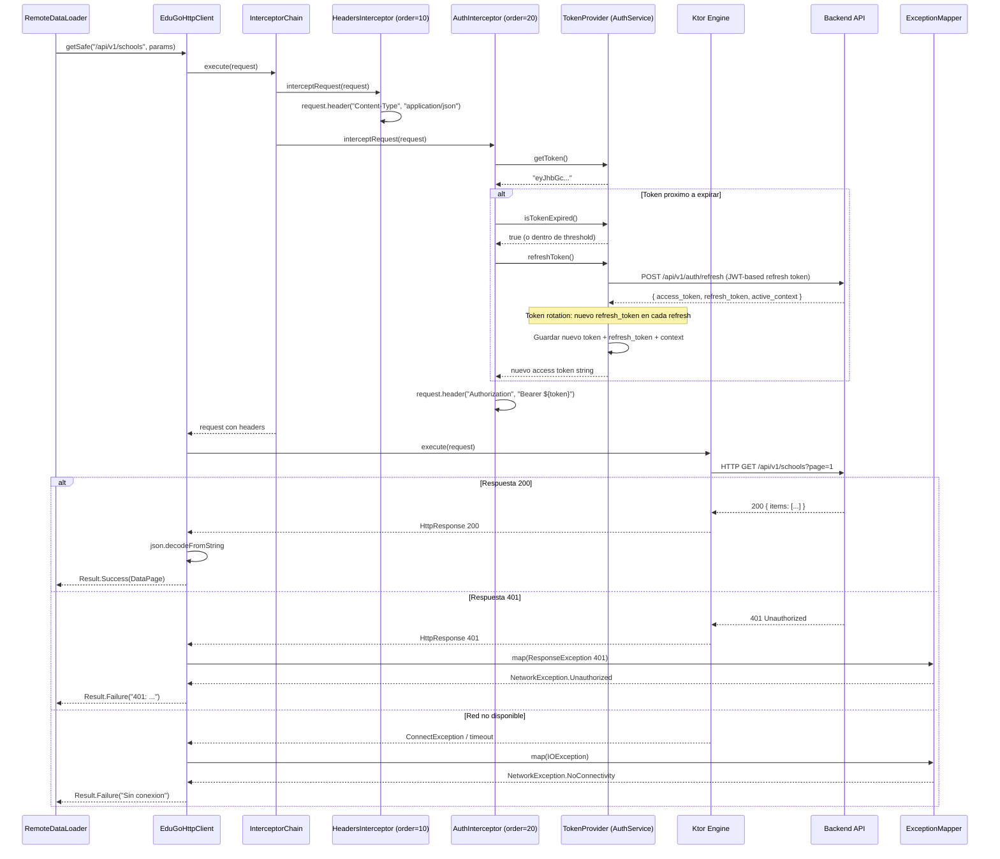

---

## Endpoints de Sincronizacion (Sync Bundle)

El sistema de sincronizacion centraliza la descarga de datos del usuario (menu, permisos, pantallas, contextos) en un unico bundle via el IAM Platform API.

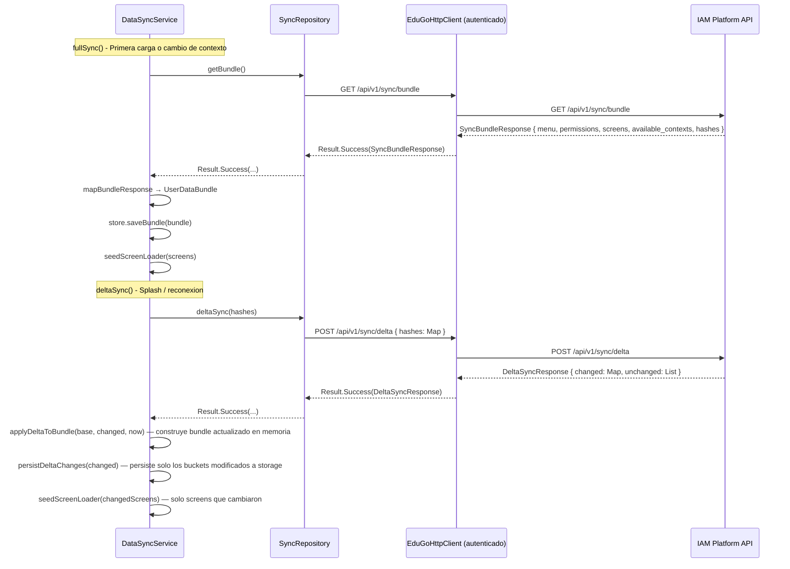

### Endpoints de sync registrados

| Endpoint | Metodo | API | Descripcion |
|----------|--------|-----|-------------|
| `/api/v1/sync/bundle` | GET | IAM Platform | Bundle completo: menu, permisos, screens, contextos disponibles, hashes por bucket |
| `/api/v1/sync/delta` | POST | IAM Platform | Sync delta: envia `{ hashes: Map<String, String> }` con hashes locales. Retorna solo buckets que cambiaron |
| `/screen-config/version/{key}` | GET | IAM Platform | Verificacion ligera de version de un screen (retorna version + updatedAt) |

### Parametros de los endpoints de sync

#### GET `/api/v1/sync/bundle`
| Header | Tipo | Requerido | Descripcion |
|--------|------|:---------:|-------------|
| `Authorization` | `Bearer {jwt}` | Si | Token JWT del usuario autenticado |

**Respuesta:** `SyncBundleResponse`
```json
{
  "menu": [
    { "name": "Escuelas", "icon": "school", "screen_key": "schools-list", "permissions": ["schools.read"], "children": [] }
  ],
  "permissions": ["schools.read", "schools.write", "students.read"],
  "screens": {
    "schools-list": {
      "screen_key": "schools-list",
      "screen_name": "Lista de Escuelas",
      "pattern": "list",
      "version": 3,
      "template": { "zones": ["..."] },
      "slot_data": { "page_title": "Escuelas" },
      "data_config": { "endpoint": "admin:/api/v1/schools", "field_mapping": {}, "pagination": {} },
      "handler_key": "schools",
      "updated_at": "2026-02-25T10:30:00Z"
    }
  },
  "available_contexts": [
    { "role_id": "uuid", "role_name": "admin", "school_id": "uuid", "school_name": "Colegio ABC", "permissions": ["..."] }
  ],
  "hashes": {
    "menu": "a1b2c3...",
    "permissions": "d4e5f6...",
    "screen:schools-list": "g7h8i9...",
    "available_contexts": "j0k1l2..."
  }
}
```

**Nota:** El backend construye el bundle en paralelo (errgroup de Go) con 4 goroutines: menu, permisos, contextos, y screens. Las screens se resuelven secuencialmente dentro de su goroutine.

#### POST `/api/v1/sync/delta`
| Header | Tipo | Requerido | Descripcion |
|--------|------|:---------:|-------------|
| `Authorization` | `Bearer {jwt}` | Si | Token JWT del usuario autenticado |

**Request body:**
```json
{
  "hashes": {
    "menu": "a1b2c3...",
    "permissions": "d4e5f6...",
    "screen:schools-list": "g7h8i9...",
    "screen:schools-form": "m3n4o5...",
    "available_contexts": "j0k1l2..."
  }
}
```

**Respuesta:** `DeltaSyncResponse`
```json
{
  "changed": {
    "menu": {
      "data": [{ "name": "Escuelas" }],
      "hash": "x1y2z3..."
    },
    "screen:schools-list": {
      "data": { "screen_key": "schools-list", "pattern": "list" },
      "hash": "p6q7r8..."
    }
  },
  "unchanged": ["permissions", "available_contexts", "screen:schools-form"]
}
```

**Nota:** Solo retorna en `changed` los buckets cuyo hash difiere. El servidor recalcula el bundle completo internamente y compara hashes SHA256.

#### GET `/api/v1/screen-config/version/{screenKey}`
| Header | Tipo | Requerido | Descripcion |
|--------|------|:---------:|-------------|
| `Authorization` | `Bearer {jwt}` | Si | Token JWT del usuario autenticado |

| Path param | Tipo | Descripcion |
|------------|------|-------------|
| `screenKey` | `String` | Clave unica del screen (ej: `schools-list`) |

**Respuesta:**
```json
{
  "version": 3,
  "updated_at": "2026-02-25T10:30:00Z"
}
```

### Modelo de respuesta del bundle

```
SyncBundleResponse {
    menu: List<MenuItem>           // Items del menu lateral
    permissions: List<String>      // Permisos del contexto activo (ej: "schools.read")
    screens: Map<String, ScreenBundleEntry>  // Clave = screenKey
    available_contexts: List<UserContext>     // Escuelas/roles disponibles
    hashes: Map<String, String>              // Hash por bucket para delta sync
}
```

---

## Calculo de Hashes: Mecanismo del Delta Sync

El delta sync se basa en comparar hashes SHA256 entre cliente y servidor.
**Los hashes no se persisten en base de datos** — se recalculan en cada request.

### Funciones de hash en el backend (sync_service.go)

```mermaid
flowchart TD
    subgraph hashJSON ["hashJSON(v interface{})"]
        HJ1["json.Marshal(v)"] --> HJ2["sha256.Sum256(bytes)"]
        HJ2 --> HJ3["hex string"]
    end

    subgraph hashPermissions ["hashPermissions(permissions []string)"]
        HP1["sort.Strings(copy)"] --> HP2["strings.Join(sorted, ',')"]
        HP2 --> HP3["sha256.Sum256(joined)"]
        HP3 --> HP4["hex string"]
    end

    subgraph hashScreen ["hashScreen(version int, updatedAt string)"]
        HS1["fmt.Sprintf('%d:%s', version, updatedAt)"]
        HS1 --> HS2["sha256.Sum256(formatted)"]
        HS2 --> HS3["hex string"]
    end
```

### Que hashea cada bucket

| Bucket key | Funcion | Input | Fuente en BD | Determinista? |
|------------|---------|-------|-------------|:---:|
| `menu` | `hashJSON()` | `[]MenuItemDTO` serializado | `iam.resources` con `ORDER BY sort_order` | ✅ |
| `permissions` | `hashPermissions()` | Permisos **ordenados** y unidos por coma | `iam.permissions` via `SELECT DISTINCT` | ✅ (ordena antes) |
| `available_contexts` | `hashJSON()` | `[]UserContextDTO` serializado | `iam.user_roles` **sin ORDER BY** | ❌ |
| `screen:{key}` | `hashScreen()` | `"{version}:{updated_at}"` | `ui_config.screen_templates.version` + `screen_instances.updated_at` | ✅ |

### Flujo del delta sync en el servidor

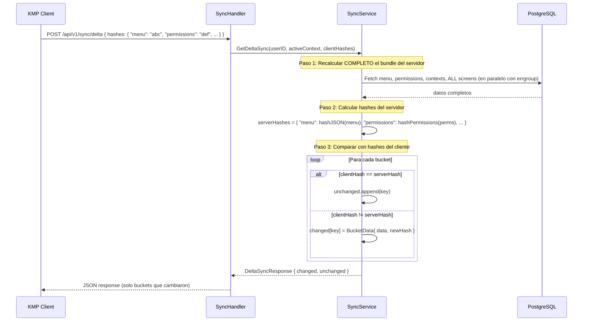

### Cuando cambia un hash (deteccion de cambios)

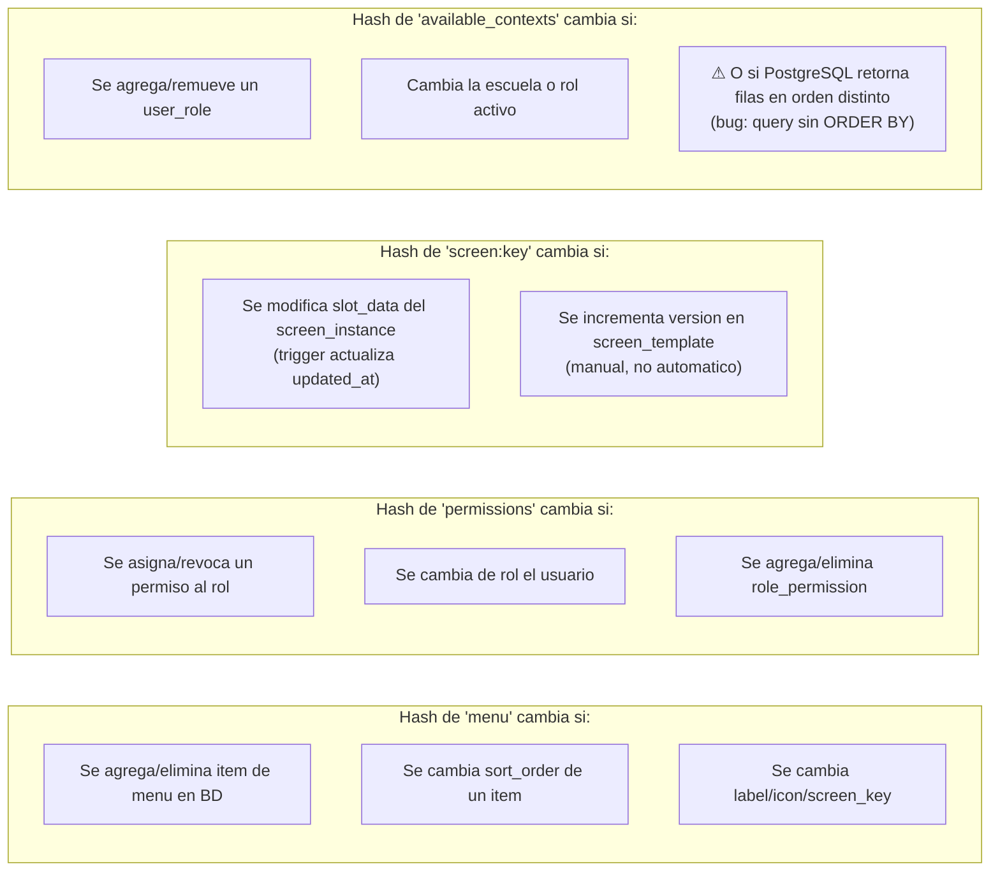

### ⚠ Bug conocido: Hashes no deterministas

El hash de `available_contexts` **no es estable entre reinicios de la API** porque:

1. **`FindByUser()` en user_role_repository** no tiene `ORDER BY` — PostgreSQL puede retornar filas en cualquier orden
2. **`GetUserPermissions()` SQL** usa `SELECT DISTINCT` sin `ORDER BY` — el array de permisos dentro de cada contexto varia
3. **`hashJSON()` no ordena** — serializa el slice tal como llega

**Consecuencia:** tras un reinicio del API (o incluso entre requests), el hash de `available_contexts` puede cambiar sin que los datos hayan cambiado realmente, causando descargas innecesarias en el delta sync.

**Fix requerido (3 cambios de una linea):**

```
1. iam_repositories.go FindByUser():     agregar .Order("id ASC")
2. iam_repositories.go GetUserPermissions(): agregar ORDER BY p.name
3. sync_service.go:  ordenar contexts slice antes de hashJSON()
```

### Nota de rendimiento

El delta sync **no es un delta real a nivel de servidor**: recalcula todo el bundle completo y solo ahorra bandwidth al cliente. Para escalar, considerar:
- Cache de hashes en Redis (Upstash) con TTL de 5 min
- Invalidar cache via evento cuando hay escrituras (POST/PUT/DELETE)
- O persistir hashes en una tabla `sync_hashes(user_id, bucket_key, hash, updated_at)`

---

## Token Refresh: JWT con Rotacion

El sistema de refresh tokens usa tokens JWT (no random base64). Cada refresh genera un nuevo par de tokens.

```mermaid
sequenceDiagram
    participant TRM as TokenRefreshManagerImpl
    participant Repo as AuthRepository
    participant Backend as IAM Platform
    participant Storage as SafeEduGoStorage

    TRM->>TRM: shouldRefresh(token)? → true
    TRM->>Repo: refresh(refreshToken)
    Repo->>Backend: POST /api/v1/auth/refresh { refresh_token: "jwt..." }
    Backend-->>Repo: RefreshResponse { access_token, expires_in, token_type, refresh_token, active_context }
    Repo-->>TRM: Result.Success(RefreshResponse)

    TRM->>TRM: refreshResponse.toAuthToken(existingRefreshToken)
    Note over TRM: Si refresh_token viene en respuesta,<br/>usa el nuevo; si no, mantiene el anterior

    TRM->>Storage: putStringSafe("auth_token", newTokenJson)

    alt active_context presente en respuesta
        TRM->>Storage: putStringSafe("auth_context", contextJson)
    end

    TRM->>TRM: emitir onRefreshSuccess
```

### RefreshResponse — Campos clave

| Campo | Tipo | Descripcion |
|-------|------|-------------|
| `access_token` | `String` | Nuevo JWT de acceso |
| `expires_in` | `Int` | Segundos hasta expiracion |
| `token_type` | `String` | Siempre "Bearer" |
| `refresh_token` | `String?` | **Nuevo refresh token** (rotacion). Si viene, reemplaza al anterior |
| `active_context` | `UserContext?` | Contexto activo actualizado (si hubo cambios server-side) |

---

## NetworkObserver: Conectividad Multiplataforma

`NetworkObserver` esta registrado en `networkModule` via la funcion `createNetworkObserver()` (expect/actual por plataforma).

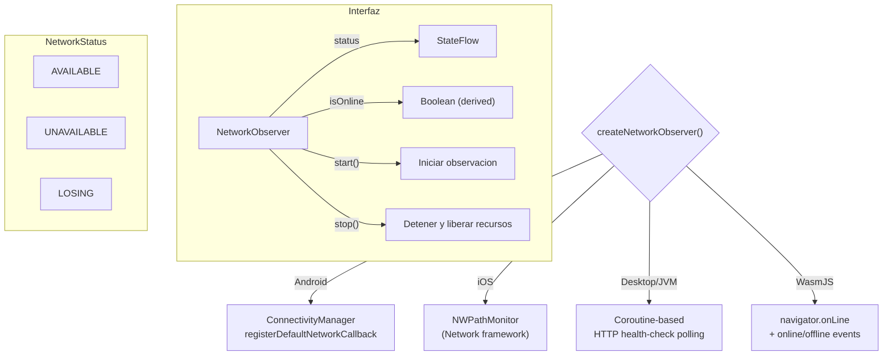

### Registro en DI

```kotlin
// networkModule
single<NetworkObserver> { createNetworkObserver() }
```

Consumidores principales: `CachedScreenLoader`, `CachedDataLoader`, `DynamicScreenViewModel`, `SyncEngine`, `ConnectivitySyncManager`.

---

## Motor HTTP por Plataforma

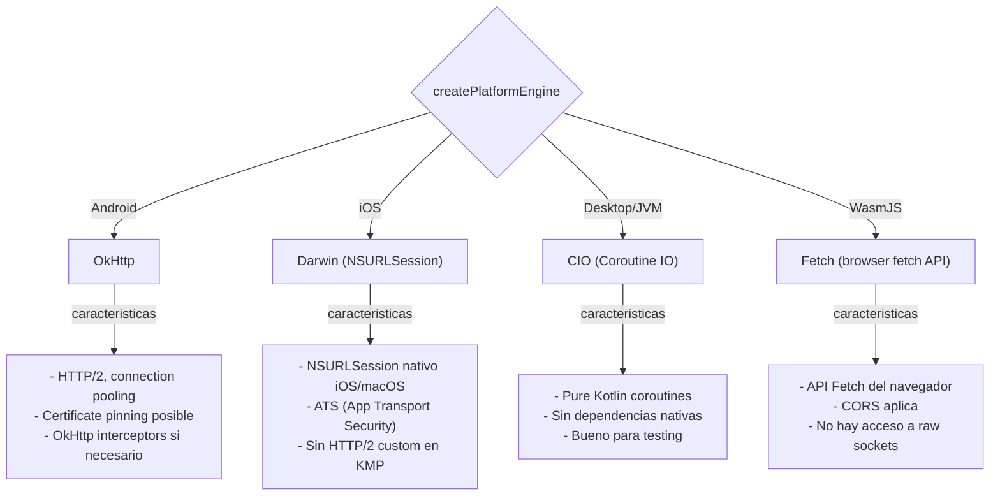

---

## Multi-API Routing: Resolucion de URLs

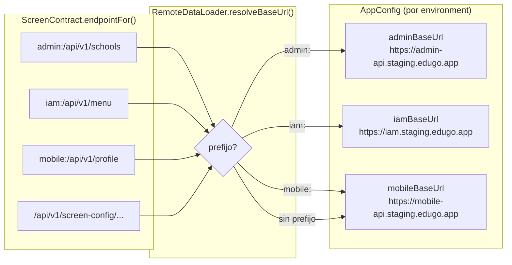

---

## CircuitBreaker: Maquina de Estados

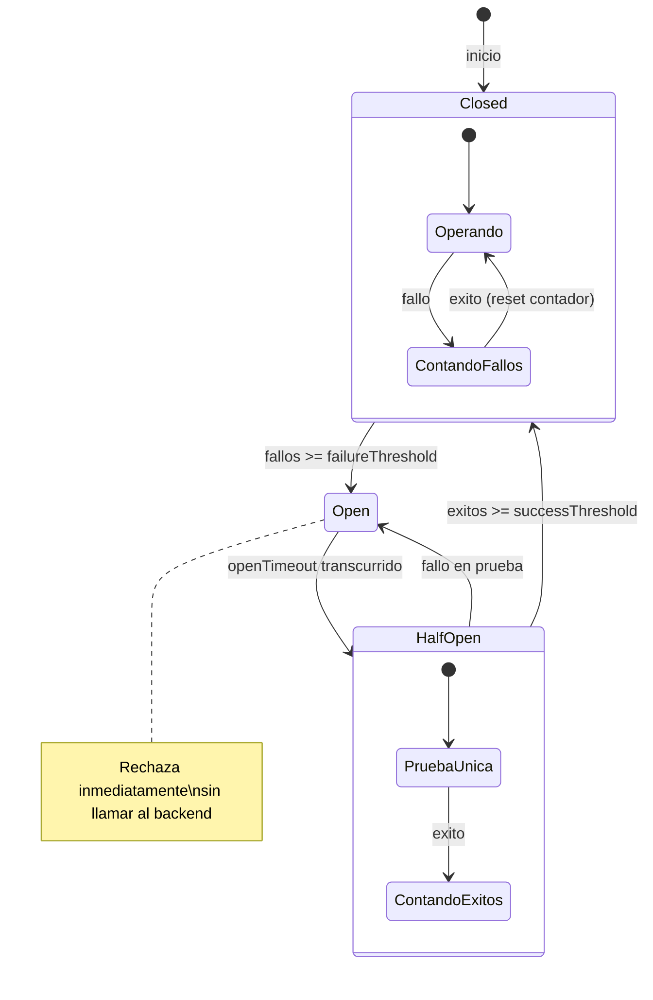

---

## Configuracion por Ambiente

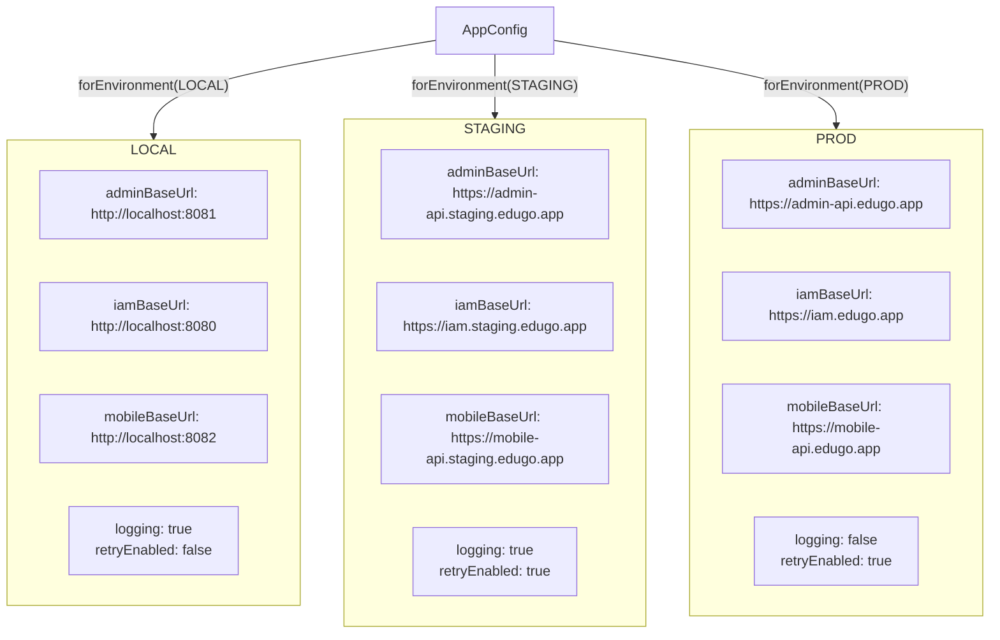

---

## Manejo de Errores: ExceptionMapper

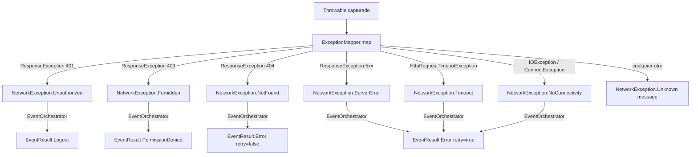

---

## Dos Instancias de HttpClient (DI)

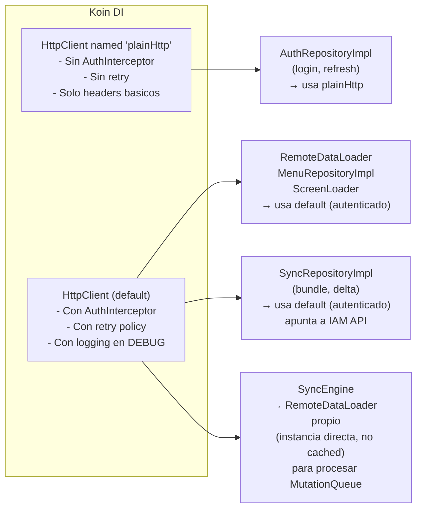

### Detalle de instancias en DynamicUiModule

| Componente | HttpClient | DataLoader | Nota |
|------------|-----------|------------|------|
| `RemoteDataLoader` (singleton via `DataLoader`) | default (autenticado) | `CachedDataLoader` wrapping `RemoteDataLoader` | Para pantallas dinamicas, con cache |
| `SyncRepositoryImpl` | default (autenticado) | N/A (usa httpClient directo) | Apunta a `iamApiBaseUrl` para bundle/delta |
| `SyncEngine` | default (autenticado) | `RemoteDataLoader` propio (sin cache) | Instancia separada para ejecutar MutationQueue sin pasar por cache |
| `CachedScreenLoader` | default (autenticado) | N/A | Via `RemoteScreenLoader` interno |

---

## Offline Queue: MutationQueue + SyncEngine

El sistema de offline queue permite encolar operaciones de escritura (SAVE_NEW, SAVE_EXISTING) cuando no hay red y procesarlas automaticamente al reconectar.

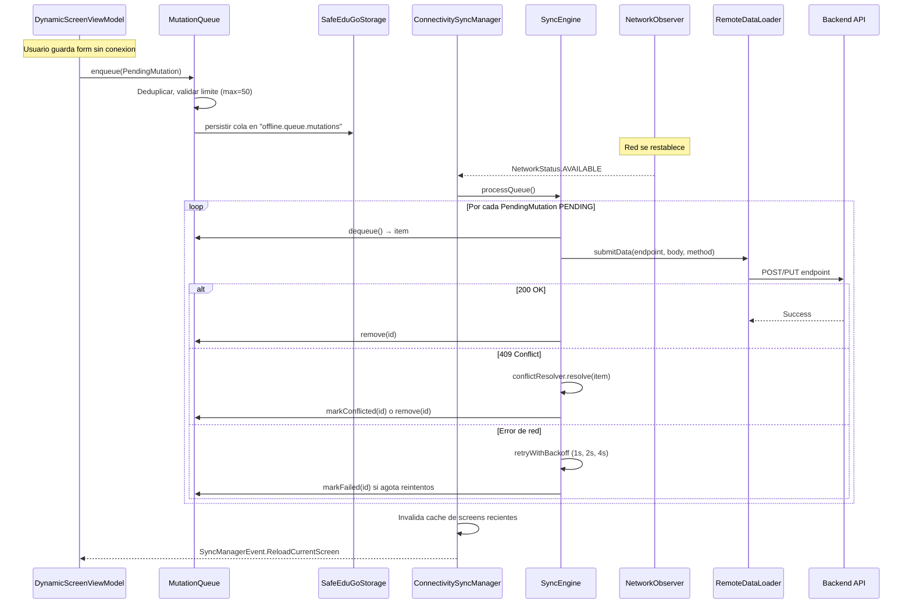

### Componentes del sistema offline

| Clase | Responsabilidad |
|-------|----------------|
| `PendingMutation` | Modelo de una mutacion pendiente: id, endpoint, method, body, status, retryCount |
| `MutationQueue` | Cola FIFO persistida en storage. Deduplicacion, limite de 50 items. Expone `pendingCount: StateFlow<Int>` |
| `SyncEngine` | Procesa la cola al reconectar. Retry con backoff exponencial (1s, 2s, 4s). Resolucion de conflictos 409/404 |
| `ConflictResolver` | Decide que hacer con mutaciones en conflicto: `RetryWithoutCheck`, `Skip`, o `Failed` |
| `ConnectivitySyncManager` | Orquesta reconexion: procesa queue → invalida cache de screens recientes → notifica UI para reload |

---

## Diferencias por Plataforma

| Aspecto | Android | iOS | Desktop | WasmJS |
|---------|---------|-----|---------|--------|
| Engine | OkHttp | Darwin (NSURLSession) | CIO | Fetch API |
| HTTP/2 | Si (OkHttp) | Si (NSURLSession) | No por defecto | Depende del browser |
| Timeout de conexion | 30s configurable | 30s configurable | 30s configurable | Depende de browser |
| Certificados personalizados | Si (OkHttp trust manager) | Si (URLSessionDelegate) | Si (JVM TrustManager) | No (solo certs del browser) |
| CORS | N/A | N/A | N/A | Requerido por browser |
| Background requests | Si (WorkManager si aplica) | Si (Background URLSession) | Si (coroutines) | Solo en Service Workers |
| Request cancellation | Ktor cancel via Job | Ktor cancel via Job | Ktor cancel via Job | Ktor cancel (abort signal) |
| NetworkObserver | ConnectivityManager callback | NWPathMonitor | HTTP health-check polling | navigator.onLine + events |

---

## Mejoras Propuestas

| Mejora | Justificacion | Estado |
|--------|--------------|--------|
| Offline queue | Encolar SAVE_NEW/SAVE_EXISTING cuando no hay red y enviar al reconectar | **IMPLEMENTADO** (MutationQueue + SyncEngine + ConnectivitySyncManager) |
| Certificate pinning en Android/iOS | Proteccion contra MITM en redes publicas | Pendiente (prioridad alta) |
| Request deduplication | Si dos pantallas piden el mismo endpoint simultaneamente, evitar doble request | Pendiente (prioridad media) |
| Response caching HTTP (ETag/Last-Modified) | Usar cabeceras HTTP estandar de cache para screens y datos | Pendiente (prioridad media) |
| Timeout diferenciado por tipo de request | Login puede tolerar mas espera que una busqueda | Pendiente (prioridad media) |
| Request metrics (latencia, bytes) | Para observabilidad y optimizacion en produccion | Pendiente (prioridad baja) |
| Compression (gzip) | Las respuestas JSON de listas pueden ser grandes | Pendiente (prioridad media) |
