# 07 — Conectado y Offline

## Estrategia General

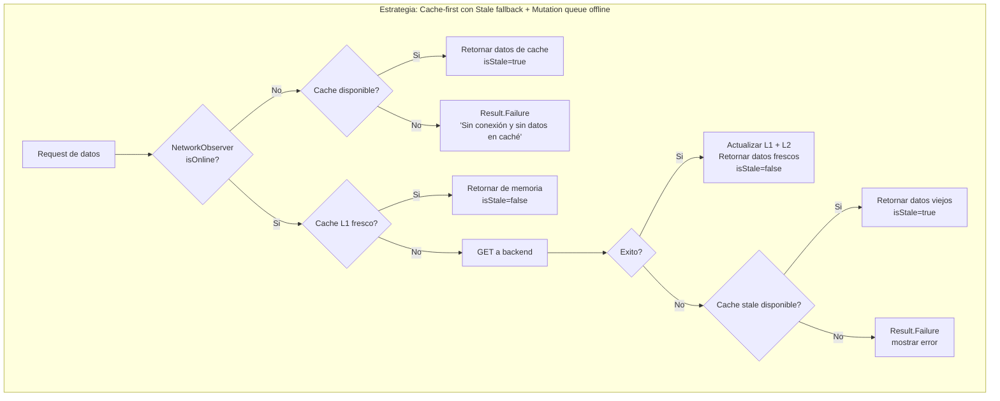

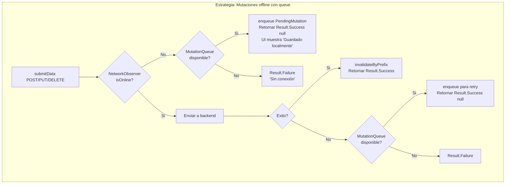

---

## NetworkObserver: Deteccion de Conectividad Multiplataforma

Implementado en `modules/network/src/commonMain/kotlin/.../connectivity/`.

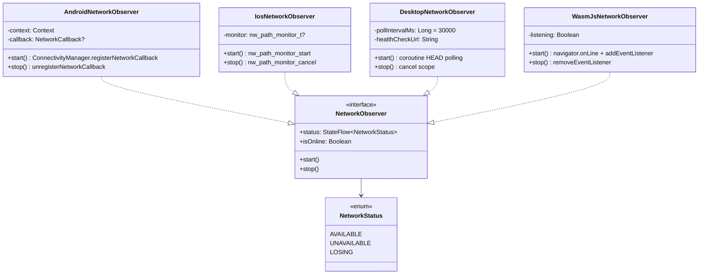

### API comun

```kotlin
interface NetworkObserver {
    val status: StateFlow<NetworkStatus>
    val isOnline: Boolean  // status.value == AVAILABLE
    fun start()
    fun stop()
}

enum class NetworkStatus { AVAILABLE, UNAVAILABLE, LOSING }
```

### Creacion por plataforma

```kotlin
// expect/actual en commonMain
expect fun createNetworkObserver(): NetworkObserver

// Registrado en networkModule (Koin)
single<NetworkObserver> { createNetworkObserver() }
```

**Nota Android:** `createNetworkObserver()` lanza `UnsupportedOperationException`. En Android se usa `createAndroidNetworkObserver(context)` inyectado via Koin con el application Context.

### Implementaciones por plataforma

| Plataforma | Clase | Mecanismo | Latencia |
|------------|-------|-----------|----------|
| Android | `AndroidNetworkObserver` | `ConnectivityManager.registerNetworkCallback` con `NET_CAPABILITY_INTERNET` | Inmediata (callback del sistema) |
| iOS | `IosNetworkObserver` | `nw_path_monitor_create` + `nw_path_monitor_set_update_handler` en main queue | Inmediata (callback del sistema) |
| Desktop/JVM | `DesktopNetworkObserver` | HTTP HEAD a `clients3.google.com/generate_204` cada 30s | Hasta 30s (polling) |
| WasmJS | `WasmJsNetworkObserver` | `navigator.onLine` + `window.addEventListener('online'/'offline')` | Inmediata (eventos del navegador) |

---

## Estados del Sistema por Conectividad

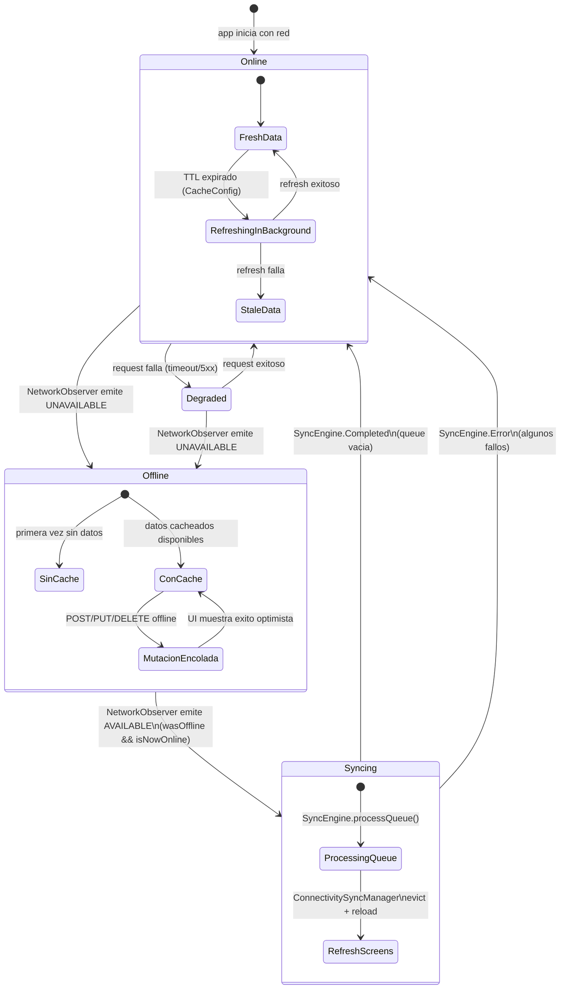

---

## CachedDataLoader: Flujo Detallado

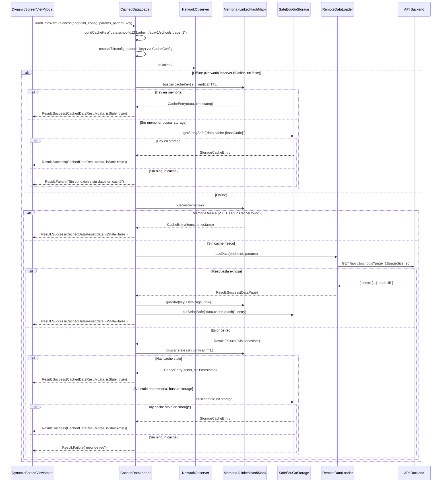

---

## MutationQueue: Cola de Mutaciones Offline

Implementado en `modules/dynamic-ui/.../offline/MutationQueue.kt`.

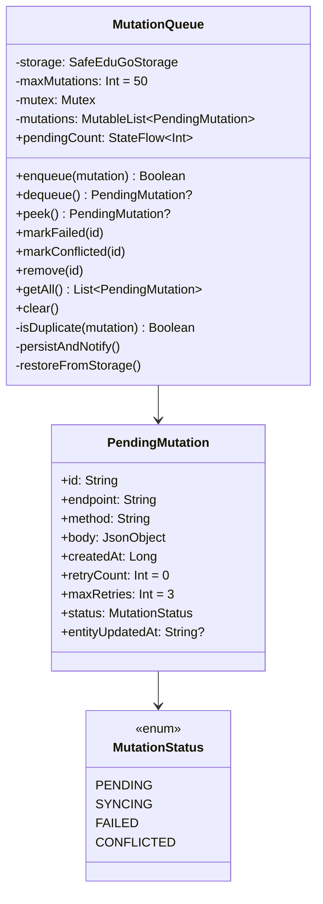

### Caracteristicas

- **Thread-safe:** Todas las operaciones protegidas con `Mutex`
- **Deduplicacion:** `isDuplicate()` compara `endpoint|method|body` contra mutaciones PENDING existentes
- **Persistente:** Serializada a `SafeEduGoStorage` con key `offline.queue.mutations`, sobrevive reinicio de app
- **Observable:** `pendingCount: StateFlow<Int>` para que la UI muestre el badge de cambios pendientes
- **Limite:** Maximo 50 mutaciones encoladas (configurable via `maxMutations`)
- **Ciclo de vida:** `init` llama `restoreFromStorage()` para recuperar mutaciones de sesiones anteriores

### Flujo de una mutacion

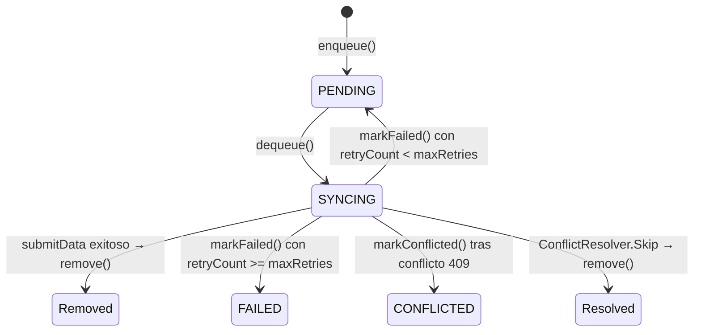

---

## SyncEngine: Procesamiento de Cola al Reconectar

Implementado en `modules/dynamic-ui/.../offline/SyncEngine.kt`.

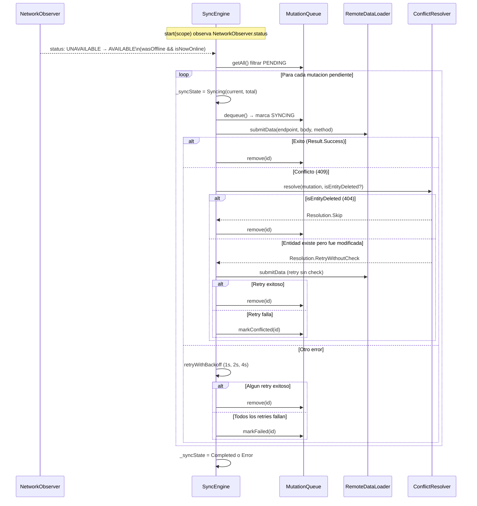

### SyncState

```kotlin
sealed class SyncState {
    data object Idle : SyncState()
    data class Syncing(val current: Int, val total: Int) : SyncState()
    data object Completed : SyncState()
    data class Error(val message: String) : SyncState()
}
```

### Exponential Backoff

```
Intento 0: delay 1s  (1000 * 2^0)
Intento 1: delay 2s  (1000 * 2^1)
Intento 2: delay 4s  (1000 * 2^2)
```

---

## ConflictResolver: Resolucion de Conflictos

Implementado en `modules/dynamic-ui/.../offline/ConflictResolver.kt`.

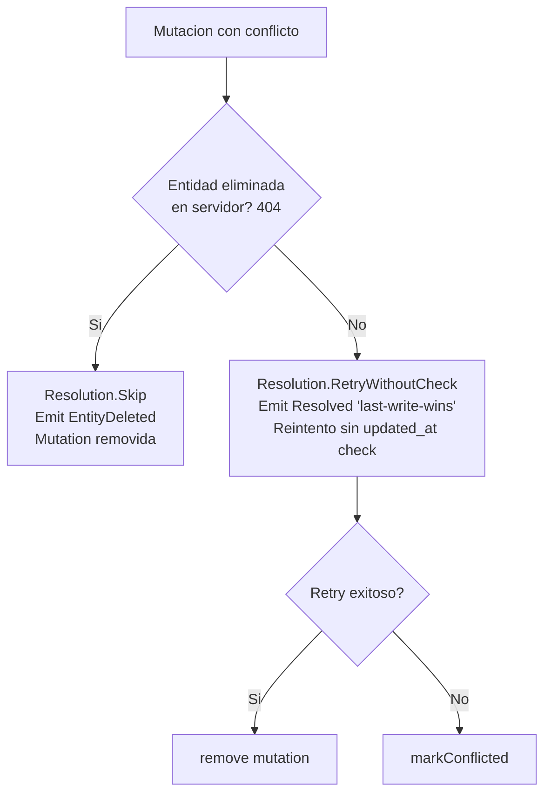

### Estrategia actual: Last-Write-Wins

La implementacion actual es basica:
- **Entidad eliminada (404):** Skip, la mutacion se descarta silenciosamente
- **Entidad modificada (409):** Retry sin verificacion de `updated_at` (last-write-wins)
- **Eventos observables:** `ConflictEvent.Resolved`, `ConflictEvent.EntityDeleted`, `ConflictEvent.Failed` via `SharedFlow`

---

## ConnectivitySyncManager: Coordinacion al Reconectar

Implementado en `modules/dynamic-ui/.../offline/ConnectivitySyncManager.kt`.

Coordina `NetworkObserver` + `SyncEngine` + `RecentScreenTracker` + `CachedScreenLoader` para ejecutar una secuencia de recuperacion completa cuando la app vuelve a estar online.

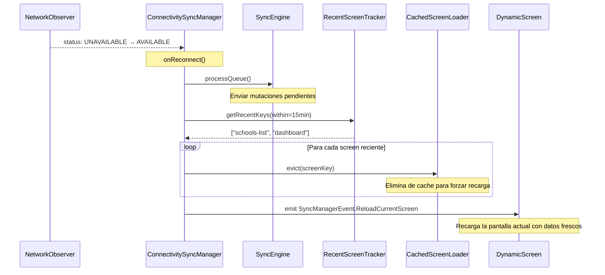

### RecentScreenTracker

```kotlin
class RecentScreenTracker(maxEntries: Int = 10) {
    fun recordAccess(screenKey: String)      // LRU con timestamp
    fun getRecentKeys(within: Duration = 15.minutes): List<String>
    fun clear()
}
```

Registrado como dependencia del `DynamicScreenViewModel`:
```kotlin
// En loadScreen():
recentScreenTracker?.recordAccess(screenKey)
```

---

## CacheConfig: TTL Diferenciado por Tipo

Implementado en `modules/dynamic-ui/.../cache/CacheConfig.kt`.

```kotlin
class CacheConfig(
    val screenTtlByPattern: Map<ScreenPattern, Duration>,
    val dataTtlByPattern: Map<ScreenPattern, Duration>,
    val screenTtlOverrides: Map<String, Duration>,  // por screenKey especifico
    val dataTtlOverrides: Map<String, Duration>,
    val maxScreenMemoryEntries: Int = 20,
    val maxDataMemoryEntries: Int = 30,
)
```

### TTLs por defecto

| Pattern | TTL Screen | TTL Data |
|---------|-----------|----------|
| DASHBOARD | 60s | 60s |
| LIST | 5 min | 5 min |
| FORM | 60 min | 60 min |
| DETAIL | 10 min | 10 min |
| SETTINGS | 30 min | 30 min |

### Prioridad de resolucion

1. Override por `screenKey` especifico (ej: `"schools-list"` → 2 min)
2. TTL por `ScreenPattern` (ej: `LIST` → 5 min)
3. Default global: 5 min

---

## Busqueda Offline en 2 Pasos

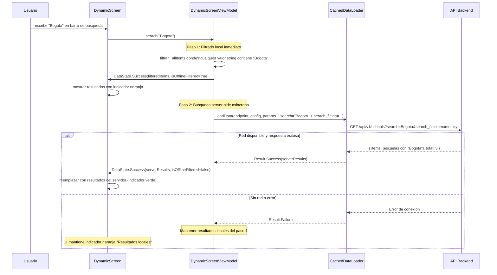

---

## Componentes UI de Conectividad

### ConnectivityBanner

Implementado en `kmp-screens/.../dynamic/components/ConnectivityBanner.kt`.

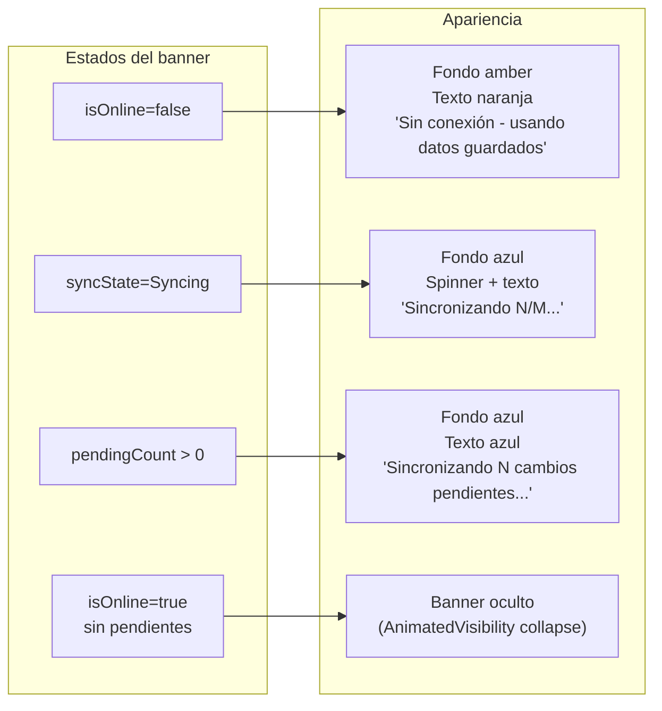

**Parametros:**
```kotlin
@Composable
fun ConnectivityBanner(
    isOnline: Boolean,
    pendingMutationCount: Int,
    syncState: SyncEngine.SyncState,
    modifier: Modifier = Modifier,
)
```

Usa `AnimatedVisibility` con `expandVertically()`/`shrinkVertically()` para transiciones suaves.

### StaleDataIndicator

Implementado en `kmp-screens/.../dynamic/components/StaleDataIndicator.kt`.

```kotlin
@Composable
fun StaleDataIndicator(isStale: Boolean, modifier: Modifier)
```

- Chip amarillo con texto "Datos en cache"
- Visible solo cuando `isStale=true` (retornado por `CachedDataResult`)
- Colores: fondo `#FFF8E1`, texto `#F57F17`
- Implementado como `SuggestionChip` de Material3

---

## Manejo de Token Expirado sin Red

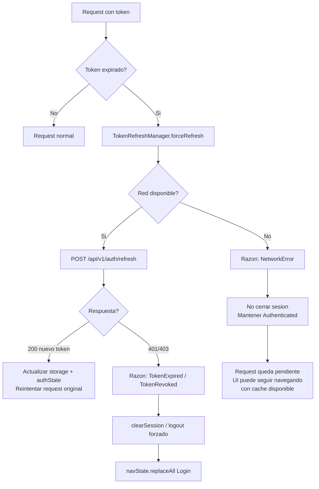

---

## Invalidacion de Cache tras Mutacion

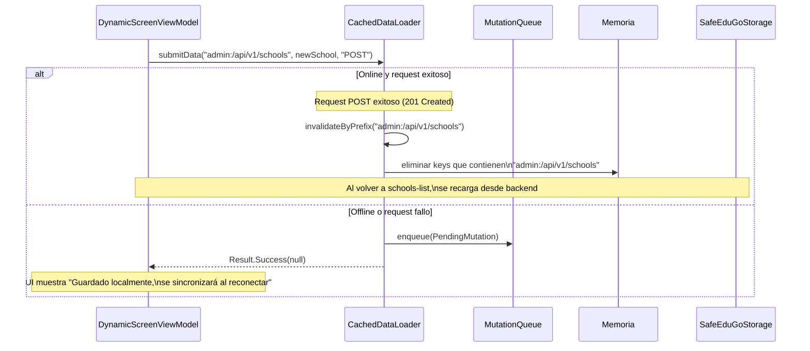

---

## Submitform: Flujo Completo Online/Offline

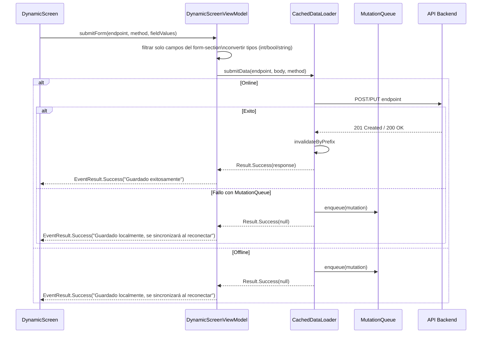

---

## Comportamiento por Escenario

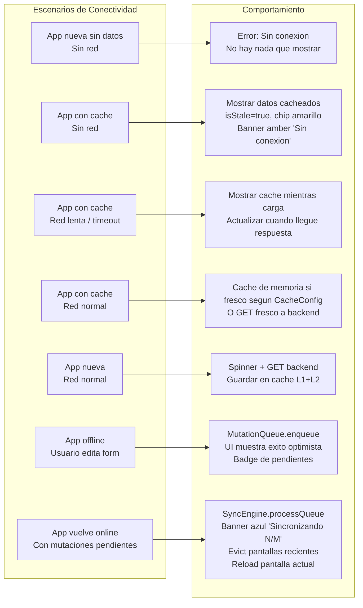

---

## DI: Registro de Componentes Offline

Todos los componentes estan registrados en Koin via `networkModule` y `dynamicUiModule`:

```kotlin
// networkModule
single<NetworkObserver> { createNetworkObserver() }

// dynamicUiModule
single { CacheConfig() }
single { RecentScreenTracker() }
single { MutationQueue(get<SafeEduGoStorage>()) }
single { ConflictResolver() }
single { SyncEngine(get(), remoteDataLoader, get(), get()) }
single { ConnectivitySyncManager(get(), get(), get(), screenLoader as CachedScreenLoader) }

// CachedDataLoader recibe NetworkObserver y MutationQueue
single<DataLoader> {
    CachedDataLoader(
        remote = remote,
        storage = get(),
        cacheConfig = get(),
        networkObserver = getOrNull<NetworkObserver>(),
        mutationQueue = get(),
    )
}

// ViewModel recibe NetworkObserver, RecentScreenTracker, MutationQueue
factory {
    DynamicScreenViewModel(
        networkObserver = getOrNull<NetworkObserver>(),
        recentScreenTracker = get(),
        mutationQueue = get(),
    )
}
```

**Nota:** `getOrNull<NetworkObserver>()` se usa en varios sitios para manejar gracefully el caso donde la plataforma no provee un observer (ej: Android sin Context inyectado).

**Nota:** `DynamicScreenViewModel.isOnline` es un `StateFlow<Boolean>` reactivo que delega directamente al `networkObserver.status`. Ya NO usa snapshots manuales (`updateOnlineStatus()` fue eliminado). Cualquier cambio en el `NetworkObserver` se refleja inmediatamente en la UI via Compose `collectAsState()`.

---

## Diferencias por Plataforma en Offline

| Aspecto | Android | iOS | Desktop | WasmJS |
|---------|---------|-----|---------|--------|
| Deteccion de conectividad | `ConnectivityManager` callback (inmediata) | `NWPathMonitor` (inmediata) | HTTP HEAD polling cada 30s | `navigator.onLine` + eventos (inmediata) |
| Estado LOSING | `onLosing()` callback | `nw_path_status_satisfiable` | No soportado (solo AVAILABLE/UNAVAILABLE) | No soportado |
| Offline queue | MutationQueue (SafeEduGoStorage) | MutationQueue (SafeEduGoStorage) | MutationQueue (SafeEduGoStorage) | MutationQueue (SafeEduGoStorage) |
| Sync al reconectar | SyncEngine + ConnectivitySyncManager | SyncEngine + ConnectivitySyncManager | SyncEngine + ConnectivitySyncManager | SyncEngine + ConnectivitySyncManager |
| Background sync | No implementado (WorkManager disponible) | No implementado (Background App Refresh disponible) | No aplica | No implementado (Service Worker disponible) |
| Cache persistencia | SharedPreferences (sobrevive reinicio) | NSUserDefaults (sobrevive reinicio) | Java Preferences (sobrevive reinicio) | localStorage (sobrevive reinicio) |
| Limpieza de cache | Manual con `clearCache()` | Manual con `clearCache()` | Manual con `clearCache()` | Manual con `clearCache()` |

---

## Archivos Relevantes

| Componente | Ruta |
|-----------|------|
| NetworkObserver (interfaz + expect) | `modules/network/src/commonMain/.../connectivity/NetworkObserver.kt` |
| Android NetworkObserver | `modules/network/src/androidMain/.../connectivity/NetworkObserver.android.kt` |
| iOS NetworkObserver | `modules/network/src/iosMain/.../connectivity/NetworkObserver.ios.kt` |
| Desktop NetworkObserver | `modules/network/src/desktopMain/.../connectivity/NetworkObserver.jvm.kt` |
| WasmJS NetworkObserver | `modules/network/src/wasmJsMain/.../connectivity/NetworkObserver.wasmJs.kt` |
| PendingMutation + MutationStatus | `modules/dynamic-ui/src/commonMain/.../offline/PendingMutation.kt` |
| MutationQueue | `modules/dynamic-ui/src/commonMain/.../offline/MutationQueue.kt` |
| SyncEngine | `modules/dynamic-ui/src/commonMain/.../offline/SyncEngine.kt` |
| ConflictResolver | `modules/dynamic-ui/src/commonMain/.../offline/ConflictResolver.kt` |
| ConnectivitySyncManager | `modules/dynamic-ui/src/commonMain/.../offline/ConnectivitySyncManager.kt` |
| CacheConfig | `modules/dynamic-ui/src/commonMain/.../cache/CacheConfig.kt` |
| RecentScreenTracker | `modules/dynamic-ui/src/commonMain/.../cache/RecentScreenTracker.kt` |
| CachedDataLoader | `modules/dynamic-ui/src/commonMain/.../data/CachedDataLoader.kt` |
| ConnectivityBanner | `kmp-screens/src/commonMain/.../dynamic/components/ConnectivityBanner.kt` |
| StaleDataIndicator | `kmp-screens/src/commonMain/.../dynamic/components/StaleDataIndicator.kt` |
| DI NetworkModule | `modules/di/src/commonMain/.../module/NetworkModule.kt` |
| DI DynamicUiModule | `modules/di/src/commonMain/.../module/DynamicUiModule.kt` |

---

## Optimizaciones de Rendimiento: Primera Carga (Sprint 8)

### Flujo Optimizado del SplashScreen

El splash screen ejecuta las operaciones de restauración en paralelo para minimizar el tiempo total:

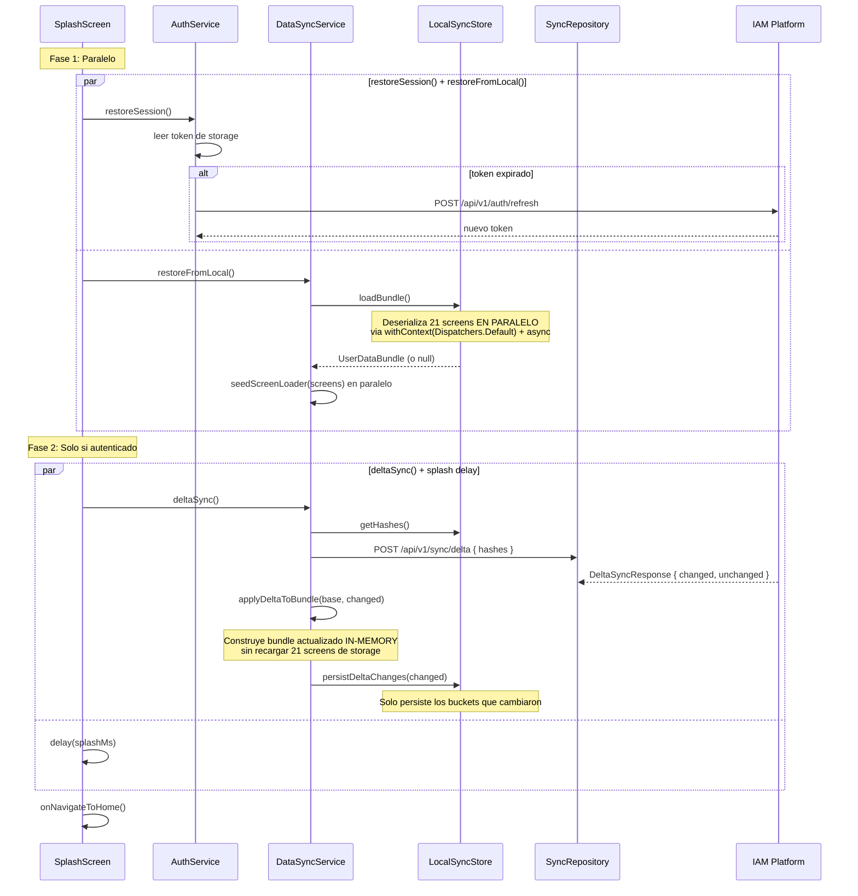

### Comparación: Antes vs Después

| Paso | Antes | Después |
|------|-------|---------|
| Auth + restoreFromLocal | Secuencial (~1.5-3s) | Paralelo (~max 1-2s) |
| Screen deserialization (21 screens) | Secuencial (~300-840ms) | Paralelo ~4 cores (~80-200ms) |
| seedFromBundle serialization | Secuencial (~150-420ms) | Paralelo (~40-100ms) |
| Delta sync → reload bundle | Recargaba TODO de storage (~300-840ms) | Incremental en memoria (~10-50ms) |
| **Total primera carga** | **~3.5-5s** | **~1.5-2.5s** |

---

## Mejoras Implementadas vs Propuestas

### Completadas

| Mejora | Estado | Implementacion |
|--------|--------|---------------|
| NetworkObserver multiplataforma | HECHO | 4 implementaciones: Android, iOS, Desktop, WasmJS |
| Offline mutation queue | HECHO | MutationQueue con deduplicacion, persistencia, limites |
| Sync automatico al reconectar | HECHO | SyncEngine observa NetworkObserver, procesa cola |
| Banner de estado de red | HECHO | ConnectivityBanner con 3 estados (offline/syncing/pending) |
| Indicador de datos stale | HECHO | StaleDataIndicator chip amarillo + CachedDataResult.isStale |
| Cache TTL por tipo | HECHO | CacheConfig con TTLs por ScreenPattern + overrides por screenKey |
| Conflict resolution basico | HECHO | ConflictResolver con last-write-wins y skip para entidades eliminadas |
| Re-sync de pantallas recientes | HECHO | ConnectivitySyncManager + RecentScreenTracker evict + reload |
| isOnline reactivo en ViewModel | HECHO | `DynamicScreenViewModel.isOnline` ahora es StateFlow reactivo directo del `NetworkObserver.status`, eliminando snapshots manuales y race conditions al arranque |
| Paralelización del splash screen | HECHO | `restoreSession()` y `restoreFromLocal()` corren en paralelo. `deltaSync()` corre en paralelo con splash delay |
| Paralelización de screen I/O | HECHO | `LocalSyncStore.loadAllScreens()` y `CachedScreenLoader.seedFromBundle()` serializan/deserializan 21 screens en paralelo via `withContext(Dispatchers.Default)` + `async` |
| Delta sync incremental | HECHO | `DataSyncService.deltaSync()` construye bundle actualizado en memoria (`applyDeltaToBundle`) en lugar de recargar todo el bundle de storage |

### Pendientes

| Mejora | Justificacion | Prioridad |
|--------|--------------|-----------|
| Conflict resolution avanzado | Estrategias mas sofisticadas: merge, prompts al usuario, diff visual | Media |
| Background sync nativo | WorkManager (Android) / Background App Refresh (iOS) para sync sin app en foreground | Baja |
| Retry UI para mutaciones fallidas | Pantalla donde el usuario ve mutaciones FAILED/CONFLICTED y puede reintentar o descartar | Media |
| Sync parcial de pantallas | Actualmente evict + full reload; optimizar a delta refresh con hashes | Baja |
| Indicador visual en items stale | Items individuales de lista con timestamp de cache mostrando antiguedad | Baja |
