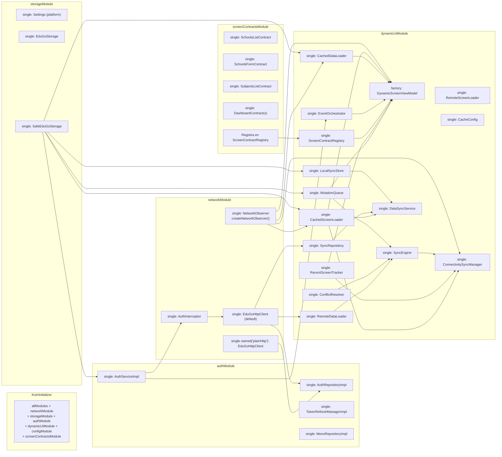
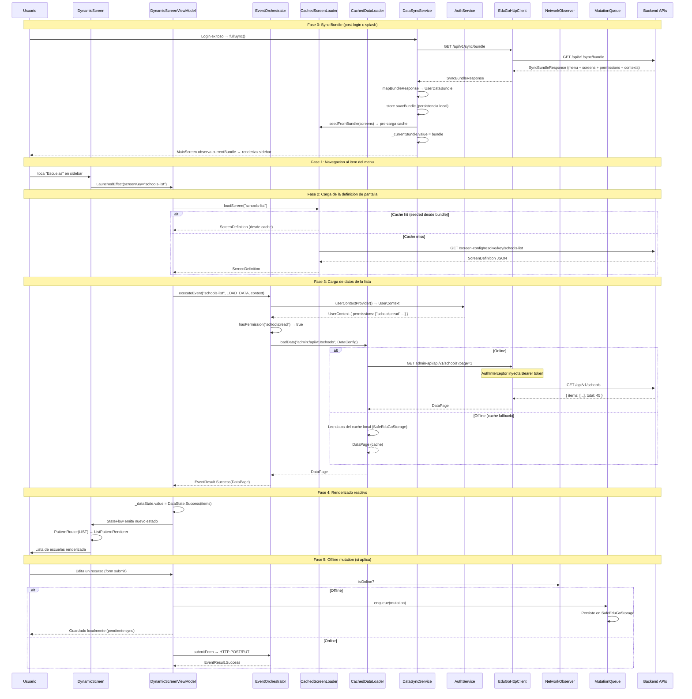
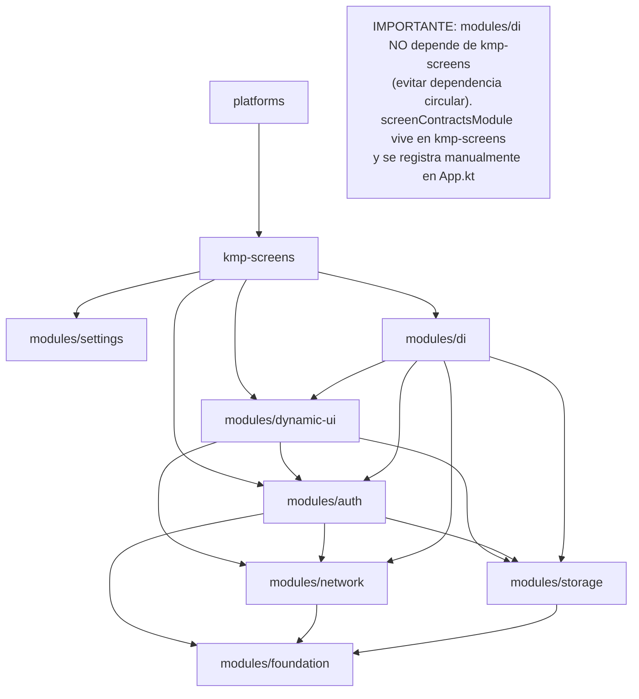
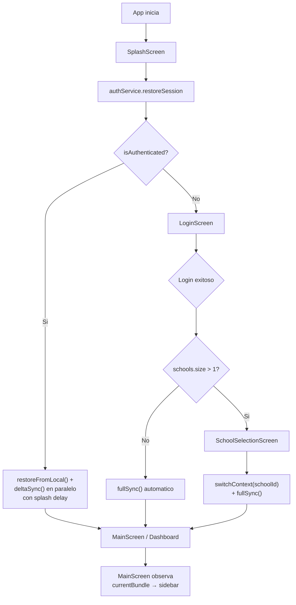

# 08 — Arquitectura Global y DI

## Capas de la Arquitectura

```mermaid
graph TB
    subgraph Platforms ["Plataformas (expect/actual)"]
        AND[Android\nMainActivity]
        IOS[iOS\nMainViewController]
        DESK[Desktop\nMain.kt Window]
        WEB[WasmJS\nCanvasBasedWindow]
    end

    subgraph KmpScreens ["kmp-screens (Presentacion Compartida)"]
        APP[App.kt\nKoin + Tema + Navegacion]
        NAVSTATE[NavigationState\nBackstack]
        MAINSCREEN[MainScreen\nSidebar + Content]
        DYNSCREEN[DynamicScreen\nPatternRouter + Toolbar]
        TOOLBAR[DynamicToolbar\nAcciones contextuales por pattern]
        CONTRACTS[ScreenContracts\nlogica de negocio UI]
        SCREENS["Screens especificas\n(Login, Splash, Dashboard...)"]
        SCHOOLSEL[SchoolSelectionScreen\nPost-login multi-escuela]
        CONNBANNER[ConnectivityBanner\nEstado offline/sync]
        STALEINDICATOR[StaleDataIndicator\nDatos en cache]
    end

    subgraph DynamicUi ["modules/dynamic-ui (Dominio UI)"]
        VM[DynamicScreenViewModel\nState + Effects]
        EO[EventOrchestrator\nPermisos + Routing]
        CSL[CachedScreenLoader\nSDUI definitions]
        CDL[CachedDataLoader\nDatos de pantalla]
        DSS[DataSyncService\nBundle + fullSync + deltaSync]
        LSS[LocalSyncStore\nPersistencia local del bundle]
        SYNCREP[SyncRepository\nHTTP sync endpoints]
        MQ[MutationQueue\nCola offline de escrituras]
        SE[SyncEngine\nFlush mutations al reconectar]
        CR[ConflictResolver\nResolucion de conflictos]
        CSM[ConnectivitySyncManager\nAuto-sync al reconectar]
        CCFG[CacheConfig\nTTL + politicas de cache]
        RST[RecentScreenTracker\nPantallas recientes para prefetch]
    end

    subgraph Auth ["modules/auth (Dominio Auth)"]
        AS[AuthServiceImpl\nStateFlow + Mutex]
        TRM[TokenRefreshManagerImpl\nAuto-refresh]
        CB[CircuitBreaker\nResiliencia]
        RL2[RateLimiter\nProteccion login]
    end

    subgraph Network ["modules/network (Infraestructura)"]
        HTTP[EduGoHttpClient\nKtor]
        IC[InterceptorChain\nAuth + Headers]
        EM[ExceptionMapper\nError handling]
        NO[NetworkObserver\ncreateNetworkObserver\nEstado de conectividad]
    end

    subgraph Storage ["modules/storage (Infraestructura)"]
        SES[SafeEduGoStorage\nWrapper seguro]
        ES[EduGoStorage\nType-safe wrapper]
        S[Settings\nmultiplatform-settings]
    end

    subgraph DI ["modules/di (Inyeccion de Dependencias)"]
        KI[KoinInitializer\nallModules]
        NM[networkModule]
        SM[storageModule]
        AM[authModule]
        DUM[dynamicUiModule]
        SCM[screenContractsModule\nen kmp-screens]
    end

    Platforms --> KmpScreens
    KmpScreens --> DynamicUi
    KmpScreens --> Auth
    DynamicUi --> Auth
    DynamicUi --> Network
    DynamicUi --> Storage
    Auth --> Network
    Auth --> Storage
    DI --> Platforms
    DI --> KmpScreens
    DI --> DynamicUi
    DI --> Auth
    DI --> Network
    DI --> Storage
```



---

## Modulos Koin: Grafo de Dependencias



---

## Flujo Completo de Datos: Desde Tap hasta Renderizado



---

## Ciclo de Vida de la App por Plataforma

```mermaid
flowchart TD
    subgraph Android
        A1[MainActivity.onCreate] --> A2[setContent { App() }]
        A2 --> A3[KoinApplication inicializa]
        A3 --> A4[App corriendo]
        A4 --> |"onStop"| A5[Compose se pausa\nCoroutines suspenden]
        A5 --> |"onStart"| A4
        A4 --> |"onDestroy"| A6[Cleanup]
    end

    subgraph iOS
        I1[MainViewController.viewDidLoad] --> I2[ComposeUIViewController { App() }]
        I2 --> I3[KoinApplication inicializa]
        I3 --> I4[App corriendo]
        I4 --> |"viewWillDisappear"| I5[Compose se pausa]
        I5 --> |"viewWillAppear"| I4
    end

    subgraph Desktop
        D1[main fun] --> D2[Window aplicacion { App() }]
        D2 --> D3[KoinApplication inicializa]
        D3 --> D4[App corriendo]
        D4 --> |"ventana cerrada"| D5[exitApplication\nCleanup]
    end

    subgraph WasmJS
        W1[main fun] --> W2[CanvasBasedWindow { App() }]
        W2 --> W3[KoinApplication inicializa]
        W3 --> W4[App corriendo en browser]
        W4 --> |"tab cerrado"| W5[JS context destruido]
    end
```

---

## Patron de Estado Reactivo

```mermaid
graph LR
    subgraph Sources ["Fuentes de Estado"]
        AS[AuthService._authState\nMutableStateFlow~AuthState~]
        VS[ViewModel._screenState\nMutableStateFlow~ScreenState~]
        VD[ViewModel._dataState\nMutableStateFlow~DataState~]
        VF[ViewModel._fieldValues\nMutableStateFlow~Map~]
        DSB[DataSyncService._currentBundle\nMutableStateFlow~UserDataBundle?~]
        DSS[DataSyncService._syncState\nMutableStateFlow~SyncState~]
        NO[NetworkObserver.status\nStateFlow~NetworkStatus~]
        MQ[MutationQueue.pendingCount\nStateFlow~Int~]
        VIO[ViewModel.isOnline\nStateFlow~Boolean~]
        VPC[ViewModel.pendingMutationCount\nStateFlow~Int~]
    end

    subgraph Composables ["Composables que observan"]
        APP[App.kt\nobserva authState → navegar a Login\nobserva onTokenRefreshed → deltaSync]
        MAIN[MainScreen\nobserva currentBundle → reconstruir sidebar\nobserva authState → context picker]
        DS[DynamicScreen\nobserva screenState + dataState\nobserva isOnline + pendingMutationCount]
        FORM[FormRenderer\nobserva fieldValues]
        CB[ConnectivityBanner\nobserva isOnline + pendingCount + syncState]
        SCHOOL[SchoolSelectionScreen\nobserva syncState (isSyncing)]
    end

    AS --> |"collectAsState()"| APP
    AS --> |"collectAsState()"| MAIN
    VS --> |"collectAsState()"| DS
    VD --> |"collectAsState()"| DS
    VF --> |"collectAsState()"| FORM
    DSB --> |"collectAsState()"| MAIN
    DSS --> |"collectAsState()"| SCHOOL
    VIO --> |"collectAsState()"| DS
    VIO --> |"collectAsState()"| CB
    VPC --> |"collectAsState()"| CB
    NO --> VIO
    MQ --> VPC
```

---

## Arquitectura de Modulos: Dependencias



---

## Diferencias de Entry Point por Plataforma

| Aspecto | Android | iOS | Desktop | WasmJS |
|---------|---------|-----|---------|--------|
| Entry point | `MainActivity` | `MainViewController` | `main()` fun | `main()` fun |
| Window management | Android Activity | UIViewController | `Window {}` composable | Canvas |
| DI inicializacion | En `setContent {}` de Activity | En `viewDidLoad` | En `main()` antes de Window | En `main()` antes de Canvas |
| Lifecycle hooks | Activity lifecycle | ViewController lifecycle | Window close | Browser unload |
| Splash screen | Activity tema / SplashScreen API | LaunchScreen.storyboard | Pantalla en blanco (no implementado) | HTML loading state |
| Orientacion | `setRequestedOrientation` posible | UIInterfaceOrientationMask | No aplica | No aplica |

---

## Flujo de Inicio: Splash → Dashboard



---

## Mejoras Propuestas

| Mejora | Justificacion | Prioridad |
|--------|--------------|-----------|
| Separar ScreenContracts en modulo propio | Actualmente en kmp-screens, deberia ser `modules/screen-contracts` independiente | Media |
| ViewModel Factory tipado | Actualmente `factory: DynamicScreenViewModel` en Koin sin parametros tipados | Media |
| Instrumentacion de telemetria | No hay observabilidad de errores en produccion (Crashlytics/Sentry) | Alta |
| Feature flags | No hay mecanismo para habilitar/deshabilitar features por ambiente | Media |
| Modularizacion por feature | Actualmente todo en modulos transversales; considerar `modules/schools`, `modules/subjects` | Baja |
| HMR en Desktop (Hot Module Replacement) | Compose for Desktop soporta reload parcial pero no esta configurado | Baja |
