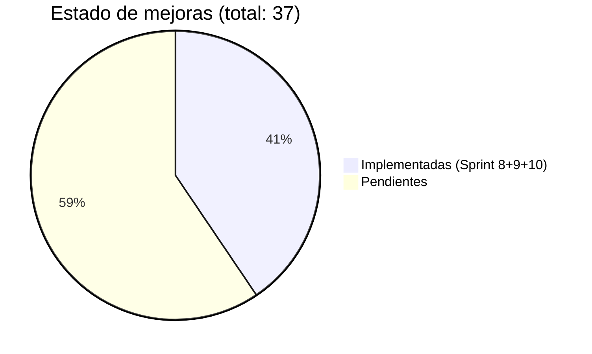
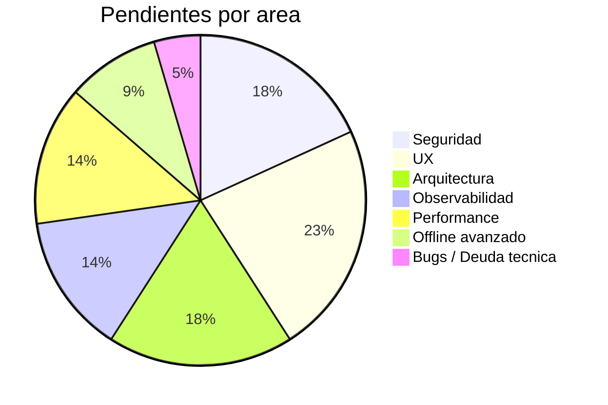
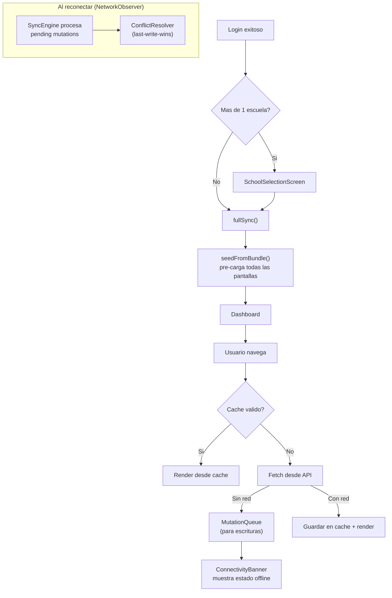
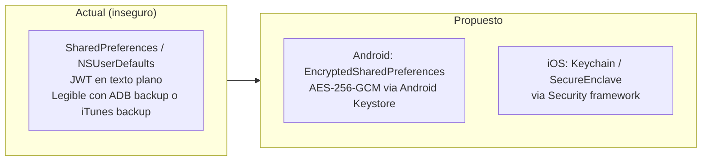
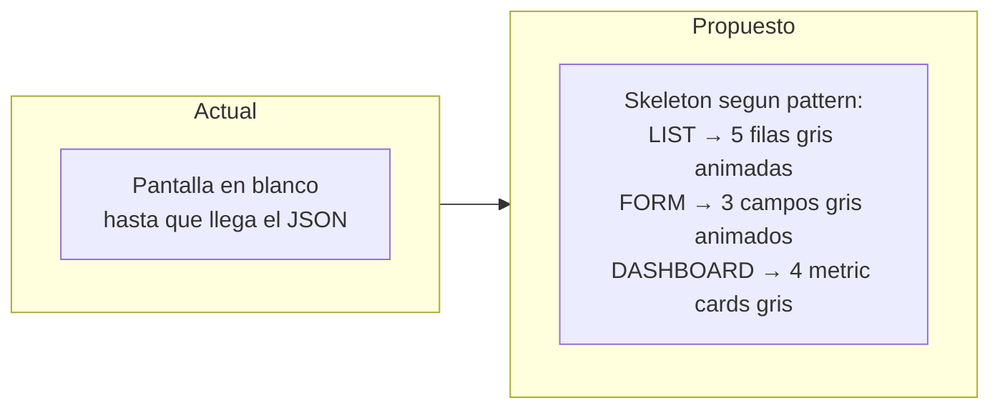
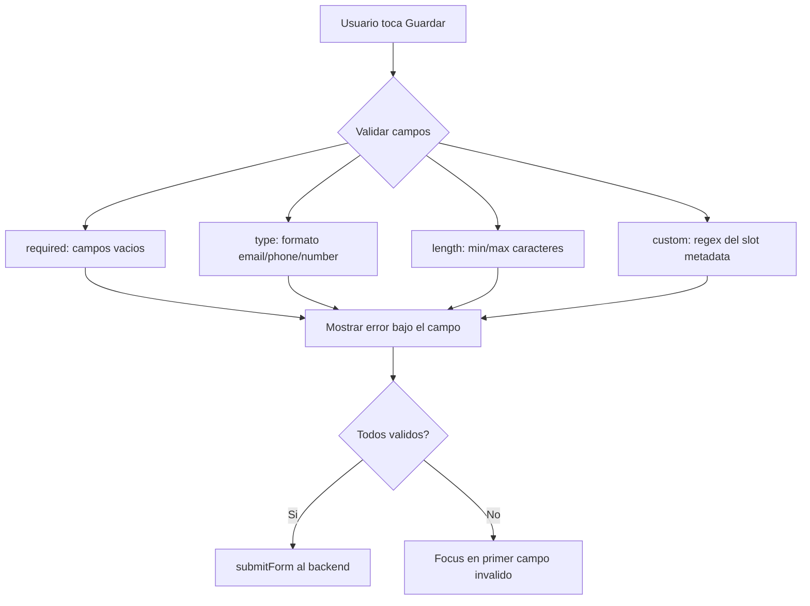
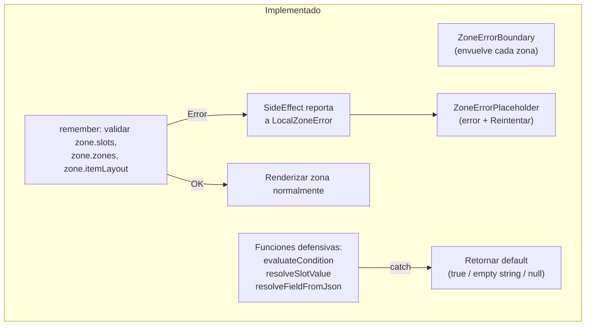
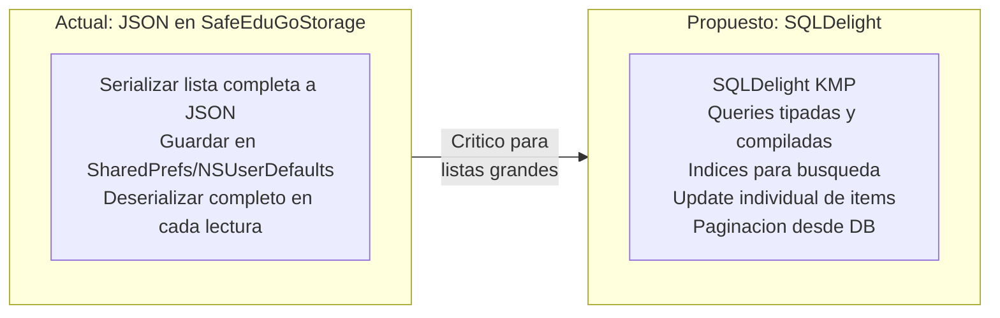
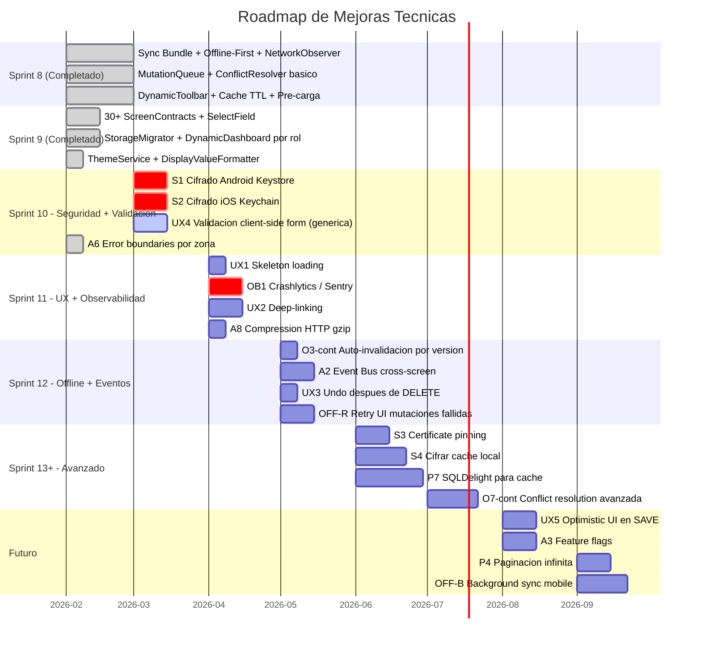

# 09 — Mejoras Propuestas (Actualizado Sprint 9)

> Documento de referencia para decision-making. Contiene el inventario de mejoras
> ya implementadas y las pendientes con contexto detallado para priorizar los
> proximos sprints.

---

## Resumen Ejecutivo





---

# PARTE 1 — Mejoras Implementadas

## Sprint 8 (Feb 2026)

Las siguientes mejoras fueron completadas como parte del Sprint 8 que incluyo
Sync Bundle, Offline-First, NetworkObserver, MutationQueue y DynamicToolbar.

| Codigo | Mejora | Estado | Notas |
|--------|--------|--------|-------|
| O1 | NetworkObserver multiplataforma | Completado | Android (ConnectivityManager), iOS (NWPathMonitor), Desktop (health check), WasmJS (online/offline events) |
| O2 | Offline mutation queue | Completado | MutationQueue + SyncEngine + ConflictResolver implementados |
| O3 | Versionado de pantallas SDUI | Parcial | Backend tiene endpoint de version, cliente tiene `checkVersionAsync`, pero falta auto-invalidacion (ver O3-cont) |
| O4 | TTL configurable por tipo de datos | Completado | CacheConfig con TTLs por pattern (LIST, FORM, DASHBOARD, etc.) |
| O5 | Banner de estado de red | Completado | ConnectivityBanner + StaleDataIndicator en kmp-screens |
| O6 | Cache TTL diferenciado | Completado | Fusionado con O4 — TTLs distintos por tipo de pantalla |
| O7 | Conflict resolution basico | Parcial | ConflictResolver con estrategia last-write-wins (ver O7-cont para version avanzada) |
| P1 | Cache del menu por rol | Completado | Menu viene del sync bundle, no se re-fetcha individualmente |
| A7 | Pre-carga de pantallas | Completado | `seedFromBundle` pre-carga todas las pantallas al login |

## Sprint 9 (Feb 2026)

| Codigo | Mejora | Estado | Notas |
|--------|--------|--------|-------|
| SC1 | Catalogo expandido de ScreenContracts (30+) | Completado | Schools, Users, Units, Subjects, Memberships, Materials, Assessments, Roles, Permissions, Guardian + 7 Dashboards + Login + Settings |
| SC2 | SelectField (opciones fijas) | Completado | `ControlType.SELECT` + `SelectField.kt` + `SlotOption`. `remote_select` pendiente |
| SC3 | StorageMigrator | Completado | `StorageMigration` interface + `StorageMigrator` con versionado y crash-safety |
| SC4 | DynamicDashboard por rol | Completado | Seleccion automatica de screenKey segun rol (superadmin, schooladmin, teacher, student, guardian) con placeholders |
| SC5 | ThemeService | Completado | `ThemeServiceImpl` con LIGHT/DARK/SYSTEM, integrado en DynamicSettingsScreen via campo `dark_mode` |
| A6 | Error boundaries por zona SDUI | Completado | `ZoneErrorBoundary` + `LocalZoneError` CompositionLocal + pre-validacion en `remember` + funciones de datos defensivas (`evaluateCondition`, `resolveSlotValue`, `resolveFieldFromJson`) con try-catch. Placeholder inline con retry |

### Flujo implementado: Sync Bundle + Offline



---

# PARTE 2 — Mejoras Pendientes

---

## Seguridad

### S1: Cifrar tokens en Android Keystore

| Campo | Detalle |
|-------|---------|
| **Mejora** | Cifrar JWT tokens almacenados en Android |
| **Por que es necesario** | Los tokens JWT se guardan como texto plano en SharedPreferences, legibles mediante ADB backup o root del dispositivo |
| **Caso de mejora** | Un dispositivo Android robado o con root podria extraer el JWT y suplantar la sesion del usuario |
| **Que se tocaria** | `modules/storage` — implementacion actual de Android (`androidMain`). Reemplazar `SharedPreferences` por `EncryptedSharedPreferences` que usa Android Keystore / AES-256-GCM |
| **Beneficio esperado** | Tokens protegidos en reposo en Android; cumplimiento de buenas practicas de seguridad movil |
| **Prioridad sugerida** | Alta |
| **Esfuerzo estimado** | Medio |

### S2: Cifrar tokens en iOS Keychain

| Campo | Detalle |
|-------|---------|
| **Mejora** | Cifrar JWT tokens almacenados en iOS |
| **Por que es necesario** | Los tokens JWT se guardan en NSUserDefaults, legibles con backup del dispositivo o jailbreak |
| **Caso de mejora** | Un backup de iTunes/Finder no cifrado expone los tokens JWT del usuario |
| **Que se tocaria** | `modules/storage` — implementacion actual de iOS (`iosMain`). Migrar a iOS Keychain via Security framework / SecureEnclave |
| **Beneficio esperado** | Tokens protegidos en reposo en iOS; alineacion con las guias de seguridad de Apple |
| **Prioridad sugerida** | Alta |
| **Esfuerzo estimado** | Medio |



### S3: Certificate pinning

| Campo | Detalle |
|-------|---------|
| **Mejora** | Validar certificados SSL contra hashes conocidos |
| **Por que es necesario** | Sin pinning, un proxy corporativo o red publica puede interceptar trafico HTTPS (MITM) instalando un CA raiz personalizado |
| **Caso de mejora** | Estudiantes en una red WiFi de escuela con proxy SSL inspection — el proxy puede leer tokens y datos |
| **Que se tocaria** | `modules/network` — engines por plataforma: OkHttp `CertificatePinner` (Android), `URLSessionDelegate` (iOS). Desktop y WasmJS tienen menor riesgo |
| **Beneficio esperado** | Proteccion contra ataques man-in-the-middle incluso en redes comprometidas |
| **Prioridad sugerida** | Media |
| **Esfuerzo estimado** | Medio |

### S4: Cifrar cache local

| Campo | Detalle |
|-------|---------|
| **Mejora** | Cifrar todos los datos cacheados (nombres de alumnos, datos de escuelas, etc.) |
| **Por que es necesario** | Los datos de cache se almacenan como JSON plano en storage local; contienen informacion personal de alumnos y docentes |
| **Caso de mejora** | Un dispositivo compartido o robado expone nombres, correos y datos academicos de alumnos menores de edad |
| **Que se tocaria** | `modules/storage` — `SafeEduGoStorage` wrapper. Agregar capa de cifrado transparente (AES) antes de persistir |
| **Beneficio esperado** | Proteccion de datos personales en reposo; alineacion con regulaciones de privacidad (GDPR, habeas data) |
| **Prioridad sugerida** | Alta |
| **Esfuerzo estimado** | Alto |

---

## Experiencia de Usuario (UX)

### UX1: Skeleton loading en SDUI

| Campo | Detalle |
|-------|---------|
| **Mejora** | Mostrar placeholders animados mientras carga la ScreenDefinition |
| **Por que es necesario** | Actualmente se muestra pantalla en blanco hasta que llega el JSON de la pantalla, generando sensacion de lentitud |
| **Caso de mejora** | Un docente abre la lista de alumnos en conexion 3G — ve 2-3 segundos de pantalla vacia |
| **Que se tocaria** | `kmp-screens/dynamic/renderer/` — cada PatternRenderer (ListPatternRenderer, FormPatternRenderer, DashboardPatternRenderer). Agregar composables de skeleton por pattern |
| **Beneficio esperado** | Percepcion de carga instantanea; eliminacion de flashes blancos |
| **Prioridad sugerida** | Media |
| **Esfuerzo estimado** | Bajo |



### UX2: Deep-linking

| Campo | Detalle |
|-------|---------|
| **Mejora** | Soporte de URLs directas a pantallas (ej: `edugo://schools-list`) |
| **Por que es necesario** | No se puede compartir un enlace que lleve directamente a una pantalla especifica de la app |
| **Caso de mejora** | Un admin envia por email un link directo al formulario de un alumno; el receptor abre la app directamente en esa pantalla |
| **Que se tocaria** | `platforms/*` (Android App Links, iOS Universal Links, Web URL routing), `Routes.kt`, `NavigationState` |
| **Beneficio esperado** | Navegacion directa desde notificaciones, emails o mensajes; mejora significativa en flujo de trabajo |
| **Prioridad sugerida** | Media |
| **Esfuerzo estimado** | Medio |

### UX3: Undo despues de DELETE

| Campo | Detalle |
|-------|---------|
| **Mejora** | Mostrar Snackbar con boton "Deshacer" antes de ejecutar el DELETE definitivo |
| **Por que es necesario** | El DELETE es inmediato sin opcion de recuperacion; un tap accidental elimina datos permanentemente |
| **Caso de mejora** | Un admin borra accidentalmente una escuela mientras scrollea la lista en su telefono |
| **Que se tocaria** | `EventOrchestrator`, `DynamicScreen`, `DynamicScreenViewModel`. Patron Material 3: delay de 5s antes del DELETE real |
| **Beneficio esperado** | Prevencion de perdida accidental de datos; patron estandar de UX (Gmail, Google Drive) |
| **Prioridad sugerida** | Media |
| **Esfuerzo estimado** | Bajo |

### UX4: Validacion client-side en FORM

| Campo | Detalle |
|-------|---------|
| **Mejora** | Validacion generica de campos del formulario desde metadata del slot antes de enviar al backend |
| **Por que es necesario** | Los CrudContracts ya validan campos obligatorios en sus handlers (`UserCrudContract` valida first_name/last_name/email, `SchoolCrudContract` valida name, etc.), pero falta una validacion **generica** que lea `required`, `minLength`, `maxLength`, `regex` de la metadata del slot SDUI |
| **Caso de mejora** | Un docente deja el campo "email" vacio o con formato invalido y debe esperar 2-3 segundos para ver el error del backend — deberia ver error instantaneo desde el slot metadata |
| **Que se tocaria** | `DynamicScreenViewModel` (logica de validacion generica), `FormPatternRenderer` (mostrar errores bajo cada campo). Complementaria la validacion especifica que ya existe en los CrudContracts |
| **Beneficio esperado** | Feedback instantaneo para TODOS los formularios SDUI, no solo los que tienen Contract con validacion manual |
| **Prioridad sugerida** | Alta |
| **Esfuerzo estimado** | Medio |
| **Estado parcial** | CrudContracts (`UserCrudContract`, `SchoolCrudContract`, `UnitCrudContract`, `MembershipAddContract`, `MaterialCreateContract`, `MaterialEditContract`) ya validan campos requeridos en sus `SubmitFormHandler.execute()` |
| **Esfuerzo estimado** | Medio |



### UX5: Optimistic UI en SAVE

| Campo | Detalle |
|-------|---------|
| **Mejora** | Actualizar la lista inmediatamente despues de guardar, sin esperar respuesta del servidor |
| **Por que es necesario** | Actualmente al guardar un form, el usuario vuelve a la lista pero debe esperar el refresh para ver el item nuevo/editado. MutationQueue ya retorna exito optimistico para offline, pero la lista no se auto-actualiza |
| **Caso de mejora** | Admin crea una nueva escuela — al volver a la lista, la escuela no aparece hasta que se hace pull-to-refresh |
| **Que se tocaria** | `CachedDataLoader`, `DynamicScreenViewModel`, `ListPatternRenderer`. Insertar item en cache local inmediatamente |
| **Beneficio esperado** | UI reactiva instantanea; coherencia con el flujo offline ya implementado |
| **Prioridad sugerida** | Media |
| **Esfuerzo estimado** | Medio |

### UX6: Breadcrumb en EXPANDED layout

| Campo | Detalle |
|-------|---------|
| **Mejora** | Mostrar ruta de navegacion ("Escuelas > Formulario de Escuela") en layout desktop/tablet |
| **Por que es necesario** | En pantallas grandes con sidebar expandido, no hay indicacion visual de la profundidad de navegacion |
| **Caso de mejora** | Admin en desktop edita un formulario anidado 3 niveles y no sabe como volver |
| **Que se tocaria** | `MainScreen`, `DynamicToolbar`. Agregar composable Breadcrumb que lea la pila de navegacion |
| **Beneficio esperado** | Contexto de navegacion claro en pantallas grandes; patron estandar de aplicaciones web |
| **Prioridad sugerida** | Baja |
| **Esfuerzo estimado** | Bajo |

---

## Arquitectura

### A1: Separar ScreenContracts en modulo propio

| Campo | Detalle |
|-------|---------|
| **Mejora** | Mover contracts de `kmp-screens/contracts/` a un modulo `modules/screen-contracts` independiente |
| **Por que es necesario** | Los contracts viven en `kmp-screens` pero son logica de negocio, no UI. Esto crea una dependencia circular potencial (modules/di no puede depender de kmp-screens) |
| **Caso de mejora** | Agregar un nuevo contract requiere tocar kmp-screens aunque no sea codigo de UI |
| **Que se tocaria** | `kmp-screens/dynamic/contracts/` → nuevo `modules/screen-contracts`, DI module, build.gradle |
| **Beneficio esperado** | Separacion de concerns limpia; contracts testeables sin dependencia de Compose |
| **Prioridad sugerida** | Media |
| **Esfuerzo estimado** | Medio |

### A2: Event Bus cross-screen

| Campo | Detalle |
|-------|---------|
| **Mejora** | Bus de eventos (SharedFlow) para que una pantalla notifique a otra que debe recargarse |
| **Por que es necesario** | Al guardar un form, el cache de la lista se invalida pero la lista no sabe que debe recargar hasta que el usuario navega. Causa datos stale visibles |
| **Caso de mejora** | Admin edita nombre de escuela en form → vuelve a la lista → ve el nombre viejo hasta hacer pull-to-refresh |
| **Que se tocaria** | `modules/dynamic-ui` (nuevo EventBus), `DynamicScreenViewModel` (suscribirse a eventos de invalidacion) |
| **Beneficio esperado** | Listas siempre actualizadas despues de operaciones CRUD; UX consistente |
| **Prioridad sugerida** | Media |
| **Esfuerzo estimado** | Medio |

### A3: Feature flags

| Campo | Detalle |
|-------|---------|
| **Mejora** | Sistema para habilitar/deshabilitar features por ambiente o gradualmente |
| **Por que es necesario** | No hay mecanismo para activar features solo en staging, o hacer rollout gradual a un porcentaje de usuarios |
| **Caso de mejora** | Querer probar skeleton loading solo en staging antes de desplegarlo a produccion |
| **Que se tocaria** | `modules/config` (nuevo FeatureFlagService), todos los features que lo usen. Podria ser local (JSON) o remoto (Firebase Remote Config) |
| **Beneficio esperado** | Rollout controlado; capacidad de A/B testing; kill switch para features problematicos |
| **Prioridad sugerida** | Media |
| **Esfuerzo estimado** | Medio |

### A5: Request deduplication

| Campo | Detalle |
|-------|---------|
| **Mejora** | Deduplicar requests concurrentes al mismo endpoint |
| **Por que es necesario** | Dos pantallas que necesitan el mismo endpoint (ej: dashboard y detalle piden `/schools`) generan dos HTTP calls simultaneos |
| **Caso de mejora** | Al abrir la app, el dashboard y el sidebar piden la misma API de menu — dos requests identicos en paralelo |
| **Que se tocaria** | `CachedDataLoader` o `HttpClient` builder en `modules/network`. Usar `Mutex` + mapa de Deferred por URL |
| **Beneficio esperado** | Menos llamadas API; menor uso de ancho de banda; respuestas mas rapidas (solo 1 request real) |
| **Prioridad sugerida** | Media |
| **Esfuerzo estimado** | Medio |

### A6: Error boundaries por zona — COMPLETADO

| Campo | Detalle |
|-------|---------|
| **Mejora** | Envolver cada Zone en error boundary para que un error de render no tumbe toda la pantalla |
| **Estado** | **Completado** (Sprint 10) |
| **Implementacion** | `ZoneErrorBoundary` en `kmp-screens/.../renderer/ZoneErrorBoundary.kt`. Cada zona envuelta automaticamente desde `ZoneRenderer`. Pre-validacion de datos en `remember` + reporte via `LocalZoneError` CompositionLocal + `SideEffect`. Funciones defensivas: `evaluateCondition`, `resolveFieldExists`, `resolveSlotValue`, `resolveFieldFromJson` con try-catch. Placeholder inline con titulo, mensaje de error (maxLines=2), y boton "Reintentar" que fuerza recomposicion via `key(retryCount)` |
| **Limitacion** | Compose no soporta try-catch alrededor de funciones @Composable (a diferencia de React). Los errores dentro de composables del design system no se capturan automaticamente. La proteccion cubre: datos de zona corruptos, condiciones malformadas, JSON malformado en bindings, y errores en resolucion de valores |



### A8: Compression HTTP (gzip)

| Campo | Detalle |
|-------|---------|
| **Mejora** | Habilitar compresion gzip/deflate en Ktor client |
| **Por que es necesario** | Las respuestas JSON no se comprimen; ScreenDefinitions grandes pueden ser 50-100KB en texto plano |
| **Caso de mejora** | En conexion 3G, una pantalla con muchos slots tarda mas de lo necesario por el tamano del JSON sin comprimir |
| **Que se tocaria** | `modules/network` — `HttpClient` builder. Agregar `ContentEncoding { gzip() }` plugin de Ktor |
| **Beneficio esperado** | Reduccion de 60-80% en tamano de respuestas; carga mas rapida en conexiones lentas |
| **Prioridad sugerida** | Media |
| **Esfuerzo estimado** | Bajo |

---

## Observabilidad

### OB1: Crashlytics / Sentry

| Campo | Detalle |
|-------|---------|
| **Mejora** | Integracion de reporte de crashes y errores en produccion |
| **Por que es necesario** | Solo hay logging local (KMP Logger → console/logcat); si la app crashea en produccion no hay visibilidad |
| **Caso de mejora** | Un alumno reporta que la app se cierra al abrir una pantalla especifica — sin Crashlytics no hay stack trace para diagnosticar |
| **Que se tocaria** | Todos los modulos (agregar puntos de reporte de errores). Sentry KMP SDK como opcion multiplataforma, o Firebase Crashlytics para Android/iOS |
| **Beneficio esperado** | Visibilidad de crashes en produccion; metricas de performance; alertas automaticas |
| **Prioridad sugerida** | Alta |
| **Esfuerzo estimado** | Medio |

### OB2: Request metrics

| Campo | Detalle |
|-------|---------|
| **Mejora** | Medir latencia, tamano de respuesta y tasa de error de cada endpoint |
| **Por que es necesario** | No hay datos sobre que endpoints son lentos o cuanto ancho de banda consume la app |
| **Caso de mejora** | Usuarios reportan "la app es lenta" pero no sabemos si es el endpoint de dashboard (500ms) o el de alumnos (3s) |
| **Que se tocaria** | `modules/network` — agregar interceptor de metricas en HttpClient. Loggear o enviar a servicio de metricas |
| **Beneficio esperado** | Datos cuantitativos para optimizar APIs lentas; deteccion proactiva de degradacion |
| **Prioridad sugerida** | Baja |
| **Esfuerzo estimado** | Bajo |

### OB3: Cache hit rate logging

| Campo | Detalle |
|-------|---------|
| **Mejora** | Registrar hits y misses del cache para medir efectividad |
| **Por que es necesario** | No sabemos si el cache esta siendo efectivo o si los TTLs configurados son adecuados |
| **Caso de mejora** | Se configuro TTL de 5 min para listas pero resulta que los usuarios navegan cada 2 min — hit rate 0% y los TTLs deberian ajustarse |
| **Que se tocaria** | `CachedScreenLoader`, `CachedDataLoader`. Agregar contadores hits/misses y logguear periodicamente |
| **Beneficio esperado** | Datos para optimizar TTLs; validar que la estrategia de cache es efectiva |
| **Prioridad sugerida** | Baja |
| **Esfuerzo estimado** | Bajo |

---

## Performance

### P3: Iconos SVG del backend

| Campo | Detalle |
|-------|---------|
| **Mejora** | Soportar iconos SVG personalizados servidos desde el backend, ademas de Material Icons |
| **Por que es necesario** | Actualmente solo se soportan Material Icons via mapa hardcodeado; no se pueden agregar iconos custom sin update de la app |
| **Caso de mejora** | Una escuela quiere un icono personalizado para "Biblioteca" pero no existe en Material Icons |
| **Que se tocaria** | `kmp-screens` — icon resolver. Agregar soporte para URL de SVG con cache local |
| **Beneficio esperado** | Iconografia 100% dinamica; escuelas pueden personalizar iconos sin release de la app |
| **Prioridad sugerida** | Media |
| **Esfuerzo estimado** | Medio |

### P4: Paginacion infinita

| Campo | Detalle |
|-------|---------|
| **Mejora** | Auto-cargar pagina siguiente al llegar al final del scroll (infinite scroll) |
| **Por que es necesario** | Existe `loadMore()` en el ViewModel pero no se dispara automaticamente al llegar al fondo de la lista |
| **Caso de mejora** | Lista de 500 alumnos — el usuario debe tocar "Cargar mas" manualmente en cada pagina |
| **Que se tocaria** | `ListPatternRenderer` (detector de scroll al fondo), `DynamicScreenViewModel` (auto-trigger de loadMore) |
| **Beneficio esperado** | Scroll continuo sin interrupciones; patron estandar de apps modernas |
| **Prioridad sugerida** | Media |
| **Esfuerzo estimado** | Medio |

### P6: Compresion de cache

| Campo | Detalle |
|-------|---------|
| **Mejora** | Comprimir JSON antes de almacenarlo en cache local |
| **Por que es necesario** | ScreenDefinitions grandes se guardan como JSON strings sin comprimir en SharedPrefs/NSUserDefaults |
| **Caso de mejora** | Un dispositivo con storage limitado tiene 50+ pantallas cacheadas ocupando varios MB de espacio |
| **Que se tocaria** | `SafeEduGoStorage`, `CachedScreenLoader`. Agregar compresion/descompresion transparente (gzip) |
| **Beneficio esperado** | Reduccion de 60-80% en espacio de cache; importante para dispositivos de gama baja |
| **Prioridad sugerida** | Baja |
| **Esfuerzo estimado** | Medio |

### P7: SQLDelight para cache

| Campo | Detalle |
|-------|---------|
| **Mejora** | Reemplazar JSON strings en key-value storage por base de datos SQLite via SQLDelight |
| **Por que es necesario** | Todo el cache se guarda como strings JSON en SharedPrefs/NSUserDefaults. Leer una lista de 1000 items requiere deserializar el JSON completo cada vez. No hay indices, no hay queries parciales, no hay actualizaciones individuales |
| **Caso de mejora** | Buscar un alumno por nombre en cache requiere deserializar toda la lista, iterar, y re-serializar. Con SQL seria un SELECT WHERE |
| **Que se tocaria** | `modules/storage` (cambio mayor — agregar SQLDelight como dependencia), `CachedDataLoader`, `CachedScreenLoader`. Requiere migracion de datos existentes |
| **Beneficio esperado** | Queries indexadas; actualizaciones parciales; paginacion eficiente desde cache; base para funcionalidades offline mas complejas |
| **Prioridad sugerida** | Media |
| **Esfuerzo estimado** | Alto |



---

## Offline Avanzado (mejoras parciales que necesitan completarse)

### O3-cont: Auto-invalidacion por version

| Campo | Detalle |
|-------|---------|
| **Mejora** | Completar el wiring para que un cambio de version en backend dispare recarga automatica de la pantalla |
| **Por que es necesario** | El backend ya retorna version de pantalla y el cliente tiene `checkVersionAsync`, pero si la version cambia no se dispara reload automatico — el usuario sigue viendo la version cacheada |
| **Caso de mejora** | Admin modifica la estructura de la pantalla de dashboard en el backoffice pero los usuarios ven la version vieja hasta que expira el TTL |
| **Que se tocaria** | `CachedScreenLoader` (comparar version y trigger invalidation), `DynamicScreenViewModel` (observar cambios de version) |
| **Beneficio esperado** | Pantallas siempre actualizadas cuando el admin modifica la estructura SDUI |
| **Prioridad sugerida** | Media |
| **Esfuerzo estimado** | Bajo |

### O7-cont: Conflict resolution avanzada

| Campo | Detalle |
|-------|---------|
| **Mejora** | UI de resolucion de conflictos que muestre ambas versiones y permita al usuario elegir |
| **Por que es necesario** | El ConflictResolver actual usa last-write-wins, lo que puede sobrescribir silenciosamente cambios de otro usuario |
| **Caso de mejora** | Dos admins editan la misma escuela offline — al reconectar, uno pierde sus cambios sin saberlo |
| **Que se tocaria** | `ConflictResolver` (estrategia alternativa), nueva `ConflictResolutionScreen` (UI para mostrar diff y elegir), `SyncEngine` |
| **Beneficio esperado** | Cero perdida silenciosa de datos; el usuario decide que version conservar |
| **Prioridad sugerida** | Baja |
| **Esfuerzo estimado** | Alto |

### OFF-R: Retry UI para mutaciones fallidas

| Campo | Detalle |
|-------|---------|
| **Mejora** | Pantalla que muestre las mutaciones pendientes/fallidas con opciones de reintentar o descartar |
| **Por que es necesario** | Las mutaciones fallidas en MutationQueue no tienen mecanismo visible para el usuario; quedan "atrapadas" sin forma de reintentarlas manualmente |
| **Caso de mejora** | Un docente guarda notas offline, pierde conexion por horas, y al reconectar el backend rechaza por timeout — el usuario no sabe que sus cambios se perdieron |
| **Que se tocaria** | Nueva pantalla `MutationQueueScreen`, `MutationQueue` (exponer estado al UI), acceso desde Settings o banner |
| **Beneficio esperado** | Transparencia total sobre el estado de cambios offline; el usuario tiene control |
| **Prioridad sugerida** | Media |
| **Esfuerzo estimado** | Medio |

### OFF-B: Background sync en mobile

| Campo | Detalle |
|-------|---------|
| **Mejora** | Ejecutar SyncEngine cuando la app esta en background |
| **Por que es necesario** | SyncEngine solo corre con la app en foreground; si el usuario cierra la app con mutaciones pendientes, no se sincronizan hasta reabrir |
| **Caso de mejora** | Docente guarda notas, cierra la app, y al dia siguiente las notas siguen pendientes porque el sync no corrio en background |
| **Que se tocaria** | Implementaciones de plataforma: Android (WorkManager), iOS (Background App Refresh). Requiere permisos adicionales |
| **Beneficio esperado** | Sync completa aunque la app este cerrada; datos siempre actualizados al reabrir |
| **Prioridad sugerida** | Baja |
| **Esfuerzo estimado** | Alto |

### BUG-1: Hashes de delta sync no deterministas

| Campo | Detalle |
|-------|---------|
| **Mejora** | Corregir el calculo de hashes en el backend para que sean deterministas entre reinicios |
| **Por que es necesario** | El hash de `available_contexts` cambia entre reinicios del API porque las queries SQL no tienen `ORDER BY`. Esto causa que el delta sync descargue datos innecesariamente, anulando la ventaja del sistema de hashes |
| **Caso de mejora** | El API se reinicia (deploy, crash, scaling). El proximo delta sync de todos los usuarios detecta cambio en `available_contexts` aunque nada cambio → descarga completa innecesaria para todos |
| **Que se tocaria** | Backend IAM Platform — 3 cambios de una linea: (1) `FindByUser()` agregar `.Order("id ASC")`, (2) `GetUserPermissions()` agregar `ORDER BY p.name`, (3) `sync_service.go` ordenar slice de contexts antes de `hashJSON()` |
| **Beneficio esperado** | Delta sync realmente ahorra bandwidth; hashes estables permiten deteccion de cambios confiable |
| **Prioridad sugerida** | **Critica** — sin esto el delta sync no funciona correctamente |
| **Esfuerzo estimado** | **Muy bajo** (3 lineas de codigo) |

### PERF-SYNC: Delta sync recalcula todo en el servidor

| Campo | Detalle |
|-------|---------|
| **Mejora** | Cachear hashes del bundle en Redis para evitar recalcular todo en cada delta sync |
| **Por que es necesario** | Actualmente el delta sync hace fetch completo de menu + permisos + contextos + todas las pantallas en cada request, y solo ahorra bandwidth al cliente. Con muchos usuarios concurrentes, la BD recibe la misma carga que un full sync |
| **Caso de mejora** | 100 usuarios con app abierta hacen delta sync cada 15 min → 400 full-fetches por hora al servidor, cuando probablemente nada cambio |
| **Que se tocaria** | Backend IAM Platform: (1) Guardar hashes en Redis (Upstash, ya disponible) con TTL de 5 min, (2) Invalidar cache en los handlers de POST/PUT/DELETE de las APIs admin/mobile |
| **Beneficio esperado** | Delta sync responde en ~1ms desde Redis en vez de ~200ms de queries; reduce carga en PostgreSQL |
| **Prioridad sugerida** | Media (no critico hasta tener muchos usuarios concurrentes) |
| **Esfuerzo estimado** | Medio |

---

## Roadmap Sugerido



---

## Matriz Esfuerzo vs Impacto

```
ALTO IMPACTO
│
│  ┌─────────────────────────┐  ┌─────────────────────────────────┐
│  │ QUICK WINS              │  │ PROYECTOS ESTRATEGICOS          │
│  │ (Bajo esfuerzo)         │  │ (Alto esfuerzo, alto retorno)   │
│  │                         │  │                                 │
│  │ UX1 Skeleton loading    │  │ S4  Cifrar cache local          │
│  │ A8  Compression gzip    │  │ P7  SQLDelight para cache       │
│  │ O3c Auto-invalidacion   │  │ OB1 Crashlytics/Sentry         │
│  │ UX3 Undo DELETE         │  │ UX4 Validacion client-side      │
│  │ OB3 Cache hit rate      │  │ S1  Cifrado Android Keystore    │
│  │                         │  │ S2  Cifrado iOS Keychain        │
│  │                         │  │ UX2 Deep-linking                │
│  └─────────────────────────┘  └─────────────────────────────────┘
│
│  ┌─────────────────────────┐  ┌─────────────────────────────────┐
│  │ RELLENO                 │  │ INVERSIONES A LARGO PLAZO       │
│  │ (Bajo esfuerzo,         │  │ (Alto esfuerzo, retorno         │
│  │  bajo impacto)          │  │  diferido)                      │
│  │                         │  │                                 │
│  │ UX6 Breadcrumb          │  │ O7c Conflict resolution avanz.  │
│  │ OB2 Request metrics     │  │ OFF-B Background sync mobile    │
│  │ P6  Compresion cache    │  │ A3  Feature flags               │
│  │                         │  │ S3  Certificate pinning         │
│  │                         │  │ P3  Iconos SVG backend          │
│  └─────────────────────────┘  └─────────────────────────────────┘
│
BAJO IMPACTO
└─────────────────────────────────────────────────────────────────────
  BAJO ESFUERZO                                     ALTO ESFUERZO
```

### Lectura de la matriz

- **Quick Wins (arriba-izquierda):** Implementar primero. Bajo costo, alto impacto. UX1, A8, O3-cont y UX3 son candidatos ideales para llenar huecos entre features grandes.
- **Proyectos Estrategicos (arriba-derecha):** Planificar y ejecutar con prioridad. S1/S2 y UX4 para Sprint 10; OB1 para Sprint 11.
- **Inversiones a Largo Plazo (abajo-derecha):** Diferir hasta tener capacidad. P7 (SQLDelight) tiene impacto potencialmente alto pero requiere inversion significativa.
- **Relleno (abajo-izquierda):** Hacer cuando haya tiempo libre o como tareas de onboarding para nuevos miembros.

---

## Tabla Resumen de Pendientes

| Codigo | Mejora | Prioridad | Esfuerzo | Sprint sugerido |
|--------|--------|-----------|----------|-----------------|
| **S1** | Cifrar tokens Android Keystore | Alta | Medio | 10 |
| **S2** | Cifrar tokens iOS Keychain | Alta | Medio | 10 |
| **UX4** | Validacion client-side FORM | Alta | Medio | 10 |
| **A6** | Error boundaries por zona | ~~Alta~~ | ~~Medio~~ | **HECHO** |
| **S4** | Cifrar cache local | Alta | Alto | 13 |
| **OB1** | Crashlytics / Sentry | Alta | Medio | 11 |
| **UX1** | Skeleton loading | Media | Bajo | 11 |
| **UX2** | Deep-linking | Media | Medio | 11 |
| **A8** | Compression HTTP gzip | Media | Bajo | 11 |
| **O3-cont** | Auto-invalidacion version | Media | Bajo | 12 |
| **A2** | Event Bus cross-screen | Media | Medio | 12 |
| **UX3** | Undo despues de DELETE | Media | Bajo | 12 |
| **OFF-R** | Retry UI mutaciones fallidas | Media | Medio | 12 |
| **UX5** | Optimistic UI en SAVE | Media | Medio | Futuro |
| **A3** | Feature flags | Media | Medio | Futuro |
| **A5** | Request deduplication | Media | Medio | Futuro |
| **P3** | Iconos SVG backend | Media | Medio | Futuro |
| **P4** | Paginacion infinita (auto-trigger) | Media | Medio | Futuro |
| **P7** | SQLDelight para cache | Media | Alto | 13+ |
| **S3** | Certificate pinning | Media | Medio | 13 |
| **O7-cont** | Conflict resolution avanzada | Baja | Alto | 13+ |
| **OFF-B** | Background sync mobile | Baja | Alto | Futuro |
| **OB2** | Request metrics | Baja | Bajo | Futuro |
| **OB3** | Cache hit rate logging | Baja | Bajo | Futuro |
| **UX6** | Breadcrumb EXPANDED | Baja | Bajo | Futuro |
| **P6** | Compresion de cache | Baja | Medio | Futuro |

### Notas sobre items removidos de pendientes

| Codigo | Mejora | Motivo |
|--------|--------|--------|
| A1 | Separar ScreenContracts en modulo propio | Deprioritizado: 30+ contracts funcionan bien en `kmp-screens/contracts/`. La separacion no aporta valor significativo en esta etapa |
| P1 | Cache del menu por rol | **HECHO** (Sprint 8) — menu via sync bundle |
| A7 | Pre-carga de pantallas | **HECHO** (Sprint 8) — seedFromBundle |
| Migracion storage | Migracion de keys | **HECHO** (Sprint 9) — StorageMigrator implementado |
