# 10 — Multiidioma (i18n)

> Diseño de arquitectura para internacionalizacion en EduGo KMP.
> Usa el estandar de JetBrains (composeResources) para strings del sistema.
> La terminologia por institucion (Grado/Level/Modulo) es un tema SEPARADO
> documentado en [11-conceptos-terminologia.md](./11-conceptos-terminologia.md).

---

## Estado Actual

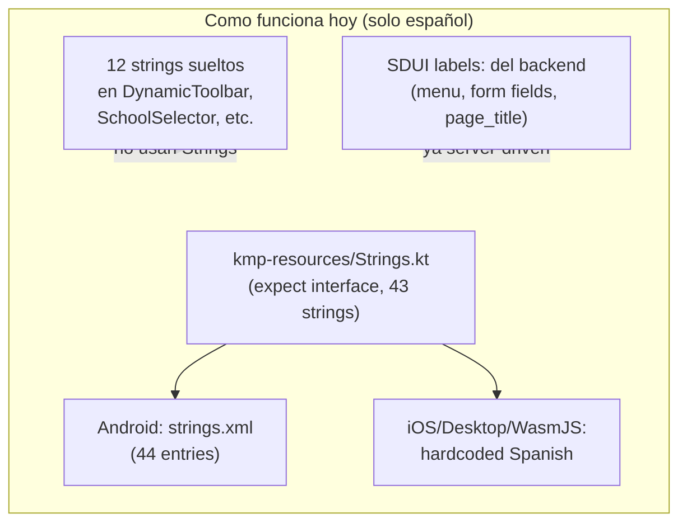

### Inventario de strings

| Categoria | Cantidad | Fuente actual | Ejemplo |
|-----------|:--------:|---------------|---------|
| Framework UI (botones, nav) | ~43 | `kmp-resources/Strings` | "Guardar", "Cancelar", "Cerrar sesion" |
| Strings sueltos hardcoded | ~12 | Directos en .kt | "Volver", "Nuevo", "Seleccionar escuela" |
| SDUI labels (del backend) | ~100+ | ScreenDefinition.slotData | `page_title`, `label`, `placeholder` |
| Menu items | ~15 | Sync bundle (MenuItem.displayName) | "Escuelas", "Materias", "Dashboard" |
| Mensajes de error API | Variable | Backend responses | "No active membership" |

---

## Diseño Propuesto: Arquitectura de 2 Capas

> **Nota:** La terminologia por institucion (Grado/Level/Modulo, Estudiante/Participante)
> NO es un problema de idioma. Es un problema de **conceptos** resuelto con el sistema
> de `school_concepts` documentado en [doc 11](./11-conceptos-terminologia.md).

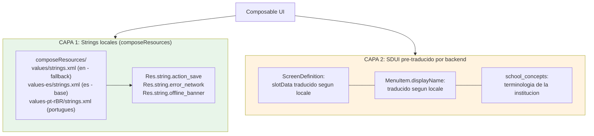

### Que va en cada capa

| Capa | Que contiene | Cuando se usa | Offline? |
|------|-------------|---------------|:--------:|
| **L1: Local** | Botones ("Guardar"), errores del sistema, estados vacios, conectividad, accesibilidad | Siempre disponible, no depende de red | ✅ Siempre |
| **L2: Backend** | Labels SDUI (page_title, field labels), menu items, terminologia de la institucion (via school_concepts) | Viaja en sync bundle, cached localmente | ✅ Cache |

### Idioma vs Terminologia (son independientes)

| | Idioma (i18n) | Terminologia (conceptos) |
|---|---|---|
| **Pertenece a** | Usuario | Institucion |
| **Cuando cambia** | En Settings | Al hacer switchContext |
| **Afecta** | "Guardar"→"Save", "Sin conexion"→"No connection" | "Grado"→"Level", "Estudiante"→"Participant" |
| **Documentado en** | Este documento (10) | [Doc 11](./11-conceptos-terminologia.md) |
| **Mecanismo** | composeResources locales | school_concepts via sync bundle |

---

## Capa 1: composeResources (Estandar JetBrains)

### Estructura de directorios

```
kmp-screens/src/commonMain/
  composeResources/
    values/                          ← Fallback (ingles)
      strings.xml
    values-es/                       ← Español base
      strings.xml
    values-es-rCO/                   ← Colombia (overrides)
      strings.xml
    values-es-rAR/                   ← Argentina (overrides)
      strings.xml
    values-es-rMX/                   ← Mexico (overrides)
      strings.xml
    values-pt-rBR/                   ← Portugues Brasil
      strings.xml
```

### Formato de los XML

```xml
<!-- values/strings.xml (ingles - fallback) -->
<resources>
    <!-- Actions -->
    <string name="action_save">Save</string>
    <string name="action_cancel">Cancel</string>
    <string name="action_delete">Delete</string>
    <string name="action_back">Back</string>
    <string name="action_create">New</string>
    <string name="action_edit">Edit</string>
    <string name="action_logout">Log out</string>
    <string name="action_switch_context">Switch context</string>
    <string name="action_retry">Retry</string>
    <string name="action_search">Search</string>

    <!-- Connectivity -->
    <string name="offline_banner">No connection — using saved data</string>
    <string name="offline_syncing">Syncing %1$d/%2$d…</string>
    <string name="offline_pending">Syncing %1$d pending changes…</string>
    <string name="stale_data_indicator">Cached data</string>
    <string name="saved_locally">Saved locally, will sync on reconnect</string>

    <!-- School selection -->
    <string name="school_selection_title">Select a school</string>
    <string name="school_selection_subtitle">Select a school to continue</string>
    <string name="school_selection_empty">No schools available</string>
    <string name="school_selection_error">Error loading schools: %1$s</string>

    <!-- Form -->
    <string name="form_required_field">This field is required</string>
    <string name="form_invalid_email">Invalid email address</string>
    <string name="form_save_success">Saved successfully</string>
    <string name="form_save_error">Error saving: %1$s</string>
    <string name="form_edit_title">Edit %1$s</string>
    <string name="form_create_title">New %1$s</string>

    <!-- Empty states -->
    <string name="empty_list">No items found</string>
    <string name="empty_search">No results for "%1$s"</string>

    <!-- Errors -->
    <string name="error_generic">Something went wrong</string>
    <string name="error_no_permission">You don't have permission for this action</string>
    <string name="error_session_expired">Session expired, please log in again</string>
    <string name="error_network">Connection error, try again</string>

    <!-- Plurals -->
    <plurals name="pending_changes">
        <item quantity="one">%1$d pending change</item>
        <item quantity="other">%1$d pending changes</item>
    </plurals>
</resources>
```

```xml
<!-- values-es/strings.xml (español base) -->
<resources>
    <string name="action_save">Guardar</string>
    <string name="action_cancel">Cancelar</string>
    <string name="action_delete">Eliminar</string>
    <string name="action_back">Volver</string>
    <string name="action_create">Nuevo</string>
    <string name="action_edit">Editar</string>
    <string name="action_logout">Cerrar sesion</string>
    <string name="action_switch_context">Cambiar contexto</string>
    <string name="action_retry">Reintentar</string>
    <string name="action_search">Buscar</string>

    <string name="offline_banner">Sin conexion — usando datos guardados</string>
    <string name="offline_syncing">Sincronizando %1$d/%2$d…</string>
    <string name="offline_pending">Sincronizando %1$d cambios pendientes…</string>
    <string name="stale_data_indicator">Datos en cache</string>
    <string name="saved_locally">Guardado localmente, se sincronizara al reconectar</string>

    <string name="school_selection_title">Seleccionar escuela</string>
    <string name="school_selection_subtitle">Selecciona una escuela para continuar</string>
    <string name="school_selection_empty">No hay escuelas disponibles</string>
    <string name="school_selection_error">Error cargando escuelas: %1$s</string>

    <string name="form_required_field">Este campo es obligatorio</string>
    <string name="form_invalid_email">Direccion de correo invalida</string>
    <string name="form_save_success">Guardado exitosamente</string>
    <string name="form_save_error">Error al guardar: %1$s</string>
    <string name="form_edit_title">Editar %1$s</string>
    <string name="form_create_title">Nuevo %1$s</string>

    <string name="empty_list">No se encontraron elementos</string>
    <string name="empty_search">Sin resultados para "%1$s"</string>

    <string name="error_generic">Ocurrio un error</string>
    <string name="error_no_permission">No tienes permiso para esta accion</string>
    <string name="error_session_expired">Sesion expirada, inicia sesion nuevamente</string>
    <string name="error_network">Error de conexion, intenta de nuevo</string>

    <plurals name="pending_changes">
        <item quantity="one">%1$d cambio pendiente</item>
        <item quantity="other">%1$d cambios pendientes</item>
    </plurals>
</resources>
```

### Uso en Composables

```kotlin
// Uso basico
Text(stringResource(Res.string.action_save))

// Con parametros
Text(stringResource(Res.string.form_edit_title, "Escuela"))
Text(stringResource(Res.string.offline_syncing, current, total))

// Plurales
Text(pluralStringResource(Res.plurals.pending_changes, count, count))

// Fuera de Composable (suspend)
val msg = getString(Res.string.form_save_success)
```

### Convencion de nombres de keys

```
{categoria}.{contexto}_{elemento}

Categorias:
  action_*          → Botones y acciones del usuario
  offline_*         → Mensajes de conectividad
  stale_*           → Indicadores de datos en cache
  school_selection_* → Pantalla de seleccion de escuela
  form_*            → Formularios genericos
  empty_*           → Estados vacios
  error_*           → Mensajes de error
  nav_*             → Navegacion
  auth_*            → Autenticacion
```

---

## Terminologia por Institucion → Ver Doc 11

La terminologia dinamica (Grado/Level/Modulo, Estudiante/Participante) se resuelve
con el sistema de **concept_types** y **school_concepts** documentado en
[11-conceptos-terminologia.md](./11-conceptos-terminologia.md).

No es un problema de idioma. Es una configuracion por institucion que viaja
en el sync bundle como bucket `glossary`.

---

## Seccion Legacy: Strings del Servidor (Sync Bundle)

### Por que tener strings del servidor

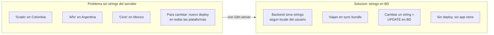

### Modelo de datos en backend

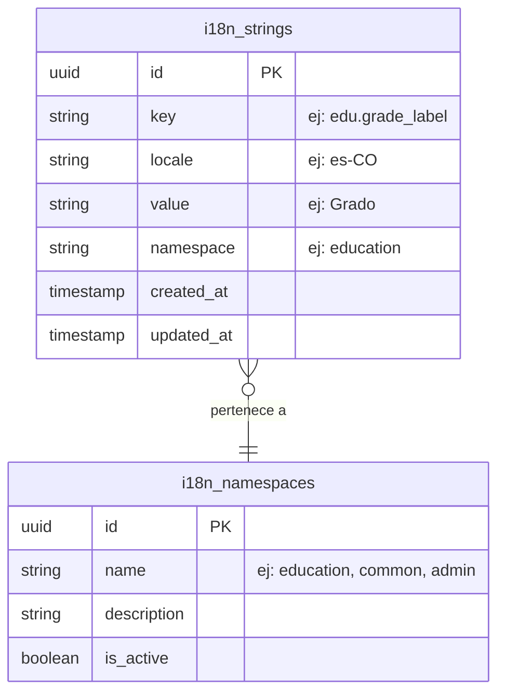

### Estructura del namespace

```
education.*         → Terminologia educativa que varia por pais
  education.grade_label        → "Grado" / "Año" / "Ciclo"
  education.period_label       → "Periodo" / "Cuatrimestre" / "Bimestre"
  education.school_label       → "Colegio" / "Escuela" / "Institucion"
  education.subject_label      → "Materia" / "Asignatura"
  education.student_label      → "Estudiante" / "Alumno"
  education.teacher_label      → "Docente" / "Profesor"
  education.guardian_label     → "Acudiente" / "Tutor" / "Apoderado"

admin.*             → Labels administrativos
  admin.dashboard_title        → "Panel de control"
  admin.users_section          → "Usuarios"

notifications.*     → Mensajes que se quieren cambiar sin deploy
  notifications.welcome        → "Bienvenido a EduGo"
  notifications.maintenance    → "Mantenimiento programado para..."
```

### Viaje en el Sync Bundle

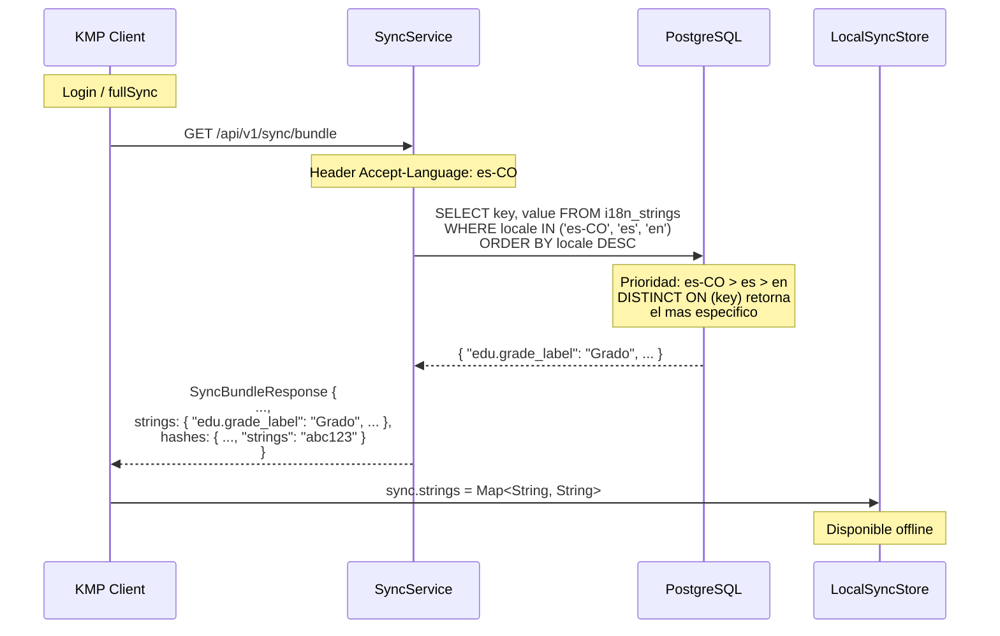

### Nuevo bucket en el bundle

```kotlin
// SyncBundleResponse (backend)
data class SyncBundleResponse(
    val menu: List<MenuItem>,
    val permissions: List<String>,
    val screens: Map<String, ScreenBundleEntry>,
    val availableContexts: List<UserContext>,
    val strings: Map<String, String>,         // ← NUEVO
    val hashes: Map<String, String>,
)

// UserDataBundle (KMP)
data class UserDataBundle(
    val menu: MenuResponse,
    val permissions: List<String>,
    val screens: Map<String, ScreenDefinition>,
    val availableContexts: List<UserContext>,
    val strings: Map<String, String>,         // ← NUEVO
    val hashes: Map<String, String>,
    val syncedAt: Instant,
)
```

### StringResolver: Resolucion unificada

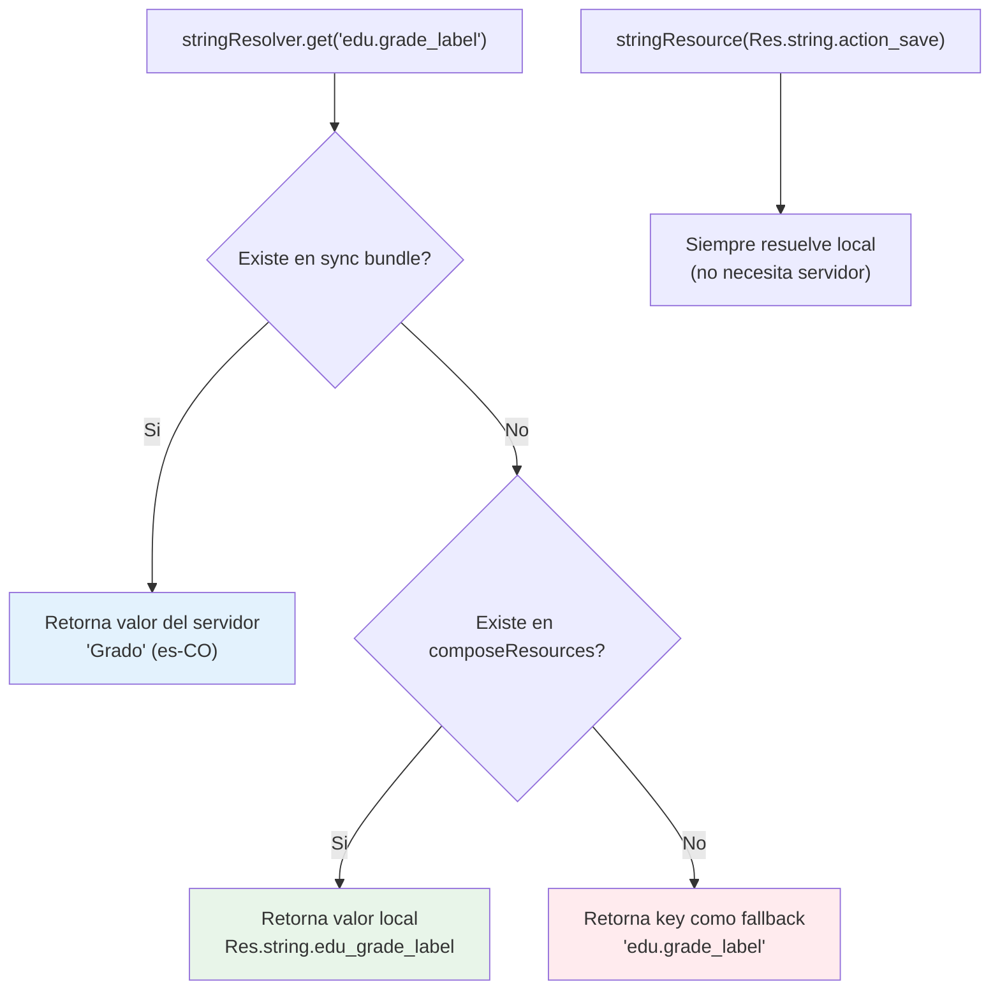

```kotlin
// StringResolver.kt (commonMain)
class StringResolver(
    private val dataSyncService: DataSyncService,
) {
    /**
     * Busca un string primero en el bundle del servidor,
     * luego hace fallback al valor local proporcionado.
     */
    fun get(key: String, localFallback: String? = null): String {
        val bundle = dataSyncService.currentBundle.value
        return bundle?.strings?.get(key)
            ?: localFallback
            ?: key
    }

    /**
     * Para uso en Composable con fallback a composeResources.
     */
    @Composable
    fun resolve(key: String, localResource: StringResource): String {
        val serverValue = get(key)
        return if (serverValue != key) serverValue
               else stringResource(localResource)
    }
}
```

### Uso en la UI

```kotlin
@Composable
fun GradeField(resolver: StringResolver) {
    // Prioridad: servidor (puede variar por pais) > local (fallback)
    val label = resolver.resolve(
        key = "edu.grade_label",
        localResource = Res.string.edu_grade_label
    )
    DSTextField(label = label, ...)
}

// Para strings que NUNCA necesitan servidor (acciones basicas):
Text(stringResource(Res.string.action_save))  // Siempre local
```

---

## Capa 3: SDUI Pre-traducido

### Como funciona (ya implementado parcialmente)

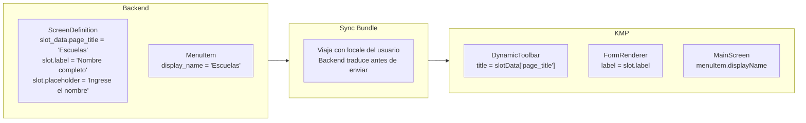

### Que debe cambiar en el backend

El backend debe resolver el locale del usuario al construir:
- `ScreenDefinition.slotData` → labels, titles, placeholders
- `MenuItem.displayName` → nombres del menu
- `DataConfig.fieldMapping` → podria incluir labels traducidos

```
// Actual: slotData esta en español fijo en la BD
{ "page_title": "Escuelas", "edit_title": "Editar Escuela" }

// Propuesto: slotData tiene keys, backend resuelve antes de enviar
// BD almacena:
{ "page_title": "i18n:schools.list.title", "edit_title": "i18n:schools.form.edit_title" }

// Backend detecta prefijo "i18n:" y resuelve contra i18n_strings
// Al enviar al cliente (locale es-CO):
{ "page_title": "Colegios", "edit_title": "Editar Colegio" }
// Al enviar al cliente (locale es-AR):
{ "page_title": "Escuelas", "edit_title": "Editar Escuela" }
```

---

## Cambio de Idioma en Runtime

### Flujo del usuario

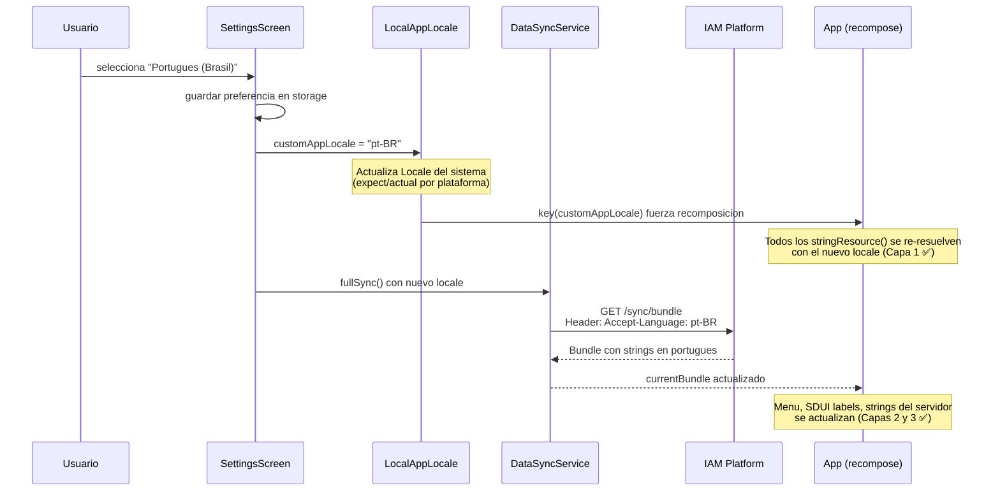

### Implementacion expect/actual del locale

```kotlin
// commonMain
var customAppLocale by mutableStateOf<String?>(null) // null = sistema

// androidMain
// Usa Locale.setDefault() + resources.updateConfiguration()

// iosMain
// Usa NSUserDefaults.setObject(arrayListOf(locale), "AppleLanguages")

// desktopMain
// Usa Locale.setDefault(Locale(language))

// wasmJsMain
// Usa window.__customLocale override en navigator.languages
```

### Persistencia de preferencia

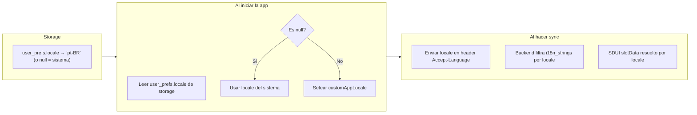

---

## Cadena de Fallback por Locale

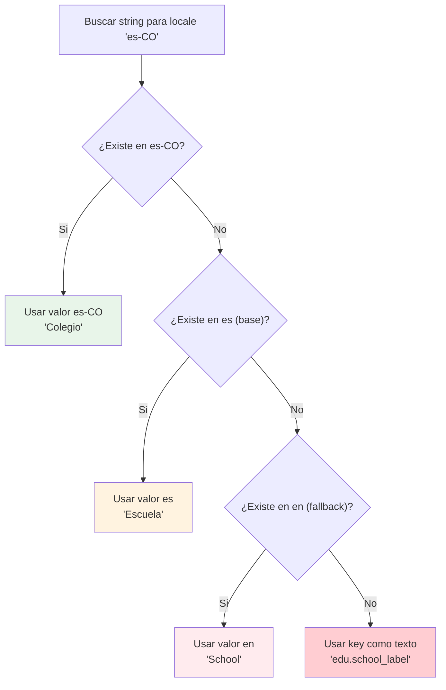

**En el backend (SQL):**
```sql
SELECT DISTINCT ON (key) key, value
FROM i18n.i18n_strings
WHERE locale IN ('es-CO', 'es', 'en')
  AND namespace = 'education'
ORDER BY key,
  CASE locale
    WHEN 'es-CO' THEN 1
    WHEN 'es' THEN 2
    WHEN 'en' THEN 3
  END
```

**En el cliente (offline):**
El bundle ya viene con los strings resueltos por el backend.
Si el usuario cambia de idioma offline, solo se actualiza la Capa 1 (composeResources locales).
Las Capas 2 y 3 se actualizan en el proximo sync con red.

---

## Diferencias por Plataforma

| Aspecto | Android | iOS | Desktop | WasmJS |
|---------|---------|-----|---------|--------|
| Locale del sistema | `Locale.getDefault()` | `NSLocale.preferredLanguages` | `Locale.getDefault()` | `navigator.languages` |
| Cambio en runtime | `resources.updateConfiguration()` | `NSUserDefaults` + restart compose | `Locale.setDefault()` | Override `navigator.languages` |
| composeResources | Nativo | Nativo | Nativo | Nativo |
| Strings del bundle | SharedPreferences | NSUserDefaults | Java Preferences | localStorage |
| RTL support | Automatico (Compose) | Automatico (Compose) | Automatico (Compose) | Automatico (Compose) |

---

## Migracion desde el sistema actual

### Fase 1: Mover hardcoded strings a composeResources

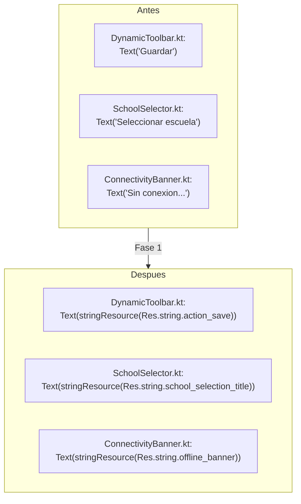

**Archivos a modificar:**
- `DynamicToolbar.kt` — 5 strings
- `UserMenuHeader.kt` — 2 strings
- `SchoolSelectorScreen.kt` — 4 strings
- `SchoolSelectionScreen.kt` — 1 string
- `ConnectivityBanner.kt` — 3 strings
- `StaleDataIndicator.kt` — 1 string

### Fase 2: Deprecar kmp-resources/Strings

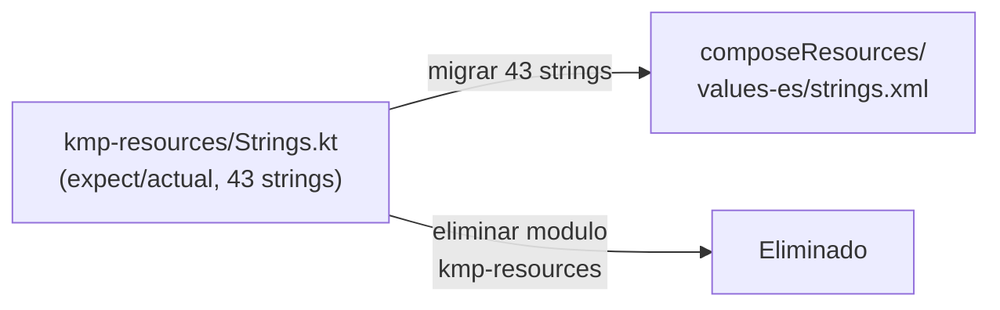

### Fase 3: Agregar strings del servidor

- Crear tabla `i18n_strings` en backend
- Agregar bucket `strings` al sync bundle
- Implementar `StringResolver` en KMP
- Migrar terminologia educativa a BD

### Fase 4: Agregar segundo idioma

- Crear `values/strings.xml` (ingles)
- Poblar `i18n_strings` con locale `en`
- Implementar selector de idioma en Settings
- Implementar `LocalAppLocale` expect/actual

---

## Que NO hacer

| Anti-patron | Por que evitarlo |
|------------|-----------------|
| Concatenar strings traducidos | `"Hola " + name` se rompe en idiomas con orden de palabras diferente. Usar `stringResource(Res.string.greeting, name)` |
| Reusar keys por coincidencia textual | "Guardar" en un formulario vs "Guardar" en un dialogo de archivo son contextos diferentes. Usar keys separadas |
| Traducir enums en el cliente | No hacer `when(status) { "ACTIVE" -> "Activo" }`. El backend debe enviar `statusDisplay: "Activo"` |
| Meter TODO en el servidor | Strings basicos ("Cancelar", "OK", "Error") deben ser locales para funcionar offline sin sync |
| Hardcodear locale | No hacer `if (locale == "es-CO")`. Usar la cadena de fallback |
| Usar strings como IDs | No hacer `if (buttonText == "Guardar")`. Usar `eventId` o `screenEvent` |

---

## Hash del Bucket de Strings

Para el delta sync, el bucket `strings` se hashea igual que los demas:

```go
// sync_service.go
func (s *SyncService) hashStrings(strings map[string]string) string {
    // Ordenar keys para hash determinista
    keys := make([]string, 0, len(strings))
    for k := range strings {
        keys = append(keys, k)
    }
    sort.Strings(keys)

    var sb strings.Builder
    for _, k := range keys {
        sb.WriteString(k)
        sb.WriteString("=")
        sb.WriteString(strings[k])
        sb.WriteString("\n")
    }
    return fmt.Sprintf("%x", sha256.Sum256([]byte(sb.String())))
}
```

**El hash cambia cuando:** se modifica cualquier string en `i18n_strings` para el locale del usuario.

---

## Mejoras Futuras

| Mejora | Descripcion | Prioridad |
|--------|-------------|-----------|
| ICU MessageFormat | Soporte para plurales complejos y genero en strings del servidor (`{count, plural, one {# escuela} other {# escuelas}}`) | Media |
| Panel de traduccion | UI admin para editar i18n_strings sin SQL directo | Alta (cuando haya >1 idioma) |
| OTA sin sync | Actualizar solo strings sin hacer full/delta sync (endpoint dedicado ligero) | Baja |
| Deteccion automatica de pais | Usar IP o GPS para sugerir locale, no solo el del sistema | Baja |
| Validar completitud | Script que compare keys entre locales y reporte strings faltantes | Media |
| A/B testing de copy | Servir diferentes strings a diferentes usuarios para medir conversion | Baja |
