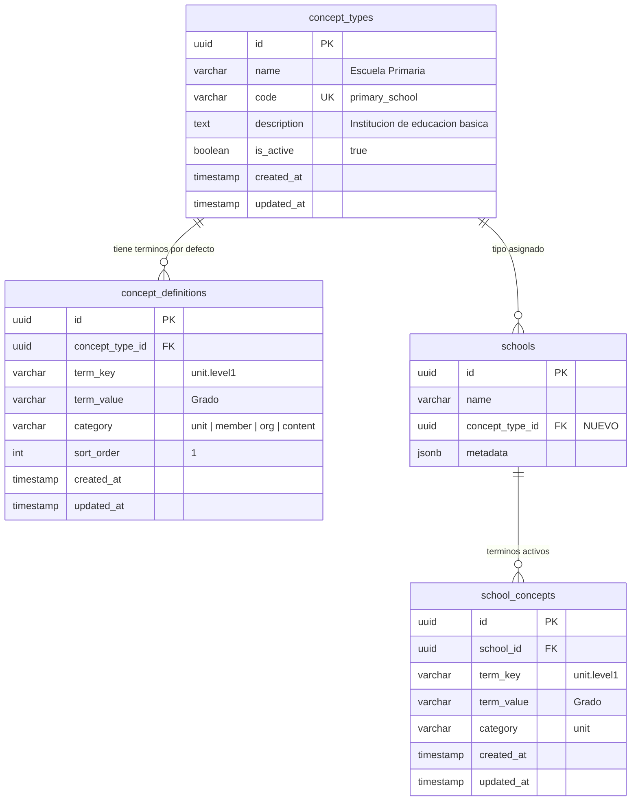
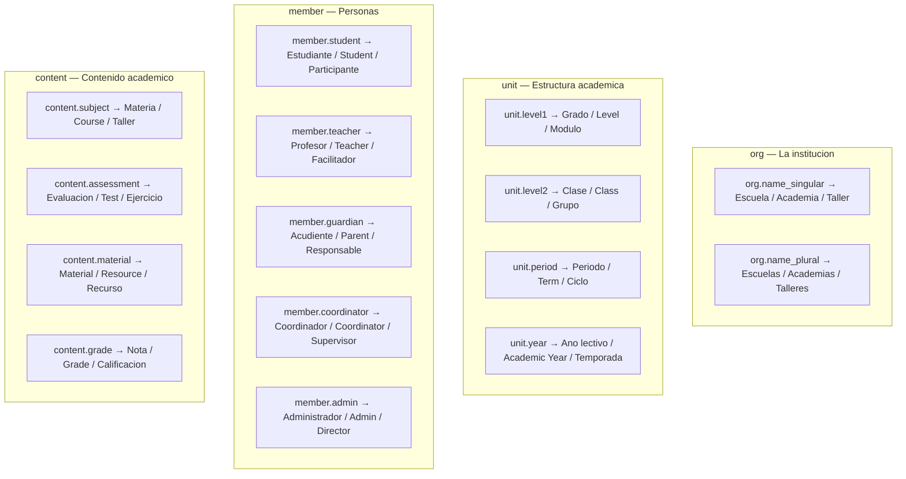
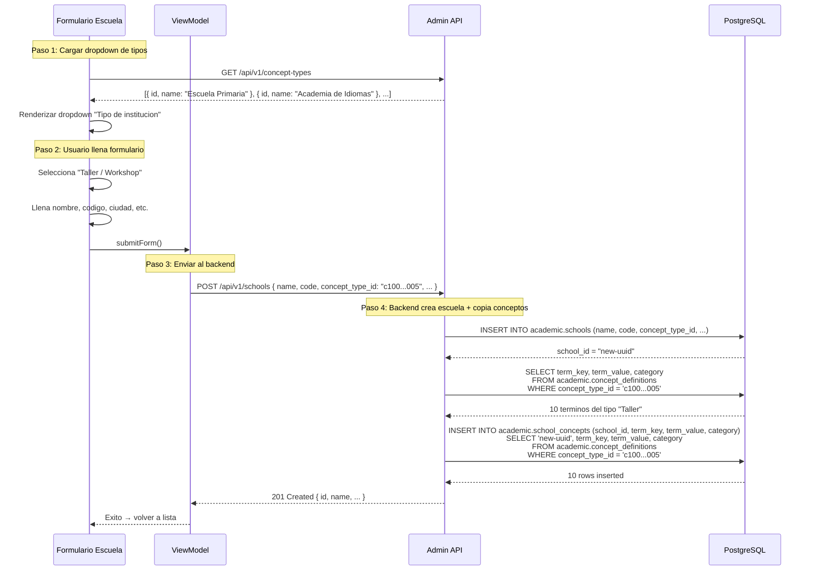
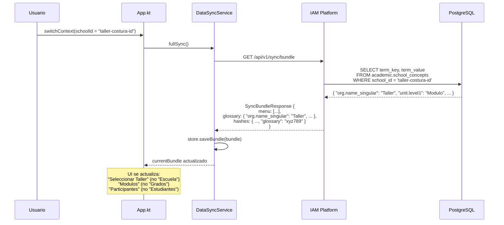
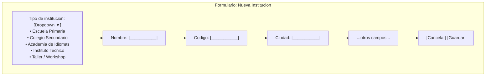
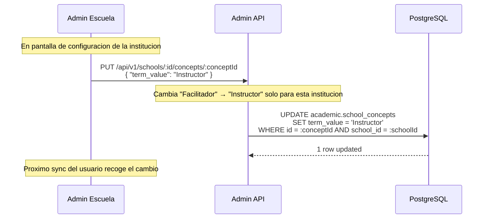
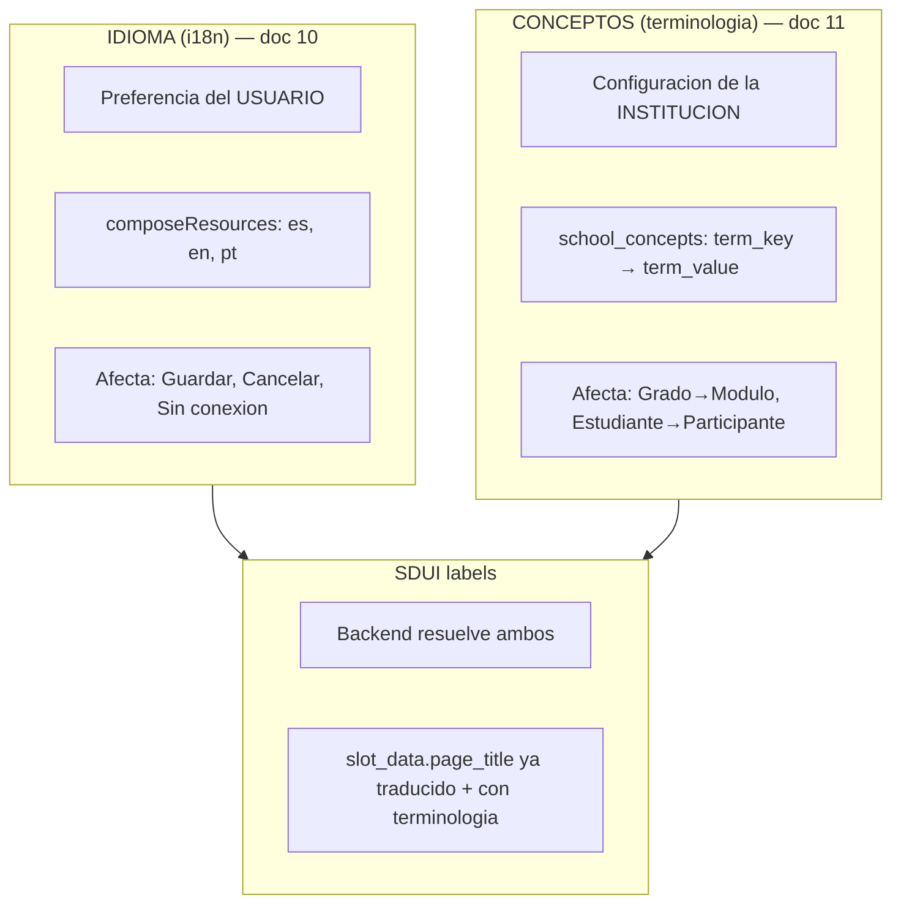

# 11 — Sistema de Conceptos (Terminologia Dinamica por Institucion)

> Cada institucion (escuela, academia, taller) define su propia terminologia.
> El usuario solo selecciona un "tipo de concepto" al crear la institucion.
> El sistema copia los terminos predefinidos y los hace disponibles via sync bundle.

---

## Problema

```
"Escuela Primaria"          "Academia de Ingles"        "Taller de Costura"
  Grado                       Level                       Modulo
  Clase                       Class                       Grupo
  Materia                     Course                      Taller
  Estudiante                  Student                     Participante
  Profesor                    Teacher                     Facilitador
  Acudiente                   Parent                      Responsable
  Periodo                     Term                        Ciclo
  Evaluacion                  Test                        Ejercicio
```

Cada institucion usa terminos distintos. No es un problema de idioma (i18n),
es un problema de **vocabulario del dominio** que depende del **tipo de institucion**.

---

## Modelo de Datos



---

## Tablas SQL

### academic.concept_types

```sql
CREATE TABLE academic.concept_types (
    id              UUID PRIMARY KEY DEFAULT gen_random_uuid(),
    name            VARCHAR(100) NOT NULL,
    code            VARCHAR(50) NOT NULL UNIQUE,
    description     TEXT,
    is_active       BOOLEAN NOT NULL DEFAULT true,
    created_at      TIMESTAMPTZ NOT NULL DEFAULT now(),
    updated_at      TIMESTAMPTZ NOT NULL DEFAULT now()
);

-- Trigger para updated_at
CREATE TRIGGER set_updated_at BEFORE UPDATE ON academic.concept_types
    FOR EACH ROW EXECUTE FUNCTION update_updated_at();
```

### academic.concept_definitions

Terminos predeterminados por tipo. Son la "plantilla" que se copia al crear una institucion.

```sql
CREATE TABLE academic.concept_definitions (
    id                UUID PRIMARY KEY DEFAULT gen_random_uuid(),
    concept_type_id   UUID NOT NULL REFERENCES academic.concept_types(id) ON DELETE CASCADE,
    term_key          VARCHAR(100) NOT NULL,
    term_value        VARCHAR(200) NOT NULL,
    category          VARCHAR(50) NOT NULL DEFAULT 'general',
    sort_order        INT NOT NULL DEFAULT 0,
    created_at        TIMESTAMPTZ NOT NULL DEFAULT now(),
    updated_at        TIMESTAMPTZ NOT NULL DEFAULT now(),

    UNIQUE (concept_type_id, term_key)
);

CREATE TRIGGER set_updated_at BEFORE UPDATE ON academic.concept_definitions
    FOR EACH ROW EXECUTE FUNCTION update_updated_at();
```

### academic.school_concepts

Terminos activos por institucion. Se copian de concept_definitions al crear la institucion.
Pueden ser editados individualmente despues.

```sql
CREATE TABLE academic.school_concepts (
    id          UUID PRIMARY KEY DEFAULT gen_random_uuid(),
    school_id   UUID NOT NULL REFERENCES academic.schools(id) ON DELETE CASCADE,
    term_key    VARCHAR(100) NOT NULL,
    term_value  VARCHAR(200) NOT NULL,
    category    VARCHAR(50) NOT NULL DEFAULT 'general',
    created_at  TIMESTAMPTZ NOT NULL DEFAULT now(),
    updated_at  TIMESTAMPTZ NOT NULL DEFAULT now(),

    UNIQUE (school_id, term_key)
);

CREATE INDEX idx_school_concepts_school ON academic.school_concepts(school_id);

CREATE TRIGGER set_updated_at BEFORE UPDATE ON academic.school_concepts
    FOR EACH ROW EXECUTE FUNCTION update_updated_at();
```

### Modificacion a academic.schools

```sql
ALTER TABLE academic.schools
    ADD COLUMN concept_type_id UUID REFERENCES academic.concept_types(id);
```

---

## Seeds de ejemplo

```sql
-- Tipos de concepto
INSERT INTO academic.concept_types (id, name, code, description) VALUES
    ('c1000000-0000-0000-0000-000000000001', 'Escuela Primaria',    'primary_school',   'Institucion de educacion basica'),
    ('c1000000-0000-0000-0000-000000000002', 'Colegio Secundario',  'high_school',      'Institucion de educacion media'),
    ('c1000000-0000-0000-0000-000000000003', 'Academia de Idiomas', 'language_academy',  'Centro de ensenanza de idiomas'),
    ('c1000000-0000-0000-0000-000000000004', 'Instituto Tecnico',   'technical_school',  'Formacion tecnica y profesional'),
    ('c1000000-0000-0000-0000-000000000005', 'Taller / Workshop',   'workshop',          'Cursos cortos y talleres practicos');

-- Definiciones para "Escuela Primaria"
INSERT INTO academic.concept_definitions (concept_type_id, term_key, term_value, category, sort_order) VALUES
    ('c1000000-0000-0000-0000-000000000001', 'org.name_singular',     'Escuela',       'org',     1),
    ('c1000000-0000-0000-0000-000000000001', 'org.name_plural',       'Escuelas',      'org',     2),
    ('c1000000-0000-0000-0000-000000000001', 'unit.level1',           'Grado',         'unit',    3),
    ('c1000000-0000-0000-0000-000000000001', 'unit.level2',           'Clase',         'unit',    4),
    ('c1000000-0000-0000-0000-000000000001', 'unit.period',           'Periodo',       'unit',    5),
    ('c1000000-0000-0000-0000-000000000001', 'member.student',        'Estudiante',    'member',  6),
    ('c1000000-0000-0000-0000-000000000001', 'member.teacher',        'Profesor',      'member',  7),
    ('c1000000-0000-0000-0000-000000000001', 'member.guardian',       'Acudiente',     'member',  8),
    ('c1000000-0000-0000-0000-000000000001', 'content.subject',       'Materia',       'content', 9),
    ('c1000000-0000-0000-0000-000000000001', 'content.assessment',    'Evaluacion',    'content', 10);

-- Definiciones para "Academia de Idiomas"
INSERT INTO academic.concept_definitions (concept_type_id, term_key, term_value, category, sort_order) VALUES
    ('c1000000-0000-0000-0000-000000000003', 'org.name_singular',     'Academia',      'org',     1),
    ('c1000000-0000-0000-0000-000000000003', 'org.name_plural',       'Academias',     'org',     2),
    ('c1000000-0000-0000-0000-000000000003', 'unit.level1',           'Level',         'unit',    3),
    ('c1000000-0000-0000-0000-000000000003', 'unit.level2',           'Class',         'unit',    4),
    ('c1000000-0000-0000-0000-000000000003', 'unit.period',           'Term',          'unit',    5),
    ('c1000000-0000-0000-0000-000000000003', 'member.student',        'Student',       'member',  6),
    ('c1000000-0000-0000-0000-000000000003', 'member.teacher',        'Teacher',       'member',  7),
    ('c1000000-0000-0000-0000-000000000003', 'member.guardian',       'Parent',        'member',  8),
    ('c1000000-0000-0000-0000-000000000003', 'content.subject',       'Course',        'content', 9),
    ('c1000000-0000-0000-0000-000000000003', 'content.assessment',    'Test',          'content', 10);

-- Definiciones para "Taller / Workshop"
INSERT INTO academic.concept_definitions (concept_type_id, term_key, term_value, category, sort_order) VALUES
    ('c1000000-0000-0000-0000-000000000005', 'org.name_singular',     'Taller',        'org',     1),
    ('c1000000-0000-0000-0000-000000000005', 'org.name_plural',       'Talleres',      'org',     2),
    ('c1000000-0000-0000-0000-000000000005', 'unit.level1',           'Modulo',        'unit',    3),
    ('c1000000-0000-0000-0000-000000000005', 'unit.level2',           'Grupo',         'unit',    4),
    ('c1000000-0000-0000-0000-000000000005', 'unit.period',           'Ciclo',         'unit',    5),
    ('c1000000-0000-0000-0000-000000000005', 'member.student',        'Participante',  'member',  6),
    ('c1000000-0000-0000-0000-000000000005', 'member.teacher',        'Facilitador',   'member',  7),
    ('c1000000-0000-0000-0000-000000000005', 'member.guardian',       'Responsable',   'member',  8),
    ('c1000000-0000-0000-0000-000000000005', 'content.subject',       'Taller',        'content', 9),
    ('c1000000-0000-0000-0000-000000000005', 'content.assessment',    'Ejercicio',     'content', 10);
```

---

## Term Keys: Catalogo Completo



---

## Endpoints del Backend

### CRUD de Tipos de Concepto

| Metodo | Endpoint | Permiso | Descripcion |
|--------|----------|---------|-------------|
| POST | `/api/v1/concept-types` | `concept_types:create` | Crear tipo de concepto |
| GET | `/api/v1/concept-types` | `concept_types:read` | Listar tipos activos |
| GET | `/api/v1/concept-types/:id` | `concept_types:read` | Obtener tipo por ID |
| PUT | `/api/v1/concept-types/:id` | `concept_types:update` | Actualizar tipo |
| DELETE | `/api/v1/concept-types/:id` | `concept_types:delete` | Desactivar tipo |

### CRUD de Definiciones (anidado bajo tipo)

| Metodo | Endpoint | Permiso | Descripcion |
|--------|----------|---------|-------------|
| POST | `/api/v1/concept-types/:id/definitions` | `concept_types:update` | Agregar termino al tipo |
| GET | `/api/v1/concept-types/:id/definitions` | `concept_types:read` | Listar terminos del tipo |
| PUT | `/api/v1/concept-types/:id/definitions/:defId` | `concept_types:update` | Editar termino |
| DELETE | `/api/v1/concept-types/:id/definitions/:defId` | `concept_types:update` | Eliminar termino |

### Conceptos de una Institucion (solo lectura para el usuario normal)

| Metodo | Endpoint | Permiso | Descripcion |
|--------|----------|---------|-------------|
| GET | `/api/v1/schools/:id/concepts` | `schools:read` | Obtener conceptos activos de la institucion |
| PUT | `/api/v1/schools/:id/concepts/:conceptId` | `schools:update` | Editar un concepto individual (personalizar) |

---

## DTOs

### ConceptType

```go
// Request
type CreateConceptTypeRequest struct {
    Name        string `json:"name" binding:"required,min=3"`
    Code        string `json:"code" binding:"required,min=3"`
    Description string `json:"description"`
}

// Response
type ConceptTypeResponse struct {
    ID          string `json:"id"`
    Name        string `json:"name"`
    Code        string `json:"code"`
    Description string `json:"description"`
    IsActive    bool   `json:"is_active"`
}

// Para dropdown en el formulario de escuela
type ConceptTypeOption struct {
    ID   string `json:"id"`
    Name string `json:"name"`
    Code string `json:"code"`
}
```

### ConceptDefinition

```go
type ConceptDefinitionRequest struct {
    TermKey   string `json:"term_key" binding:"required"`
    TermValue string `json:"term_value" binding:"required"`
    Category  string `json:"category"`
    SortOrder int    `json:"sort_order"`
}

type ConceptDefinitionResponse struct {
    ID        string `json:"id"`
    TermKey   string `json:"term_key"`
    TermValue string `json:"term_value"`
    Category  string `json:"category"`
    SortOrder int    `json:"sort_order"`
}
```

### SchoolConcept

```go
type SchoolConceptResponse struct {
    ID        string `json:"id"`
    TermKey   string `json:"term_key"`
    TermValue string `json:"term_value"`
    Category  string `json:"category"`
}
```

### Modificacion al CreateSchoolRequest

```go
type CreateSchoolRequest struct {
    Name             string                 `json:"name" binding:"required,min=3"`
    Code             string                 `json:"code" binding:"required,min=3"`
    ConceptTypeID    string                 `json:"concept_type_id" binding:"required"` // ← NUEVO
    Address          string                 `json:"address"`
    City             string                 `json:"city"`
    Country          string                 `json:"country"`
    ContactEmail     string                 `json:"contact_email"`
    ContactPhone     string                 `json:"contact_phone"`
    SubscriptionTier string                 `json:"subscription_tier"`
    MaxTeachers      int                    `json:"max_teachers"`
    MaxStudents      int                    `json:"max_students"`
    Metadata         map[string]interface{} `json:"metadata"`
}
```

---

## Flujo: Crear Institucion



---

## Flujo: Switch Context y Sync



---

## Modificacion al Formulario de Escuela (SDUI)

### Nuevo campo en slot_data

```json
{
  "fields": [
    {
      "key": "concept_type_id",
      "type": "select",
      "label": "Tipo de institucion",
      "required": true,
      "placeholder": "Seleccione un tipo",
      "options_endpoint": "admin:/api/v1/concept-types",
      "option_label": "name",
      "option_value": "id"
    },
    { "key": "name", "type": "text", "label": "Nombre", "required": true },
    { "key": "code", "type": "text", "label": "Codigo", "required": true },
    ...
  ]
}
```

### Lo que ve el usuario



El usuario **nunca ve los conceptos individuales** en este formulario.
Solo selecciona el tipo y el sistema hace el resto.

---

## Uso de Conceptos en la UI (KMP)

### GlossaryProvider

```kotlin
class GlossaryProvider(
    private val dataSyncService: DataSyncService,
) {
    val glossary: Map<String, String>
        get() = dataSyncService.currentBundle.value?.glossary.orEmpty()

    fun term(key: String): String = glossary[key] ?: key

    fun term(key: String, fallback: String): String = glossary[key] ?: fallback
}
```

### Donde se usa

```kotlin
// SchoolSelectionScreen - antes hardcodeado
Text("Seleccionar ${glossary.term("org.name_singular", "institucion")}")
// → "Seleccionar Taller" / "Seleccionar Academia" / "Seleccionar Escuela"

// DynamicToolbar - titulo de lista
// El backend ya resuelve slot_data.page_title usando glossary
// Si page_title = "{{org.name_plural}}" → backend envía "Talleres"

// Listas y formularios
// Los labels de campos ya vienen resueltos en slotData del SDUI

// Mensajes del sistema (con stringResource + glossary)
val orgName = glossary.term("org.name_singular", "institucion")
Text(stringResource(Res.string.empty_list_for, orgName))
// → "No se encontraron talleres" / "No se encontraron academias"
```

---

## Personalizacion Individual

Si una institucion quiere cambiar un termino especifico despues de creada:



---

## Backend: Logica de Copia (School Service)

```go
// school_service.go - CreateSchool
func (s *SchoolService) CreateSchool(ctx context.Context, req *dto.CreateSchoolRequest) (*dto.SchoolResponse, error) {
    // 1. Validar concept_type existe
    conceptType, err := s.conceptTypeRepo.FindByID(ctx, req.ConceptTypeID)
    if err != nil {
        return nil, fmt.Errorf("tipo de concepto no encontrado")
    }

    // 2. Crear la escuela
    school := &entities.School{
        Name:            req.Name,
        Code:            req.Code,
        ConceptTypeID:   &conceptType.ID,
        // ... demas campos
    }
    if err := s.schoolRepo.Create(ctx, school); err != nil {
        return nil, err
    }

    // 3. Copiar definiciones del tipo a school_concepts
    definitions, err := s.conceptDefRepo.FindByTypeID(ctx, conceptType.ID)
    if err != nil {
        return nil, err
    }

    concepts := make([]*entities.SchoolConcept, len(definitions))
    for i, def := range definitions {
        concepts[i] = &entities.SchoolConcept{
            SchoolID:  school.ID,
            TermKey:   def.TermKey,
            TermValue: def.TermValue,
            Category:  def.Category,
        }
    }
    if err := s.schoolConceptRepo.BulkCreate(ctx, concepts); err != nil {
        return nil, err
    }

    return toSchoolResponse(school), nil
}
```

---

## Sync Bundle: Nuevo Bucket "glossary"

### Hash del glossary

```go
func (s *SyncService) hashGlossary(concepts []SchoolConceptResponse) string {
    // Ordenar por term_key para hash determinista
    sort.Slice(concepts, func(i, j int) bool {
        return concepts[i].TermKey < concepts[j].TermKey
    })
    data, _ := json.Marshal(concepts)
    return fmt.Sprintf("%x", sha256.Sum256(data))
}
```

### Fetch en el bundle

```go
// Dentro de GetFullBundle()
var glossary map[string]string

g.Go(func() error {
    concepts, err := s.schoolConceptRepo.FindBySchoolID(gCtx, activeContext.SchoolID)
    if err != nil {
        return err
    }
    glossary = make(map[string]string, len(concepts))
    for _, c := range concepts {
        glossary[c.TermKey] = c.TermValue
    }
    return nil
})

// En el response
bundle.Glossary = glossary
bundle.Hashes["glossary"] = hashGlossary(concepts)
```

### KMP: LocalSyncStore

```kotlin
// Nuevas keys de storage
const val SYNC_GLOSSARY = "sync.glossary"

// En saveBundle()
storage.putObjectSafe(SYNC_GLOSSARY, bundle.glossary)

// En loadBundle()
val glossary: Map<String, String> = storage.getObjectSafe(SYNC_GLOSSARY) ?: emptyMap()
```

---

## Permisos Nuevos

```sql
INSERT INTO iam.permissions (id, name, display_name, description, module, is_active) VALUES
    (gen_random_uuid(), 'concept_types:read',   'Ver tipos de concepto',     'Listar tipos de concepto',             'concept_types', true),
    (gen_random_uuid(), 'concept_types:create', 'Crear tipo de concepto',    'Crear nuevos tipos de concepto',       'concept_types', true),
    (gen_random_uuid(), 'concept_types:update', 'Editar tipo de concepto',   'Modificar tipos y sus definiciones',   'concept_types', true),
    (gen_random_uuid(), 'concept_types:delete', 'Eliminar tipo de concepto', 'Desactivar tipos de concepto',         'concept_types', true);
```

Asignar a `super_admin` y `platform_admin`. Los `school_admin` solo necesitan `concept_types:read` (para ver el dropdown) y `schools:update` (para personalizar conceptos de su escuela).

---

## Resumen de Cambios por Capa

### Backend (edugo-infrastructure)

| Cambio | Tipo |
|--------|------|
| Crear tabla `academic.concept_types` | Migration |
| Crear tabla `academic.concept_definitions` | Migration |
| Crear tabla `academic.school_concepts` | Migration |
| ALTER `academic.schools` ADD `concept_type_id` | Migration |
| Seeds: 5 tipos + definiciones | Seed |
| Seeds: permisos `concept_types:*` | Seed |

### Backend (edugo-shared)

| Cambio | Tipo |
|--------|------|
| Entity `ConceptType` | New file |
| Entity `ConceptDefinition` | New file |
| Entity `SchoolConcept` | New file |
| Modificar entity `School`: agregar `ConceptTypeID` | Edit |

### Backend (edugo-api-admin-new)

| Cambio | Tipo |
|--------|------|
| DTOs: ConceptType, ConceptDefinition request/response | New file |
| Repository: ConceptType, ConceptDefinition, SchoolConcept | New file |
| Service: ConceptTypeService (CRUD) | New file |
| Handler: ConceptTypeHandler (HTTP) | New file |
| Modificar SchoolService.CreateSchool: copiar conceptos | Edit |
| Modificar CreateSchoolRequest: agregar `concept_type_id` | Edit |
| Routes: registrar endpoints concept-types | Edit |
| Container: registrar nuevos repos/services/handlers | Edit |

### Backend (edugo-api-iam-platform)

| Cambio | Tipo |
|--------|------|
| SyncService: agregar bucket `glossary` con school_concepts | Edit |
| SyncDTO: agregar `Glossary map[string]string` a bundle | Edit |
| Repository: SchoolConceptRepository (read-only) | New file |

### KMP Frontend

| Cambio | Tipo |
|--------|------|
| `SyncModels.kt`: agregar `glossary` a SyncBundleResponse | Edit |
| `UserDataBundle.kt`: agregar `glossary: Map<String, String>` | Edit |
| `LocalSyncStore.kt`: agregar key `sync.glossary` | Edit |
| `DataSyncService.kt`: mapear glossary del bundle | Edit |
| `GlossaryProvider.kt`: resolver terminos | New file |
| DI: registrar GlossaryProvider | Edit |
| Formulario escuela: agregar campo select `concept_type_id` | SDUI (BD) |

---

## Relacion con Multiidioma (doc 10)



**Son independientes:**
- Cambiar idioma NO cambia la terminologia de la institucion
- Cambiar de institucion (switch context) cambia la terminologia pero NO el idioma
- El backend puede combinar ambos: servir "Talleres" (terminologia) en un UI en portugues

---

## Decisiones de Diseño y Consideraciones

### DD-1: La copia es un snapshot, no un vinculo vivo

Al crear una institucion, los conceptos se copian desde `concept_definitions` a `school_concepts`.
Despues de eso, **no hay vinculo automatico**. Si un admin agrega un nuevo term_key
al concept_type, las instituciones existentes de ese tipo NO lo reciben automaticamente.

**Decision:** Aceptado como comportamiento V1. Cada institucion es un snapshot del tipo al momento
de su creacion. Si se necesita propagar nuevos terminos, se hara via una funcionalidad de admin
(ver DD-2).

**Justificacion:** Mantiene el modelo simple. Evita efectos secundarios al editar un tipo
(que podria afectar a 50 instituciones sin que el admin lo espere).

### DD-2: La re-sincronizacion es responsabilidad del administrador

Si se agregan nuevos term_keys a un tipo y se quieren propagar a instituciones existentes,
**un administrador (super_admin/platform_admin) debe disparar la accion explicitamente**.
No es automatico ni responsabilidad del usuario final.

**Endpoint futuro (V2):**
```
POST /api/v1/schools/:id/concepts/sync-from-type
```
Logica: inserta solo term_keys que no existan aun en `school_concepts` de esa institucion.
No sobreescribe valores personalizados.

### DD-3: La creacion de escuela es una sola transaccion

El endpoint `POST /api/v1/schools` recibe `concept_type_id` y hace todo en una transaccion:

```
BEGIN
  1. INSERT school (con concept_type_id)
  2. SELECT definitions del concept_type
  3. INSERT school_concepts (copia de definitions)
COMMIT (o ROLLBACK si falla cualquier paso)
```

No se consumen dos endpoints. Es un solo POST, una sola transaccion.
El cliente no necesita saber nada de concept_definitions.

### DD-4: El tipo de concepto es inmutable post-creacion

Una vez asignado el `concept_type_id` a una institucion, **no se puede cambiar**.
Si una institucion necesita otro tipo, se crea una nueva.

**Justificacion:** Cambiar de tipo implica decidir que hacer con los conceptos personalizados
(merge? replace? mantener?). Es complejidad innecesaria para V1 y un caso de uso raro.

### DD-5: super_admin sin glossary

El `super_admin` no tiene `schoolId` en su `activeContext`. El sync bundle devolvera
`glossary: {}` (vacio). El `GlossaryProvider` usara los fallbacks:

```kotlin
glossary.term("org.name_singular", "Institucion")  // → "Institucion"
glossary.term("unit.level1", "Nivel")               // → "Nivel"
glossary.term("member.student", "Miembro")           // → "Miembro"
```

Estos fallbacks genericos son adecuados porque el super_admin administra instituciones
desde afuera, no opera dentro de ninguna.

### DD-6: La institucion decide el idioma de sus terminos

El glossary NO tiene columna `locale`. Los valores estan en el idioma que la institucion
decida. Si una "Academia de Ingles" quiere que sus terminos esten en ingles ("Student",
"Teacher", "Level"), es decision del admin de esa academia.

**Implicacion:** Un usuario de habla portuguesa en una academia de ingles vera "Student"
(no "Estudante"). Esto es intencional — la terminologia es de la institucion, no del usuario.

**V2 posible:** Si se necesita glossary multi-idioma, agregar `locale` a
`concept_definitions` y `school_concepts`, con cadena de fallback igual que i18n.
Pero agrega complejidad significativa. Solo considerar si hay demanda real.

### DD-7: Los placeholders `{{term_key}}` se resuelven en el CLIENTE

Los `slotData` en la BD pueden contener `"page_title": "{{org.name_plural}}"`.
El **cliente** resuelve estos placeholders usando el glossary local, no el backend.

```kotlin
fun resolveTemplate(template: String, glossary: Map<String, String>): String {
    return template.replace(Regex("\\{\\{(\\w+\\.\\w+)\\}\\}")) { match ->
        glossary[match.groupValues[1]] ?: match.value
    }
}
```

**Justificacion:**
- Funciona offline (el glossary ya esta en cache)
- No requiere template engine en el backend
- El slotData viaja tal cual esta en la BD, sin transformacion
- Cada plataforma resuelve con su glossary del contexto activo

### DD-8: El dropdown de tipos requiere SDUI remote_select (prerequisito)

El formulario de crear escuela necesita un campo `select` que cargue opciones desde
`GET /api/v1/concept-types`. Actualmente el SDUI no soporta este control.

**Prerequisito:** Implementar `remote_select` como nuevo controlType en el SDUI.
Documentado en detalle en [doc 12](./12-sdui-remote-select.md).

**Alternativa temporal:** Si se implementa antes de tener `remote_select`, se puede
hardcodear el dropdown en `SchoolsFormContract` como custom event handler que carga
las opciones y las inyecta como campo del formulario.
