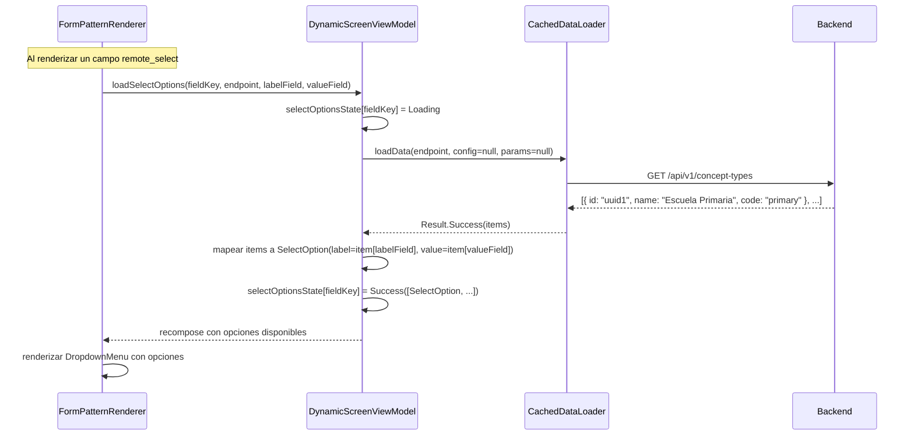
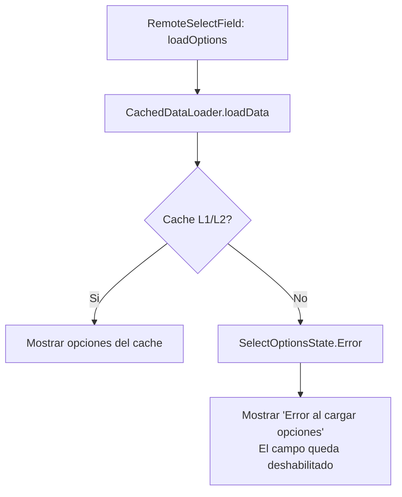

# 12 — SDUI Select y Remote Select (Dropdown Dinamico)

> **Estado:** `select` (opciones fijas) esta **IMPLEMENTADO**. `remote_select` (opciones
> desde endpoint) esta **PENDIENTE** de implementacion.
>
> Prerequisito para el formulario de creacion de instituciones (doc 11)
> y para cualquier campo select que dependa de datos del servidor.

---

## Estado de Implementacion

| Variante | Estado | Archivo(s) |
|----------|--------|------------|
| `select` (opciones fijas en `slot.options`) | ✅ **Implementado** | `ControlType.SELECT` en `Slot.kt`, `SelectField.kt` en `kmp-screens/dynamic/components/`, `SlotRenderer.kt` |
| `remote_select` (opciones desde endpoint) | ❌ **Pendiente** | Requiere: nuevo `ControlType.REMOTE_SELECT`, `loadSelectOptions()` en ViewModel, campos `options_endpoint`/`option_label`/`option_value` en Slot |

---

## Contexto

El sistema SDUI soporta 22 controlTypes en formularios (ver doc 03), incluyendo:

```
text-input, email-input, password-input, number-input, search-bar,
select ✅, checkbox, switch, radio-group, chip, rating,
filled-button, outlined-button, text-button, icon-button,
label, icon, avatar, image, divider,
list-item, list-item-navigation, metric-card
```

**`select`** ya funciona con opciones fijas definidas en `slot.options`.
Falta `remote_select` que cargue opciones desde un endpoint para formularios como
"Tipo de institucion" cuyas opciones vienen de `GET /api/v1/concept-types`.

---

## Casos de Uso

No es solo para concept_types. Este controlType se necesita en varios formularios:

| Formulario | Campo | Endpoint de opciones |
|-----------|-------|---------------------|
| Crear/Editar Escuela | Tipo de institucion | `GET /api/v1/concept-types` |
| Crear/Editar Escuela | Plan de suscripcion | Opciones fijas: free, basic, premium, enterprise |
| Crear/Editar Unidad Academica | Tipo de unidad | Opciones fijas o endpoint |
| Crear/Editar Membership | Rol | `GET /api/v1/roles?scope=school` |
| Crear/Editar Membership | Escuela | `GET /api/v1/schools` |
| Crear/Editar Subject | Unidad academica | `GET /api/v1/schools/:id/units` |

---

## Diseño: Dos Variantes de Select

### 1. `select` — Opciones fijas en slotData ✅ IMPLEMENTADO

Para campos con opciones conocidas y pocas (no necesitan endpoint).

**Modelo en Kotlin:**
```kotlin
// Slot.kt
@Serializable
data class SlotOption(
    val label: String,   // Texto visible ("Gratuito")
    val value: String,   // Valor a enviar ("free")
)

@Serializable
data class Slot(
    // ...otros campos...
    val options: List<SlotOption>? = null,  // Para select
)
```

**Composable implementado:** `SelectField.kt` en `kmp-screens/dynamic/components/`
```kotlin
@Composable
fun SelectField(
    label: String?,
    placeholder: String?,
    options: List<SlotOption>,
    selectedValue: String,
    onValueChange: (String) -> Unit,
    // ...
)
```

**Uso en SlotRenderer:**
```kotlin
ControlType.SELECT -> {
    val options = slot.options ?: emptyList()
    SelectField(
        label = slot.label,
        placeholder = slot.placeholder,
        options = options,
        selectedValue = fieldValues[slot.id] ?: "",
        onValueChange = { onFieldChanged(slot.id, it) },
        // ...
    )
}
```

**JSON del backend:**

```json
{
    "key": "subscription_tier",
    "type": "select",
    "label": "Plan de suscripcion",
    "required": true,
    "placeholder": "Seleccione un plan",
    "options": [
        { "label": "Gratuito", "value": "free" },
        { "label": "Basico", "value": "basic" },
        { "label": "Premium", "value": "premium" },
        { "label": "Empresarial", "value": "enterprise" }
    ]
}
```

### 2. `remote_select` — Opciones desde un endpoint ❌ PENDIENTE

Para campos con opciones dinamicas que vienen del servidor.

```json
{
    "key": "concept_type_id",
    "type": "remote_select",
    "label": "Tipo de institucion",
    "required": true,
    "placeholder": "Seleccione un tipo",
    "options_endpoint": "admin:/api/v1/concept-types",
    "option_label": "name",
    "option_value": "id"
}
```

| Campo del slot | Descripcion |
|----------------|-------------|
| `options_endpoint` | Endpoint a llamar (con prefijo de API). Debe retornar un array de objetos |
| `option_label` | Campo del objeto a mostrar como texto visible |
| `option_value` | Campo del objeto a usar como valor seleccionado (se envia en el submit) |

---

## Flujo de Carga



---

## Modelo en KMP

### SelectOption

```kotlin
data class SelectOption(
    val label: String,   // Texto visible ("Escuela Primaria")
    val value: String,   // Valor a enviar ("uuid-del-tipo")
)
```

### Estado en el ViewModel

```kotlin
// DynamicScreenViewModel
private val _selectOptions = MutableStateFlow<Map<String, SelectOptionsState>>(emptyMap())
val selectOptions: StateFlow<Map<String, SelectOptionsState>> = _selectOptions

sealed class SelectOptionsState {
    data object Loading : SelectOptionsState()
    data class Success(val options: List<SelectOption>) : SelectOptionsState()
    data class Error(val message: String) : SelectOptionsState()
}

fun loadSelectOptions(fieldKey: String, endpoint: String, labelField: String, valueField: String) {
    if (_selectOptions.value.containsKey(fieldKey)) return // ya cargado

    _selectOptions.update { it + (fieldKey to SelectOptionsState.Loading) }

    viewModelScope.launch {
        val result = dataLoader.loadData(endpoint, config = null, params = emptyMap())
        result.fold(
            onSuccess = { dataPage ->
                val options = dataPage.items.map { item ->
                    SelectOption(
                        label = item.jsonObject[labelField]?.jsonPrimitive?.content ?: "",
                        value = item.jsonObject[valueField]?.jsonPrimitive?.content ?: "",
                    )
                }
                _selectOptions.update { it + (fieldKey to SelectOptionsState.Success(options)) }
            },
            onFailure = { error ->
                _selectOptions.update { it + (fieldKey to SelectOptionsState.Error(error)) }
            }
        )
    }
}
```

---

## Renderizado en FormPatternRenderer

### Select (opciones fijas)

```kotlin
@Composable
fun SelectField(
    slot: Slot,
    options: List<SelectOption>,
    selectedValue: String,
    onValueChange: (String) -> Unit,
) {
    var expanded by remember { mutableStateOf(false) }
    val selectedLabel = options.find { it.value == selectedValue }?.label ?: ""

    ExposedDropdownMenuBox(expanded = expanded, onExpandedChange = { expanded = it }) {
        OutlinedTextField(
            value = selectedLabel,
            onValueChange = {},
            readOnly = true,
            label = { Text(slot.label ?: "") },
            placeholder = { Text(slot.placeholder ?: "") },
            trailingIcon = { ExposedDropdownMenuDefaults.TrailingIcon(expanded) },
            modifier = Modifier.menuAnchor().fillMaxWidth(),
        )
        ExposedDropdownMenu(expanded = expanded, onDismissRequest = { expanded = false }) {
            options.forEach { option ->
                DropdownMenuItem(
                    text = { Text(option.label) },
                    onClick = {
                        onValueChange(option.value)
                        expanded = false
                    }
                )
            }
        }
    }
}
```

### Remote Select (opciones del servidor)

```kotlin
@Composable
fun RemoteSelectField(
    slot: Slot,
    fieldKey: String,
    optionsState: SelectOptionsState?,
    selectedValue: String,
    onValueChange: (String) -> Unit,
    onLoadOptions: () -> Unit,
) {
    // Disparar carga al entrar en composicion
    LaunchedEffect(fieldKey) { onLoadOptions() }

    when (optionsState) {
        is SelectOptionsState.Loading, null -> {
            OutlinedTextField(
                value = "",
                onValueChange = {},
                readOnly = true,
                label = { Text(slot.label ?: "") },
                placeholder = { Text("Cargando...") },
                enabled = false,
                modifier = Modifier.fillMaxWidth(),
            )
        }
        is SelectOptionsState.Success -> {
            SelectField(
                slot = slot,
                options = optionsState.options,
                selectedValue = selectedValue,
                onValueChange = onValueChange,
            )
        }
        is SelectOptionsState.Error -> {
            OutlinedTextField(
                value = "",
                onValueChange = {},
                readOnly = true,
                label = { Text(slot.label ?: "") },
                placeholder = { Text("Error al cargar opciones") },
                isError = true,
                modifier = Modifier.fillMaxWidth(),
            )
        }
    }
}
```

---

## Integracion en FormPatternRenderer

```kotlin
// Dentro del loop de slots del form-section:
when (slot.controlType) {
    "text", "email", "number" -> {
        DSTextField(/* ... existente */)
    }
    "select" -> {
        val options = slot.options?.map { SelectOption(it.label, it.value) } ?: emptyList()
        SelectField(
            slot = slot,
            options = options,
            selectedValue = fieldValues[slot.key] ?: "",
            onValueChange = { viewModel.updateField(slot.key, it) },
        )
    }
    "remote_select" -> {
        val optionsState = selectOptions[slot.key]
        RemoteSelectField(
            slot = slot,
            fieldKey = slot.key,
            optionsState = optionsState,
            selectedValue = fieldValues[slot.key] ?: "",
            onValueChange = { viewModel.updateField(slot.key, it) },
            onLoadOptions = {
                viewModel.loadSelectOptions(
                    fieldKey = slot.key,
                    endpoint = slot.optionsEndpoint ?: return@RemoteSelectField,
                    labelField = slot.optionLabel ?: "name",
                    valueField = slot.optionValue ?: "id",
                )
            },
        )
    }
}
```

---

## Cambios al Modelo Slot

### Nuevos campos opcionales

```kotlin
data class Slot(
    val id: String,
    val controlType: String,
    val bind: String?,
    val eventId: String?,
    val label: String?,
    val placeholder: String?,
    val required: Boolean = false,
    val readOnly: Boolean = false,
    // Nuevos para select:
    val options: List<SlotOption>? = null,           // Para select (fijas)
    val optionsEndpoint: String? = null,             // Para remote_select
    val optionLabel: String? = null,                 // Campo a mostrar
    val optionValue: String? = null,                 // Campo como valor
)

@Serializable
data class SlotOption(
    val label: String,
    val value: String,
)
```

### Alternativa: Definir en slotData.fields (FormFieldsResolver)

Actualmente los campos de formulario vienen de `slotData.fields[]`, no del template.
Los campos nuevos se agregan al field JSON:

```json
{
    "key": "concept_type_id",
    "type": "remote_select",
    "label": "Tipo de institucion",
    "required": true,
    "options_endpoint": "admin:/api/v1/concept-types",
    "option_label": "name",
    "option_value": "id"
}
```

El `FormFieldsResolver` ya convierte `slotData.fields` en slots dinamicos.
Solo necesita mapear los campos nuevos (`options_endpoint`, `option_label`, `option_value`)
a las propiedades del Slot generado.

---

## Resolucion de Endpoint con Prefijo

El `options_endpoint` usa el mismo sistema de prefijos que el resto de la app:

```
"admin:/api/v1/concept-types"  → adminBaseUrl + "/api/v1/concept-types"
"iam:/api/v1/roles"            → iamBaseUrl + "/api/v1/roles"
"/api/v1/something"            → mobileBaseUrl + "/api/v1/something"
```

El `CachedDataLoader` ya maneja esto, asi que `loadSelectOptions` simplemente delega
a `loadData()` con el endpoint tal cual.

---

## Cache de Opciones

Las opciones se cachean en memoria dentro del ViewModel (`_selectOptions`).
No se persisten en storage porque:

- Son pocos items (tipos de concepto, roles, etc.)
- Cambian con poca frecuencia
- Se recargan al abrir el formulario

Si se necesita cache persistente (para offline), se puede usar `CachedDataLoader`
que ya tiene cache L1/L2. El `loadData()` que usamos ya pasa por el cache.

---

## Offline

Si el usuario abre el formulario sin red:



El formulario se puede llenar parcialmente. El campo `remote_select` sin opciones
quedara vacio y si es `required`, el submit fallara con validacion local.

---

## Diferencias por Plataforma

| Aspecto | Android | iOS | Desktop | WasmJS |
|---------|---------|-----|---------|--------|
| DropdownMenu | Material3 `ExposedDropdownMenuBox` | Material3 (Compose MP) | Material3 (JVM) | Material3 (Canvas) |
| Altura maxima | ~5 items visibles, scrollable | ~5 items | Adaptado a ventana | ~5 items |
| Teclado | Se cierra al abrir dropdown | Se cierra al abrir dropdown | N/A | N/A |
| Scroll | `LazyColumn` dentro del menu si >20 items | Igual | Igual | Igual |

---

## Resumen de Cambios

### Ya implementado (Sprint 9)

| Cambio | Archivo | Estado |
|--------|---------|--------|
| `SlotOption` data class | `model/Slot.kt` | ✅ Implementado |
| Campo `options: List<SlotOption>?` en `Slot` | `model/Slot.kt` | ✅ Implementado |
| `ControlType.SELECT` enum value | `model/Slot.kt` | ✅ Implementado |
| `SelectField` composable (dropdown Material3) | `kmp-screens/dynamic/components/SelectField.kt` | ✅ Implementado |
| Integrar `SELECT` en `SlotRenderer` | `kmp-screens/dynamic/renderer/SlotRenderer.kt` | ✅ Implementado |

### Pendiente para remote_select

#### KMP — modules/dynamic-ui

| Cambio | Archivo |
|--------|---------|
| Agregar `ControlType.REMOTE_SELECT` | Edit: `model/Slot.kt` |
| Agregar campos `optionsEndpoint`, `optionLabel`, `optionValue` a `Slot` | Edit: `model/Slot.kt` |
| Agregar `SelectOptionsState` sealed class | Nuevo o edit: `viewmodel/DynamicScreenViewModel.kt` |
| Agregar `loadSelectOptions()` al ViewModel | Edit: `viewmodel/DynamicScreenViewModel.kt` |
| Agregar `_selectOptions: StateFlow<Map<String, SelectOptionsState>>` | Edit: `viewmodel/DynamicScreenViewModel.kt` |

#### KMP — kmp-screens

| Cambio | Archivo |
|--------|---------|
| Agregar `RemoteSelectField` composable (con loading/error states) | Nuevo: `components/RemoteSelectField.kt` |
| Integrar `REMOTE_SELECT` en `SlotRenderer` | Edit: `renderer/SlotRenderer.kt` |
| Pasar `selectOptions` state al renderer | Edit: `FormPatternRenderer.kt` |

#### SDUI — Base de datos

| Cambio | Tabla |
|--------|-------|
| Actualizar `slot_data.fields` de `schools-form` | `ui_config.screen_instances` |
| Agregar campo `concept_type_id` como `remote_select` | `ui_config.screen_instances` |
| Cambiar `subscription_tier` de `text` a `select` con opciones fijas | `ui_config.screen_instances` |
